## 🎨 DOCUMENTO: MAQUETAS UI/UX - SIGMA-T (VERSIÓN 2.7)

**Inspiración:** McLeod Software, OptimoRoute, Turvo, diseño moderno 2026
**Herramientas de Referencia:** Figma / Adobe XD (para maquetación de alta fidelidad)  
**Fecha:** 15 de agosto de 2026
**Versión:** 2.7 (Completa - Top Mundial con VRPTW v3.0, Optimización de Combustible, Reoptimización Dinámica, IA y Análisis Post-Ruta)
**Total de Pantallas:** 25

---

## 1. IDENTIDAD VISUAL Y GUÍA DE ESTILO (VERSIÓN COMPLETA)

### 1.1 Fundamentos de Diseño
- **Principio Rector:** "Claridad Operativa". Cada elemento debe servir a la toma de decisiones rápida y la ejecución eficiente.
- **Filosofía:** Minimalista, orientado a datos y a la acción. Reducir la carga cognitiva del usuario.
- **Accesibilidad:** Contraste suficiente (WCAG 2.1 AA), tamaños de fuente legibles, soporte para lectores de pantalla.
- **Consistencia:** Mismos patrones de interacción y diseño en toda la plataforma.

### 1.2 Paleta de Colores

| Color | Código Hex | Uso Principal |
| :--- | :--- | :--- |
| **Azul Marino (Primario)** | `#1a2a3a` | Barras de navegación, encabezados, elementos de alta jerarquía. |
| **Azul Eléctrico (Acción)** | `#00b4d8` | Botones principales, enlaces, elementos interactivos. |
| **Azul Claro (Secundario)** | `#e8f4f8` | Fondos de tarjetas seleccionadas, hover en tablas. |
| **Verde Éxito (Estado)** | `#2ecc71` | Indicadores de "completado", "entregado", "activo". |
| **Ámbar Alerta (Atención)** | `#f39c12` | Indicadores de "pendiente", "en progreso", "advertencia". |
| **Rojo Crítico (Error)** | `#e74c3c` | Indicadores de "incidencia", "crítico", "alto riesgo". |
| **Gris Neutro (Fondo)** | `#f8f9fa` | Fondos de página y tarjetas. |
| **Gris Medio (Bordes)** | `#e9ecef` | Líneas divisorias, bordes de tarjetas. |
| **Gris Oscuro (Texto)** | `#495057` | Texto secundario, etiquetas. |
| **Negro (Texto Primario)** | `#212529` | Texto principal, títulos. |
| **Blanco (Base)** | `#ffffff` | Contenido principal, áreas de lectura. |
| **🆕 Naranja (Urgente)** | `#e67e22` | Indicadores de envíos urgentes |

### 1.3 Tipografía

| Aspecto | Especificación |
|---------|----------------|
| **Fuente Principal** | **Inter** - Excelente legibilidad en pantalla, estilo moderno y limpio. |
| **Fuente Alternativa** | System Font Stack (fallback para dispositivos sin Inter). |
| **Jerarquía** | |
| **Títulos** | Inter Bold, 24-32px |
| **Subtítulos** | Inter Semibold, 18-20px |
| **Cuerpo** | Inter Regular, 14-16px |
| **Etiquetas y Datos** | Inter Medium, 12-14px |
| **Énfasis** | Inter Semibold, 14-16px |

### 1.4 Sistema de Iconos

| Aspecto | Especificación |
|---------|----------------|
| **Librería Oficial** | **Lucide** (https://lucide.dev/icons) |
| **Librería Alternativa** | FontAwesome (solo si Lucide no tiene el icono) |
| **Tamaño Estándar** | 16px, 20px, 24px |
| **Color** | Hereda del color de texto o se usa color primario para acción |
| **Regla de Uso** | Siempre acompañados de texto descriptivo (excepto en barras de navegación) |

**Iconos Comunes:**

| Contexto | Icono | Contexto | Icono |
|----------|-------|----------|-------|
| Envíos | `package` | Rutas | `route` |
| Choferes | `users` | Flota | `truck` |
| Finanzas | `wallet` | Reportes | `bar-chart` |
| Aduana | `customs` (o `globe`) | Ficha de Costo | `file-text` |
| Dashboard | `layout-dashboard` | Auditoría | `clipboard-check` |
| Configuración | `settings` | Ayuda | `help-circle` |
| Buscar | `search` | Exportar | `download` |
| Importar | `upload` | Eliminar | `trash-2` |
| Editar | `pencil` | Guardar | `save` |
| Cancelar | `x` | Cerrar | `x-circle` |
| Notificación | `bell` | Usuario | `user` |
| Estado ✅ | `check-circle` | Estado ⚠️ | `alert-triangle` |
| Estado ❌ | `x-circle` | Estado 🟢 | `circle` |
| **🆕 Reoptimizar** | `refresh-cw` | **🆕 Análisis** | `chart-scatter` |
| **🆕 Eficiencia** | `gauge` | **🆕 IA** | `bot` |

### 1.5 Componentes UI (Patrones de Diseño)

#### 1.5.1 Tarjetas (Cards)

| Aspecto | Especificación |
|---------|----------------|
| **Uso** | Agrupar información relacionada |
| **Fondo** | Blanco `#ffffff` |
| **Sombra** | Sutil: `0 2px 4px rgba(0,0,0,0.05)` |
| **Bordes Redondeados** | 8px |
| **Padding** | 16-24px |
| **Separación** | 16px entre tarjetas |

#### 1.5.2 Tablas

| Aspecto | Especificación |
|---------|----------------|
| **Fondo** | Blanco `#ffffff` |
| **Filas Alternadas** | `#f8f9fa` para filas pares |
| **Hover** | `#e8f4f8` |
| **Encabezados** | Fijos, fondo gris `#f1f3f5` |
| **Bordes** | Verticales: sin bordes / Horizontales: `#e9ecef` |
| **Padding** | 12-16px |

#### 1.5.3 Botones

| Tipo | Fondo | Texto | Hover | Estado Desactivado |
|------|-------|-------|-------|-------------------|
| **Primario** | `#00b4d8` | `#ffffff` | `#0098b5` | `#80d4e8` |
| **Secundario** | `#e8f4f8` | `#1a2a3a` | `#d0e8f0` | `#f0f0f0` |
| **Éxito** | `#2ecc71` | `#ffffff` | `#27ae60` | `#80e8a8` |
| **Peligro** | `#e74c3c` | `#ffffff` | `#c0392b` | `#f08080` |
| **Advertencia** | `#f39c12` | `#ffffff` | `#d68910` | `#f8c878` |
| **🆕 Reoptimizar** | `#8e44ad` | `#ffffff` | `#732d91` | `#c39bd3` |

**Tamaños de Botones:**

| Tamaño | Padding Vertical | Padding Horizontal | Tamaño Fuente |
|--------|------------------|-------------------|---------------|
| **Pequeño** | 4px | 12px | 12px |
| **Mediano** | 8px | 16px | 14px |
| **Grande** | 12px | 24px | 16px |

#### 1.5.4 Formularios

| Aspecto | Especificación |
|---------|----------------|
| **Etiquetas** | Inter Medium, 14px, `#495057` |
| **Campos** | Borde `#e9ecef`, redondeado 4px, padding 8-12px |
| **Campo Foco** | Borde `#00b4d8`, sombra `0 0 0 3px rgba(0,180,216,0.2)` |
| **Validación Éxito** | Borde `#2ecc71` |
| **Validación Error** | Borde `#e74c3c`, mensaje en `#e74c3c` |
| **Desactivado** | Fondo `#f8f9fa`, texto `#adb5bd` |

#### 1.5.5 Estados de Carga

| Tipo | Especificación |
|------|----------------|
| **Spinner** | Color primario `#00b4d8`, tamaño 24-48px |
| **Skeleton** | Fondo `#e9ecef`, animación de pulso |
| **Barra de Progreso** | Color primario `#00b4d8`, fondo `#e9ecef` |
| **🆕 Reoptimización** | Spinner color `#8e44ad` + mensaje "Reoptimizando ruta..." |

#### 1.5.6 Notificaciones (Toast)

| Tipo | Color | Duración |
|------|-------|----------|
| **Éxito** | `#2ecc71` | 3-5 segundos |
| **Alerta** | `#f39c12` | 5-8 segundos |
| **Error** | `#e74c3c` | 8-10 segundos (o hasta cerrar) |
| **Información** | `#00b4d8` | 3-5 segundos |
| **🆕 Reoptimización Exitosa** | `#8e44ad` | 5 segundos |

#### 1.5.7 Modales

| Aspecto | Especificación |
|---------|----------------|
| **Fondo** | Blanco `#ffffff`, redondeado 12px |
| **Sombra** | Grande: `0 20px 60px rgba(0,0,0,0.2)` |
| **Overlay** | Fondo `rgba(0,0,0,0.5)` |
| **Ancho Máximo** | 600px (pequeño), 800px (mediano), 1200px (grande) |
| **Padding** | 24-32px |
| **Scroll** | Habilitado si el contenido excede |

#### 1.5.8 Badges (Indicadores de Estado)

| Tipo | Fondo | Texto | Ejemplo |
|------|-------|-------|---------|
| **Éxito** | `#2ecc71` | `#ffffff` | "Entregado", "Facturado" |
| **Alerta** | `#f39c12` | `#ffffff` | "Pendiente", "Arribado" |
| **Error** | `#e74c3c` | `#ffffff` | "Incidencia", "Error" |
| **Info** | `#00b4d8` | `#ffffff` | "En Proceso", "Clasificación" |
| **Neutral** | `#e9ecef` | `#495057` | "Normal", "Sin asignar" |
| **🆕 Urgente** | `#e67e22` | `#ffffff` | "Urgente" |
| **🆕 Reoptimizada** | `#8e44ad` | `#ffffff` | "Reoptimizada" |

### 1.6 Mensajes de Error

#### 1.6.1 Formato Estándar

```
[Contexto] + [Descripción del problema] + [Sugerencia de acción]
```

#### 1.6.2 Mensajes de Error por Contexto

| Contexto | Mensaje |
|----------|---------|
| **Campo Obligatorio** | "El campo [nombre] es obligatorio. Por favor, complétalo." |
| **Formato Inválido** | "El formato de [campo] es inválido. El formato esperado es [formato]." |
| **Carnet de Identidad** | "El Carnet de Identidad debe tener exactamente 11 dígitos." |
| **House Duplicado** | "El House [número] ya existe en el sistema." |
| **Importación Fallida** | "No se pudo importar el archivo. Verifica el formato y los datos." |
| **Error de Aduana** | "No se pudo consultar el costo de aduana para [House]. Verifica el AWB y House." |
| **Automatización Aduana** | "La automatización de facturación falló para [House]. Verifica el importe y factura." |
| **Error de Sincronización** | "No se pudo sincronizar los datos. Verifica tu conexión a internet." |
| **Error de Autenticación** | "Usuario o contraseña incorrectos. Intenta nuevamente." |
| **Error de Autorización** | "No tienes permisos para realizar esta acción." |
| **Error de Servidor** | "Ocurrió un error en el servidor. Intenta nuevamente más tarde." |
| **🆕 Error de Reoptimización** | "No se pudo reoptimizar la ruta. Intenta nuevamente o contacta al administrador." |
| **🆕 Tiempo de Reoptimización Excedido** | "La reoptimización tomó más de 5 segundos. Se usará la ruta actual." |
| **🆕 Error de IA** | "El sistema de estimación de tiempos no está disponible. Usando estimación por defecto." |

### 1.7 Feedback y Microinteracciones

| Acción | Feedback |
|--------|----------|
| **Hacer clic en botón** | Cambio de estado (hover → active → normal) |
| **Enviar formulario** | Spinner + mensaje de éxito/error |
| **Importar archivo** | Barra de progreso + mensaje de éxito/error |
| **Guardar cambios** | Toast de confirmación |
| **Eliminar elemento** | Modal de confirmación |
| **Optimizar rutas** | Spinner + toast de finalización |
| **Consultar aduana** | Barra de progreso + toast de finalización |
| **Generar ficha de costo** | Spinner + toast de finalización |
| **Sincronizar offline** | Indicador de estado + toast de finalización |
| **Ejecutar automatización** | Barra de progreso + toast de finalización |
| **🆕 Solicitar reoptimización** | Spinner color `#8e44ad` + notificación de ruta actualizada |
| **🆕 Generar análisis post-ruta** | Spinner + gráficos de eficiencia + toast |
| **🆕 Prioridad de envío** | Cambio de color del badge (Naranja para urgente) |

### 1.8 Tamaños de Pantalla Soportados

| Dispositivo | Ancho Mínimo | Ancho Máximo | Breakpoint |
|-------------|--------------|--------------|------------|
| **Móvil** | 320px | 767px | `max-width: 767px` |
| **Tablet** | 768px | 1023px | `min-width: 768px` y `max-width: 1023px` |
| **Escritorio** | 1024px | 1439px | `min-width: 1024px` y `max-width: 1439px` |
| **Pantalla Grande** | 1440px | ∞ | `min-width: 1440px` |

### 1.9 Comportamiento Responsivo

| Elemento | Comportamiento en Móvil |
|----------|------------------------|
| **Navegación** | Collapsible (hamburguesa) |
| **Tablas** | Scroll horizontal |
| **Tarjetas** | Una columna (apiladas) |
| **Formularios** | Campos en una sola columna |
| **Botones** | Ancho completo o tamaño reducido |
| **Gráficos** | Tamaño reducido, leyenda simplificada |
| **Mapas** | Tamaño reducido, controles simplificados |
| **🆕 Análisis Post-Ruta** | Gráficos simplificados, métricas clave |

### 1.10 Accesibilidad (WCAG 2.1 AA)

| Aspecto | Requisito | Verificación |
|---------|-----------|--------------|
| **Contraste de Color** | Ratio ≥ 4.5:1 para texto normal | Verificado con herramientas |
| **Tamaño de Texto** | Base ≥ 16px | Configurado en Tailwind |
| **Navegación por Teclado** | Todos los elementos accesibles por teclado | Verificado en pruebas |
| **Etiquetas ARIA** | Presentes en elementos interactivos | Verificado en código |
| **Atributos alt** | Presentes en todas las imágenes | Verificado en código |
| **Estructura Semántica** | Headings, landmarks correctos | Verificado en código |

---

## 2. MAPA DE NAVEGACIÓN (SITEMAP) - ACTUALIZADO

```mermaid
flowchart TD
    D[Dashboard] --> E[Envíos]
    D --> R[Rutas]
    D --> F[Flota]
    D --> C[Choferes]
    D --> N[Finanzas]
    D --> P[Reportes]
    D --> A[Auditoría]
    D --> M[Marketing]
    D --> S[Configuración]

    E --> E1[Importar Manifiesto]
    E --> E2[Lista de Envíos]
    E --> E3[Detalle de Envío]

    R --> R1[Planificación Semanal]
    R --> R2[Mapa de Rutas]
    R --> R3[Manifiesto de Ruta]
    R --> R4[Ficha de Costo]
    R --> R5[🆕 Análisis Post-Ruta]

    F --> F1[Gestión de Vehículos]
    F --> F2[Mantenimiento]

    C --> C1[Gestión de Choferes]
    C --> C2[Desempeño]

    N --> N1[Ingresos y Gastos]
    N --> N2[Facturación]
    N --> N3[Parámetros Financieros y Aduana]

    P --> P1[🆕 Panel de Eficiencia]
    P --> P2[🆕 Reporte de Combustible]

    S --> S1[Parámetros del Sistema]
```



---

## 3. MAQUETAS DE ALTA FIDELIDAD (25 PANTALLAS)

### 3.1 MAQUETA 1: DASHBOARD PRINCIPAL (Vista del Líder)

**Objetivo:** Proporcionar una vista de 30 segundos del estado del negocio, incluyendo métricas de eficiencia y análisis post-ruta.

```
┌─────────────────────────────────────────────────────────────────────────────────┐
│  🚚 SIGMA-T                       [Buscar...]            🔔  👤 Osleyder G.   │
│  ──────────────────────────────────────────────────────────────────────────── │
│  Inicio  │  Envíos  │  Rutas  │  Flota  │  Choferes  │  Finanzas  │  Reportes │
│  ──────────────────────────────────────────────────────────────────────────── │
│                                                                                │
│  ┌─── RESUMEN EJECUTIVO ──────────────────────────────────────────────────┐   │
│  │                                                                        │   │
│  │  ┌────────────┐  ┌────────────┐  ┌────────────┐  ┌────────────┐     │   │
│  │  │  📦 Envíos  │  │  🚚 En Ruta │  │  ⏰ A Tiempo│  │  💰 Utilidad│     │   │
│  │  │   127       │  │   12       │  │   94%      │  │  $4,250    │     │   │
│  │  │  +8% vs mes │  │  -2 vs ayer│  │  +3% vs mes│  │  +12% vs mes│   │   │
│  │  └────────────┘  └────────────┘  └────────────⎘  └────────────┘     │   │
│  └───────────────────────────────────────────────────────────────────────┘   │
│                                                                                │
│  ┌─── KPI DETALLADOS ────────────────────────────────────────────────────┐   │
│  │                                                                        │   │
│  │  ┌────────────────────────┐  ┌────────────────────────────────────┐   │   │
│  │  │  Costo por Km           │  │  Entregas a Tiempo (%)            │   │   │
│  │  │  ┌────────────────┐     │  │  ┌──────────────────┐             │   │   │
│  │  │  │ ████████████░░ │     │  │  │ █████████████████│             │   │   │
│  │  │  │    $1.25        │     │  │  │   94%            │             │   │   │
│  │  │  └────────────────┘     │  │  └──────────────────┘             │   │   │
│  │  └────────────────────────┘  └────────────────────────────────────┘   │   │
│  │                                                                        │   │
│  │  ┌────────────────────────┐  ┌────────────────────────────────────┐   │   │
│  │  │  🆕 Eficiencia Combustible│  │  🆕 Entregas Urgentes           │   │   │
│  │  │  ┌────────────────┐     │  │  ┌──────────────────┐             │   │   │
│  │  │  │ ████████████░░ │     │  │  │ ████████████████░│             │   │   │
│  │  │  │    92%         │     │  │  │   8 de 10        │             │   │   │
│  │  │  └────────────────┘     │  │  └──────────────────┘             │   │   │
│  │  └────────────────────────┘  └────────────────────────────────────┘   │   │
│  └───────────────────────────────────────────────────────────────────────┘   │
│                                                                                │
│  ┌─── ACTIVIDAD RECIENTE ────────────────────────────────────────────────┐   │
│  │                                                                        │   │
│  │  📋 14:32  •  Ruta HAV-01  •  Entregas completadas (12/15)           │   │
│  │  ⚠️ 13:15  •  Incidencia  •  Chofer: Juan C. - Cliente no encontrado  │   │
│  │  🔄 12:30  •  Reoptimización  •  Ruta CAM-02 ajustada por tráfico     │   │
│  │  ✅ 11:40  •  Sincronización  •  Datos de 3 choferes actualizados     │   │
│  │  📊 10:15  •  Aduana  •  Costos de 120 envíos actualizados           │   │
│  │  📄 09:30  •  Ficha de Costo  •  Ruta CAM-02 generada                │   │
│  │  📈 08:45  •  Análisis Post-Ruta  •  Eficiencia: +12% vs planificado │   │
│  └───────────────────────────────────────────────────────────────────────┘   │
│                                                                                │
│  ┌─── MAPA DE RUTAS EN TIEMPO REAL ─────────────────────────────────────┐   │
│  │                                                                        │   │
│  │  [Mapa de Cuba con ubicación de vehículos en tiempo real]             │   │
│  │                                                                        │   │
│  │  🟢 Vehículo 1 - Ruta HAV-01 - 5 entregas pendientes                 │   │
│  │  🟡 Vehículo 2 - Ruta CAM-02 - 8 entregas pendientes (reoptimizada)  │   │
│  │  🔴 Vehículo 3 - Ruta SCU-01 - INCIDENCIA - Avería mecánica          │   │
│  └───────────────────────────────────────────────────────────────────────┘   │
│                                                                                │
│  [Página 1/1]                                                                  │
└─────────────────────────────────────────────────────────────────────────────────┘
```

---

### 3.2 MAQUETA 2: PLANIFICACIÓN DE RUTAS SEMANAL (Vista del Dispatcher)

**Objetivo:** Planificar rutas optimizadas con interacción visual drag-and-drop y visualización de prioridades.

```
┌─────────────────────────────────────────────────────────────────────────────────┐
│  🚚 SIGMA-T                       [Buscar...]            🔔  👤 Osleyder G.   │
│  ──────────────────────────────────────────────────────────────────────────── │
│  Inicio  │  Envíos  │  Rutas  │  Flota  │  Choferes  │  Finanzas  │  Reportes │
│  ──────────────────────────────────────────────────────────────────────────── │
│                                                                                │
│  ┌─── PLANIFICACIÓN SEMANAL ────────────────────────────────────────────┐   │
│  │                                                                        │   │
│  │  Semana del:  [16/08/2026]  ◄───►  [Exportar]  [🆕 Optimizar VRPTW v3]│   │
│  │                                                                        │   │
│  │  ⛽ Optimización de Combustible: [✅ Activado]  Prioridad: [✅ Activado]│   │
│  │                                                                        │   │
│  │  ┌───────┬────────────────────────────────────────────────────────┐   │   │
│  │  │ LUN   │ 📦 15 envíos  │  🚚 CAC-01  │  🧑 Juan C. │ 🔥 3 Urg │   │   │
│  │  │ 16/08 │ 📍 Habana - 8│  ⏱️ 4.5h     │  ⛽ 22 L   │ ✅ Asignado │   │   │
│  │  ├───────┼────────────────────────────────────────────────────────┤   │   │
│  │  │ MAR   │ 📦 22 envíos  │  🚚 CAC-02  │  🧑 Pedro M.│ 🔥 5 Urg │   │   │
│  │  │ 17/08 │ 📍 Habana -12│  ⏱️ 6.2h     │  ⛽ 28 L   │ ✅ Asignado │   │   │
│  │  ├───────┼────────────────────────────────────────────────────────┤   │   │
│  │  │ MIE   │ 📦 18 envíos  │  🚚 CAC-03  │  🧑 María L.│ 🔥 2 Urg │   │   │
│  │  │ 18/08 │ 📍 Camagüey-18│ ⏱️ 7.0h     │  ⛽ 32 L   │ ⚠️ Sin asignar│   │   │
│  │  ├───────┼────────────────────────────────────────────────────────┤   │   │
│  │  │ JUE   │ 📦 30 envíos  │  🚚 CAC-04  │  🧑 Carlos R.│ 🔥 8 Urg│   │   │
│  │  │ 19/08 │ 📍 SCU-30    │  ⏱️ 8.5h     │  ⛽ 42 L   │ ✅ Asignado │   │   │
│  │  ├───────┼────────────────────────────────────────────────────────┤   │   │
│  │  │ VIE   │ 📦 25 envíos  │  🚚 CAC-05  │  🧑 Ana G. │ 🔥 4 Urg │   │   │
│  │  │ 20/08 │ 📍 Holguín-25│  ⏱️ 7.8h     │  ⛽ 35 L   │ ✅ Asignado │   │   │
│  │  └───────┴────────────────────────────────────────────────────────┘   │   │
│  └───────────────────────────────────────────────────────────────────────┘   │
│                                                                                │
│  ┌─── DETALLE DE RUTA: MIÉRCOLES 18/08 ────────────────────────────────┐   │
│  │                                                                        │   │
│  │  [Mapa interactivo con la ruta optimizada]                             │   │
│  │                                                                        │   │
│  │  🔴 Punto 1 (Urgente): 8:00 AM - Calle 10 #22, Camagüey              │   │
│  │  🔴 Punto 2 (Urgente): 8:35 AM - Calle V. Somonte #16, Guáimaro      │   │
│  │  🟡 Punto 3 (Normal):  9:15 AM - Calle Maceo #63, Abreus             │   │
│  │  🟢 Punto 4 (Economico):10:00 AM - Edif 15, RPTO Junco Sur, Cienfuegos│   │
│  │  🟡 Punto 5 (Normal):  10:45 AM - Calle Salvador Cisneros #54, Camagüey│   │
│  │  ...                                                                  │   │
│  │                                                                        │   │
│  │  [↕ Arrastra puntos para reordenar manualmente]                       │   │
│  │                                                                        │   │
│  │  Resumen: 18 entregas  |  245 km  |  7.0 horas  |  ⛽ 32 L estimado   │   │
│  │  💰 Costo estimado: $5,760  |  💰 Costo aduana incluido: $2,150      │   │
│  │  🆕 Costo Combustible: $5,120  |  🆕 Eficiencia: 92%                 │   │
│  │                                                                        │   │
│  │  [  VER FICHA DE COSTO  ]  [  🆕 ANÁLISIS POST-RUTA  ]               │   │
│  └───────────────────────────────────────────────────────────────────────┘   │
│                                                                                │
│  [Página 1/1]                                                                  │
└─────────────────────────────────────────────────────────────────────────────────┘
```

---

### 3.3 MAQUETA 3: APP DEL CHOFER - INICIO (Vista Móvil)

**Objetivo:** Interfaz simple, clara, funcional sin internet, con opción de reoptimización.

```
┌─────────────────────────────────────────────────────────────────┐
│  📱 SIGMA-T CHOFER                                       09:41  │
│  ────────────────────────────────────────────────────────────── │
│                                                                  │
│  ┌─── BIENVENIDO ──────────────────────────────────────────┐    │
│  │                                                          │    │
│  │  🧑 Juan Carlos Pérez                                   │    │
│  │  📅 Ruta del día: 18/08/2026                           │    │
│  │  🚚 Vehículo: CAC-03                                   │    │
│  │  📍 Zona: Camagüey - 18 entregas                       │    │
│  │  🔥 Urgentes: 2  │  ⛽ Combustible: 32 L estimado     │    │
│  │                                                          │    │
│  │  [  INICIAR RUTA  ]  [  VER MAPA  ]                    │    │
│  │                                                          │    │
│  └─────────────────────────────────────────────────────────┘    │
│                                                                  │
│  ┌─── PROGRESO DE LA RUTA ────────────────────────────────┐    │
│  │                                                          │    │
│  │  ███████████████░░░░░░░░░░░░░░░░░░ 45% completado      │    │
│  │  📦 8 de 18 entregas realizadas                         │    │
│  │                                                          │    │
│  └─────────────────────────────────────────────────────────┘    │
│                                                                  │
│  ┌─── PRÓXIMA ENTREGA ─────────────────────────────────────┐    │
│  │                                                          │    │
│  │  🔴 9:15 AM - CALLE ANTONIO MACEO #63 (Urgente)        │    │
│  │  🏠 Destinatario: Luis O. González                      │    │
│  │  📞 58518743                                            │    │
│  │  📦 CACC-24014873 - 22.4 kg                            │    │
│  │  💰 Costo Aduana: $1,250.00                            │    │
│  │                                                          │    │
│  │  [  📞 LLAMAR  ]  [  📍 NAVEGAR  ]                    │    │
│  │                                                          │    │
│  │  ┌──────────────────────────────────────────────────┐   │    │
│  │  │        [  ✅ ENTREGADO  ]                       │   │    │
│  │  │        [  ⚠️ INCIDENCIA  ]                     │   │    │
│  │  └──────────────────────────────────────────────────┘   │    │
│  └─────────────────────────────────────────────────────────┘    │
│                                                                  │
│  ┌─── REGISTRO DE COSTOS REALES ────────────────────────────┐    │
│  │                                                          │    │
│  │  ⛽ Combustible cargado hoy:  [ 25 L ]                  │    │
│  │  🧾 Peajes pagados:          [ $45.00 ]                │    │
│  │  🔧 Mantenimiento en ruta:    [ $0.00 ]                │    │
│  │                                                          │    │
│  │  [  GUARDAR COSTOS  ]                                   │    │
│  └─────────────────────────────────────────────────────────┘    │
│                                                                  │
│  ┌─── ACCIONES RÁPIDAS ─────────────────────────────────────┐    │
│  │                                                          │    │
│  │  [ 🔄 Reoptimizar Ruta ]  [ 📊 Ver Análisis ]          │    │
│  │                                                          │    │
│  └─────────────────────────────────────────────────────────┘    │
│                                                                  │
│  ┌─── ESTADO DE SINCRONIZACIÓN ─────────────────────────────┐    │
│  │                                                          │    │
│  │  📶 Sin conexión | 8 entregas pendientes de sincronizar │    │
│  │  [  Sincronizar ahora  ]                                │    │
│  └─────────────────────────────────────────────────────────┘    │
│                                                                  │
│  📱 Modo offline activo   🔋 87%                                │
└─────────────────────────────────────────────────────────────────┘
```

---

### 3.4 MAQUETA 4: APP DEL CHOFER - DETALLE DE ENTREGA (Vista Móvil)

**Objetivo:** Registrar la entrega con todos los datos necesarios, incluyendo incidencias que disparan reoptimización.

```
┌─────────────────────────────────────────────────────────────────┐
│  📱 SIGMA-T CHOFER                                       09:45  │
│  ────────────────────────────────────────────────────────────── │
│                                                                  │
│  ┌─── REGISTRO DE ENTREGA ────────────────────────────────┐    │
│  │                                                          │    │
│  │  ← Volver a la ruta                                     │    │
│  │                                                          │    │
│  │  🔴 CACC-24014873 (Urgente)                             │    │
│  │  📍 Destinatario: Luis O. González                      │    │
│  │  📞 58518743                                            │    │
│  │  📍 Calle Antonio Maceo #63B, Abreus, Cienfuegos      │    │
│  │  💰 Costo Aduana: $1,250.00                            │    │
│  │                                                          │    │
│  │  ──── ESTADO DE LA ENTREGA ────                        │    │
│  │                                                          │    │
│  │  [ ● Entregado ]  [ ○ No encontrado ]  [ ○ Dañado ]   │    │
│  │                                                          │    │
│  │  ──── FIRMA DEL CLIENTE ────                           │    │
│  │                                                          │    │
│  │  ┌──────────────────────────────────────────────────┐   │    │
│  │  │                                                  │   │    │
│  │  │   [ Área para firma digital ]                   │   │    │
│  │  │                                                  │   │    │
│  │  └──────────────────────────────────────────────────┘   │    │
│  │                                                          │    │
│  │  ──── EVIDENCIA ────                                   │    │
│  │                                                          │    │
│  │  📷 [ Tomar foto del paquete ]                         │    │
│  │                                                          │    │
│  │  ──── INCIDENCIA ────                                  │    │
│  │                                                          │    │
│  │  [ Seleccionar tipo de incidencia... ]                 │    │
│  │  ⚠️ Cliente no encontrado → [ 🔄 Reoptimizar Ruta ]   │    │
│  │                                                          │    │
│  │  [  ✅ COMPLETAR ENTREGA  ]                            │    │
│  └─────────────────────────────────────────────────────────┘    │
│                                                                  │
│  📱 Modo offline activo                                         │
└─────────────────────────────────────────────────────────────────┘
```

---

### 3.5 MAQUETA 5: GESTIÓN DE FLOTA (Web - Escritorio)

**Objetivo:** Administrar vehículos, mantenimientos y estado operativo, incluyendo consumo de combustible.

```
┌─────────────────────────────────────────────────────────────────────────────────┐
│  🚚 SIGMA-T                       [Buscar...]            🔔  👤 Osleyder G.   │
│  ──────────────────────────────────────────────────────────────────────────── │
│  Inicio  │  Envíos  │  Rutas  │  Flota  │  Choferes  │  Finanzas  │  Reportes │
│  ──────────────────────────────────────────────────────────────────────────── │
│                                                                                │
│  ┌─── FLOTA DE VEHÍCULOS ───────────────────────────────────────────────┐   │
│  │                                                                        │   │
│  │  [ + Nuevo Vehículo ]  [ Importar ]  [ Exportar ]  🔍 [ Buscar... ]   │   │
│  │                                                                        │   │
│  │  ┌────────────────────────────────────────────────────────────────────┐│   │
│  │  │ Estado: [ ● Todos ] [ 🟢 Activos ] [ 🟡 En Taller ] [ 🔴 Inactivo ] ││   │
│  │  └────────────────────────────────────────────────────────────────────┘│   │
│  │                                                                        │   │
│  │  ┌─────┬───────────────┬─────────┬──────────┬──────────┬───────────┐  │   │
│  │  │ #   │ Matrícula     │ Marca   │ Modelo   │ Capacidad│ Estado    │  │   │
│  │  ├─────┼───────────────┼─────────┼──────────┼──────────┼───────────┤  │   │
│  │  │ 001 │ CAC-01        │ Isuzu   │ NPR 2019 │ 5,000 kg │ 🟢 Activo │  │   │
│  │  │ 002 │ CAC-02        │ Hino    │ 300 2020 │ 4,500 kg │ 🟢 Activo │  │   │
│  │  │ 003 │ CAC-03        │ Mercedes│ 814 2018 │ 6,000 kg │ 🟡 Taller │  │   │
│  │  │ 004 │ CAC-04        │ Foton   │ Aumark   │ 3,800 kg │ 🟢 Activo │  │   │
│  │  │ 005 │ CAC-05        │ Kia     │ Bongo    │ 1,200 kg │ 🔴 Inactivo│  │   │
│  │  └─────┴───────────────┴─────────┴──────────┴──────────┴───────────┘  │   │
│  │                                                                        │   │
│  │  [Mostrando 5 de 12 vehículos]  [ < 1 2 3 > ]                         │   │
│  └───────────────────────────────────────────────────────────────────────┘   │
│                                                                                │
│  ┌─── DETALLE DEL VEHÍCULO: CAC-01 ─────────────────────────────────────┐   │
│  │                                                                        │   │
│  │  📋 Información General                                               │   │
│  │  ┌───────────────────────────────────────────────────────────────┐   │   │
│  │  │ Matrícula: CAC-01  │ Marca: Isuzu  │ Modelo: NPR 2019        │   │   │
│  │  │ Capacidad: 5,000 kg / 22 m³  │ Combustible: Diesel           │   │   │
│  │  │ 🆕 Consumo: 12 L/100km  │ Kilometraje: 45,230 km            │   │   │
│  │  │ 🆕 Eficiencia Real: 11.8 L/100km  │ Desviación: -1.7%       │   │   │
│  │  │ Próximo Mantenimiento: 50,000 km (en 4,770 km)              │   │   │
│  │  └───────────────────────────────────────────────────────────────┘   │   │
│  │                                                                        │   │
│  │  📋 Historial de Mantenimiento                                        │   │
│  │  ┌───────────────────────────────────────────────────────────────┐   │   │
│  │  │ 12/06/2026 │ Preventivo │ Cambio de aceite y filtros │ $180  │   │   │
│  │  │ 03/04/2026 │ Correctivo │ Reparación de frenos      │ $320  │   │   │
│  │  │ 15/01/2026 │ Preventivo │ Revisión general          │ $250  │   │   │
│  │  └───────────────────────────────────────────────────────────────┘   │   │
│  │                                                                        │   │
│  │  [  EDITAR  ]  [  REGISTRAR MANTENIMIENTO  ]  [  ASIGNAR CHOFER  ]   │   │
│  └───────────────────────────────────────────────────────────────────────┘   │
│                                                                                │
│  [Página 1/1]                                                                  │
└─────────────────────────────────────────────────────────────────────────────────┘
```

---

### 3.6 MAQUETA 6: GESTIÓN DE CHOFERES (Web - Escritorio)

**Objetivo:** Administrar conductores, disponibilidad y desempeño, incluyendo métricas de eficiencia.

```
┌─────────────────────────────────────────────────────────────────────────────────┐
│  🚚 SIGMA-T                       [Buscar...]            🔔  👤 Osleyder G.   │
│  ──────────────────────────────────────────────────────────────────────────── │
│  Inicio  │  Envíos  │  Rutas  │  Flota  │  Choferes  │  Finanzas  │  Reportes │
│  ──────────────────────────────────────────────────────────────────────────── │
│                                                                                │
│  ┌─── GESTIÓN DE CHOFERES ──────────────────────────────────────────────┐   │
│  │                                                                        │   │
│  │  [ + Nuevo Chofer ]  [ Exportar ]  🔍 [ Buscar... ]                   │   │
│  │                                                                        │   │
│  │  ┌─────┬───────────────┬─────────────┬──────────┬──────────┬────────┐  │   │
│  │  │ #   │ Nombre        │ Carnet      │ Teléfono │ Licencia │ Estado │  │   │
│  │  ├─────┼───────────────┼─────────────┼──────────┼──────────┼────────┤  │   │
│  │  │ 001 │ Juan C. Pérez │ 901231-1234│ 55512345 │ B-2028  │ 🟢 Act │  │   │
│  │  │ 002 │ Pedro M. Díaz │ 880515-5678│ 55523456 │ B-2027  │ 🟢 Act │  │   │
│  │  │ 003 │ María L. Gómez│ 920831-9012│ 55534567 │ B-2029  │ 🟡 Desc│  │   │
│  │  │ 004 │ Carlos R. Díaz│ 870215-3456│ 55545678 │ B-2026  │ 🟢 Act │  │   │
│  │  │ 005 │ Ana G. Pérez  │ 900720-7890│ 55556789 │ B-2028  │ 🔴 Inac│  │   │
│  │  └─────┴───────────────┴─────────────┴──────────┴──────────┴────────┘  │   │
│  │                                                                        │   │
│  │  [Mostrando 5 de 12 choferes]  [ < 1 2 3 > ]                          │   │
│  └───────────────────────────────────────────────────────────────────────┘   │
│                                                                                │
│  ┌─── DETALLE DEL CHOFER: Juan C. Pérez ────────────────────────────────┐   │
│  │                                                                        │   │
│  │  📋 Información Personal                                              │   │
│  │  ┌───────────────────────────────────────────────────────────────┐   │   │
│  │  │ Nombre: Juan Carlos Pérez Rodríguez                          │   │   │
│  │  │ Carnet: 901231-12345  │ Teléfono: 55512345  │ Email: -      │   │   │
│  │  │ Licencia: B-2028 (vigente)  │ Fecha Ingreso: 15/03/2021     │   │   │
│  │  │ Esquema de Pago: Salario Fijo + Bonos                       │   │   │
│  │  └───────────────────────────────────────────────────────────────┘   │   │
│  │                                                                        │   │
│  │  📊 Desempeño (Últimos 30 días)                                       │   │
│  │  ┌───────────────────────────────────────────────────────────────┐   │   │
│  │  │ Entregas: 47   │ A Tiempo: 94%   │ Incidencias: 2           │   │   │
│  │  │ Kms Recorridos: 2,350  │ Consumo: 11.8 L/100km              │   │   │
│  │  │ 🆕 Eficiencia: 92%  │ Urgentes: 8/10  │ Reopt.: 2 veces    │   │   │
│  │  │ Salario Base: $8,500  │ Bonos: $1,200  │ Total: $9,700     │   │   │
│  │  └───────────────────────────────────────────────────────────────┘   │   │
│  │                                                                        │   │
│  │  📅 Historial de Rutas                                                │   │
│  │  ┌───────────────────────────────────────────────────────────────┐   │   │
│  │  │ 16/08 │ Ruta HAV-01  │ 15 ent. (3 urg)│ 96% │ ✅ Complet  │   │   │
│  │  │ 15/08 │ Ruta CAM-02  │ 18 ent. (2 urg)│ 88% │ ⚠️ Reopt.  │   │   │
│  │  │ 14/08 │ Ruta SCU-01  │ 22 ent. (5 urg)│ 100%│ ✅ Complet  │   │   │
│  │  └───────────────────────────────────────────────────────────────┘   │   │
│  │                                                                        │   │
│  │  [  EDITAR  ]  [  ASIGNAR RUTA  ]  [  VER REPORTE  ]                 │   │
│  └───────────────────────────────────────────────────────────────────────┘   │
│                                                                                │
│  [Página 1/1]                                                                  │
└─────────────────────────────────────────────────────────────────────────────────┘
```

---

### 3.7 MAQUETA 7: REPORTES AVANZADOS (Web - Escritorio)

**Objetivo:** Análisis profundo de rentabilidad, costos, eficiencia y análisis post-ruta.

```
┌─────────────────────────────────────────────────────────────────────────────────┐
│  🚚 SIGMA-T                       [Buscar...]            🔔  👤 Osleyder G.   │
│  ──────────────────────────────────────────────────────────────────────────── │
│  Inicio  │  Envíos  │  Rutas  │  Flota  │  Choferes  │  Finanzas  │  Reportes │
│  ──────────────────────────────────────────────────────────────────────────── │
│                                                                                │
│  ┌─── REPORTES AVANZADOS ──────────────────────────────────────────────┐   │
│  │                                                                        │   │
│  │  Período: [ Agosto 2026 ]  [ Aplicar ]  [ Exportar PDF ]  [ CSV ]    │   │
│  │                                                                        │   │
│  │  ┌───────────────┬───────────────┬───────────────┬─────────────────┐  │   │
│  │  │ 📊 RENTABILIDAD│ 📈 EFICIENCIA │ 💰 COSTOS    │ 🏆 DESEMPEÑO   │  │   │
│  │  │               │               │               │                 │  │   │
│  │  │ • Por Ruta    │ • Km/Litro   │ • Fijos      │ • Choferes      │  │   │
│  │  │ • Por Cliente │ • Entregas/h  │ • Variables  │ • Vehículos     │  │   │
│  │  │ • Por Chofer  │ • % Ocupación │ • Por Km     │ • Tiempos       │  │   │
│  │  │ • Con Aduana  │ • 🆕 Eficiencia│ • De Aduana  │ • 🆕 Urgentes   │  │   │
│  │  │ • Ficha Costo │ • 🆕 Combustible│ • Por Ruta   │ • 🆕 Reopt.    │  │   │
│  │  └───────────────┴───────────────┴───────────────┴─────────────────┘  │   │
│  └───────────────────────────────────────────────────────────────────────┘   │
│                                                                                │
│  ┌─── 🆕 ANÁLISIS POST-RUTA ─────────────────────────────────────────────┐   │
│  │                                                                        │   │
│  │  ┌──────────────────────────────────────────────────────────────────┐ │   │
│  │  │ Ruta  │ Planif. │ Real   │ Desv.  │ Combustible │ Eficiencia │  │   │
│  │  ├────────┼─────────┼────────┼────────┼─────────────┼────────────┤  │   │
│  │  │ HAV-01 │ 180 km  │ 175 km │ -2.8%  │ 22 L / 21 L │ 95%        │  │   │
│  │  │ CAM-02 │ 245 km  │ 260 km │ +6.1%  │ 32 L / 34 L │ 88%        │  │   │
│  │  │ SCU-01 │ 310 km  │ 305 km │ -1.6%  │ 42 L / 40 L │ 96%        │  │   │
│  │  │ HOG-01 │ 190 km  │ 185 km │ -2.6%  │ 25 L / 24 L │ 94%        │  │   │
│  │  └────────┴─────────┴────────┴────────┴─────────────┴────────────┘ │   │
│  │                                                                        │   │
│  │  📊 Recomendaciones:                                                  │   │
│  │  • Ruta CAM-02: Revisar desviación de 6.1% - posible error en mapa    │   │
│  │  • Vehículo CAC-03: Consumo elevado (+12%) - revisar mantenimiento    │   │
│  └───────────────────────────────────────────────────────────────────────┘   │
│                                                                                │
│  ┌─── EVOLUCIÓN DE COSTOS ──────────────────────────────────────────────┐   │
│  │                                                                        │   │
│  │  [Gráfico de líneas: Costo por km (Ene-Ago 2026) - incluyendo aduana] │   │
│  │                                                                        │   │
│  │  $1.60 ──────────●─────────────────────────────────────────────────    │   │
│  │  $1.50 ─────────────●─────────────────●───────────────────────────    │   │
│  │  $1.40 ────────────────●─────●──────────●──────●─────────────────    │   │
│  │  $1.30 ────────────────────●──────────────────────●──────────────    │   │
│  │  $1.20 ───────────────────────────────────────────────────────────    │   │
│  │        Ene  Feb  Mar  Abr  May  Jun  Jul  Ago                        │   │
│  │                                                                        │   │
│  │  Tendencia: 📈 +8.5% en últimos 3 meses (incluye costos de aduana)   │   │
│  │  Costo promedio con aduana: $1.45  │  Sin aduana: $1.25              │   │
│  └───────────────────────────────────────────────────────────────────────┘   │
│                                                                                │
│  [Página 1/1]                                                                  │
└─────────────────────────────────────────────────────────────────────────────────┘
```

---

### 3.8 MAQUETA 8: CONFIGURACIÓN Y AJUSTES (Web - Escritorio)

**Objetivo:** Configurar parámetros del sistema (costos, tarifas, parámetros de optimización, etc.).

```
┌─────────────────────────────────────────────────────────────────────────────────┐
│  🚚 SIGMA-T                       [Buscar...]            🔔  👤 Osleyder G.   │
│  ──────────────────────────────────────────────────────────────────────────── │
│  Inicio  │  Envíos  │  Rutas  │  Flota  │  Choferes  │  Finanzas  │  Reportes │
│  ──────────────────────────────────────────────────────────────────────────── │
│                                                                                │
│  ┌─── CONFIGURACIÓN ─────────────────────────────────────────────────────┐   │
│  │                                                                        │   │
│  │  [ General ] [ Costos ] [ Rutas ] [ Notificaciones ] [ Usuarios ]    │   │
│  │  [ 🆕 Optimización ] [ 🆕 IA ]                                      │   │
│  └───────────────────────────────────────────────────────────────────────┘   │
│                                                                                │
│  ┌─── COSTOS FIJOS ─────────────────────────────────────────────────────┐   │
│  │                                                                        │   │
│  │  📋 Configuración de Costos Fijos (mensuales)                         │   │
│  │                                                                        │   │
│  │  ┌─────────────────────────────────────────────────────────────────┐  │   │
│  │  │ Categoría        │ Monto (CUP) │ Frecuencia   │ Acción         │  │   │
│  │  ├──────────────────┼─────────────┼──────────────┼────────────────┤  │   │
│  │  │ Seguro de Flota  │ $2,500.00   │ Mensual     │ [✏️] [🗑️]      │  │   │
│  │  │ Impuesto de Ruta │ $1,200.00   │ Trimestral  │ [✏️] [🗑️]      │  │   │
│  │  │ Depreciación     │ $3,800.00   │ Mensual     │ [✏️] [🗑️]      │  │   │
│  │  │ Salario Admin    │ $15,000.00  │ Mensual     │ [✏️] [🗑️]      │  │   │
│  │  │ ...              │             │             │                │  │   │
│  │  └─────────────────────────────────────────────────────────────────┘  │   │
│  │                                                                        │   │
│  │  [ + Agregar Costo Fijo ]                                             │   │
│  └───────────────────────────────────────────────────────────────────────┘   │
│                                                                                │
│  ┌─── 🆕 PARÁMETROS DE OPTIMIZACIÓN ────────────────────────────────────┐   │
│  │                                                                        │   │
│  │  📋 Configuración del Algoritmo VRPTW v3.0                            │   │
│  │                                                                        │   │
│  │  ┌─────────────────────────────────────────────────────────────────┐  │   │
│  │  │ Parámetro               │ Valor    │ Descripción               │  │   │
│  │  ├─────────────────────────┼──────────┼───────────────────────────┤  │   │
│  │  │ Peso de Combustible     │ 40%      │ Peso del costo combustible │  │   │
│  │  │ Peso de Distancia       │ 60%      │ Peso de la distancia       │  │   │
│  │  │ Penalización Urgentes   │ 50       │ Penalización por urgente   │  │   │
│  │  │ Tiempo Reoptimización   │ 5 seg    │ Tiempo máximo de respuesta │  │   │
│  │  │ Max Iteraciones         │ 1000     │ Iteraciones del algoritmo  │  │   │
│  │  └─────────────────────────────────────────────────────────────────┘  │   │
│  │                                                                        │   │
│  │  [  GUARDAR CONFIGURACIÓN  ]                                          │   │
│  └───────────────────────────────────────────────────────────────────────┘   │
│                                                                                │
│  ┌─── TARIFAS POR RUTA ────────────────────────────────────────────────┐   │
│  │                                                                        │   │
│  │  📋 Tarifas Negociadas por Cliente                                    │   │
│  │                                                                        │   │
│  │  ┌─────────────────────────────────────────────────────────────────┐  │   │
│  │  │ Cliente        │ Ruta     │ Tarifa/kg │ Tarifa/m³ │ Acción    │  │   │
│  │  ├────────────────┼──────────┼───────────┼───────────┼───────────┤  │   │
│  │  │ CAC Paquetería │ Habana   │ $45.00    │ $120.00   │ [✏️] [🗑️] │  │   │
│  │  │ CAC Paquetería │ Camagüey │ $55.00    │ $150.00   │ [✏️] [🗑️] │  │   │
│  │  │ CAC Paquetería │ Santiago │ $65.00    │ $180.00   │ [✏️] [🗑️] │  │   │
│  │  └─────────────────────────────────────────────────────────────────┘  │   │
│  │                                                                        │   │
│  │  [ + Agregar Tarifa ]                                                │   │
│  └───────────────────────────────────────────────────────────────────────┘   │
│                                                                                │
│  ┌─── PARÁMETROS DEL SISTEMA ───────────────────────────────────────────┐   │
│  │                                                                        │   │
│  │  ⛽ Costo de Combustible: [ $180.00 ] por litro                       │   │
│  │  ⏰ Hora de Inicio de Ruta: [ 08:00 AM ]                             │   │
│  │  🕐 Tiempo de Entrega Promedio: [ 15 ] minutos                       │   │
│  │  📍 API de Mapas: [ OpenStreetMap ] [ Google Maps ]                  │   │
│  │  🔄 Sincronización Automática: [ ✅ ] cada [ 15 ] minutos            │   │
│  │  💰 Mostrar costos en: [ CUP ] [ USD ]                              │   │
│  │  🆕 Reoptimización Automática: [ ✅ ]                                │   │
│  │                                                                        │   │
│  │  [  GUARDAR CONFIGURACIÓN  ]                                          │   │
│  └───────────────────────────────────────────────────────────────────────┘   │
│                                                                                │
│  [Página 1/1]                                                                  │
└─────────────────────────────────────────────────────────────────────────────────┘
```

---

### 3.9 MAQUETA 9: APP DEL CHOFER - PERFIL E HISTORIAL (Móvil)

**Objetivo:** Chofer accede a su historial y datos personales con métricas de eficiencia.

```
┌─────────────────────────────────────────────────────────────────┐
│  📱 SIGMA-T CHOFER                                       10:15  │
│  ────────────────────────────────────────────────────────────── │
│                                                                  │
│  ┌─── PERFIL ──────────────────────────────────────────────┐    │
│  │                                                          │    │
│  │  🧑 Juan Carlos Pérez                                   │    │
│  │  🚚 CAC-03 - Isuzu NPR                                 │    │
│  │  📅 Antigüedad: 2 años 5 meses                         │    │
│  │  📋 Esquema de Pago: Salario Fijo + Bonos              │    │
│  │  🆕 Eficiencia Promedio: 92%                           │    │
│  │                                                          │    │
│  │  [  VER PERFIL COMPLETO  ]                              │    │
│  └─────────────────────────────────────────────────────────┘    │
│                                                                  │
│  ┌─── ESTADÍSTICAS PERSONALES ─────────────────────────────┐    │
│  │                                                          │    │
│  │  Este Mes:                                               │    │
│  │  📦 47 entregas  │  ⏱️ 94% a tiempo  │  ⭐ 4.8/5      │    │
│  │  📍 2,350 km     │  ⛽ 11.8 L/100km  │  💰 $9,700     │    │
│  │  🔥 8 urgentes   │  🔄 2 reopt.     │  📊 92% ef.    │    │
│  │                                                          │    │
│  │  [  VER DETALLE  ]                                      │    │
│  └─────────────────────────────────────────────────────────┘    │
│                                                                  │
│  ┌─── HISTORIAL DE RUTAS ─────────────────────────────────┐    │
│  │                                                          │    │
│  │  📅 18/08/2026 - Ruta CAM-02                           │    │
│  │     ✅ 18 entregas completadas (2 urgentes)            │    │
│  │     ⏱️ 7.2 horas │ 📍 245 km                          │    │
│  │     ⛽ 34 L reales (est. 32 L)                        │    │
│  │     💰 Ficha de Costo: $26,720.00                     │    │
│  │     📊 Eficiencia: 88% │ 🔄 Reopt: 1 vez              │    │
│  │                                                          │    │
│  │  📅 17/08/2026 - Ruta SCU-01                           │    │
│  │     ✅ 22 entregas completadas (5 urgentes)            │    │
│  │     ⏱️ 8.5 horas │ 📍 310 km                          │    │
│  │     ⛽ 40 L reales (est. 42 L)                        │    │
│  │     💰 Ficha de Costo: $34,150.00                     │    │
│  │     📊 Eficiencia: 96% │ 🔄 Reopt: 0 veces            │    │
│  │                                                          │    │
│  │  [  VER TODAS  ]                                        │    │
│  └─────────────────────────────────────────────────────────┘    │
│                                                                  │
│  ┌─── CONFIGURACIÓN ──────────────────────────────────────┐    │
│  │                                                          │    │
│  │  📶 Modo Offline: [ ✅ Activado ]                      │    │
│  │  🔔 Notificaciones: [ ✅ Activado ]                    │    │
│  │  🌙 Modo Oscuro: [ ○ Activado ]                       │    │
│  │  🔄 Reoptimización Automática: [ ✅ Activado ]        │    │
│  │                                                          │    │
│  │  [  CERRAR SESIÓN  ]                                    │    │
│  └─────────────────────────────────────────────────────────┘    │
│                                                                  │
│  📱 Modo offline activo   🔋 87%                                │
└─────────────────────────────────────────────────────────────────┘
```

---

### 3.10 MAQUETA 10: PORTAL DEL CLIENTE (Web - Escritorio)

**Objetivo:** El cliente de paquetería puede rastrear sus envíos en tiempo real.

```
┌─────────────────────────────────────────────────────────────────────────────────┐
│  🚚 SIGMA-T CLIENTE              [Buscar Guía...]         🔔  👤 CAC Paquetería│
│  ──────────────────────────────────────────────────────────────────────────── │
│                                                                                │
│  ┌─── MIS ENVÍOS ────────────────────────────────────────────────────────┐   │
│  │                                                                        │   │
│  │  📦 Envíos Activos: 47  │  ✅ Entregados: 312  │  ⏳ Pendientes: 18   │   │
│  │                                                                        │   │
│  │  🔍 Buscar: [ Número de House... ]   [ Filtrar por Estado ▼ ]        │   │
│  │                                                                        │   │
│  │  ┌────────────────────────────────────────────────────────────────────┐│   │
│  │  │ 📦 CACC-24014926  │ 📍 Camagüey  │ 🟢 En Ruta  │ Actualizado: 09:30││   │
│  │  │ Destinatario: Anilex M. Pérez    │ Chofer: Juan C.  │ [📞] [📍]   ││   │
│  │  │ 💰 Costo Aduana: $1,250.00       │ Estado Aduana: ✅ Pagado      ││   │
│  │  ├────────────────────────────────────────────────────────────────────┤│   │
│  │  │ 📦 CACC-24014927  │ 📍 Camagüey  │ 🟢 En Ruta  │ Actualizado: 09:25││   │
│  │  │ Destinatario: Anilex M. Pérez    │ Chofer: Juan C.  │ [📞] [📍]   ││   │
│  │  │ 💰 Costo Aduana: $850.00         │ Estado Aduana: ✅ Pagado      ││   │
│  │  ├────────────────────────────────────────────────────────────────────┤│   │
│  │  │ 📦 CACC-24014928  │ 📍 Camagüey  │ ⚪ Pendiente  │ Actualizado: 08:00││   │
│  │  │ Destinatario: Adianet F. Brito   │ Chofer: Por asignar│ [📞] [📍] ││   │
│  │  │ 💰 Costo Aduana: $0.00 (Exento)  │ Estado Aduana: ✅ Verificado  ││   │
│  │  ├────────────────────────────────────────────────────────────────────┤│   │
│  │  │ 📦 CACC-24014873  │ 📍 Cienfuegos│ ✅ Entregado │ Fecha: 17/08/2026 ││   │
│  │  │ Destinatario: Luis O. González   │ Firma: Luis G. │ [📄 Ver]    ││   │
│  │  │ 💰 Costo Aduana: $1,250.00       │ Estado Aduana: ✅ Pagado      ││   │
│  │  │ 📄 Ficha de Costo: $26,720.00    │                               ││   │
│  │  └────────────────────────────────────────────────────────────────────┘│   │
│  │                                                                        │   │
│  │  [Mostrando 4 de 47 envíos]  [ < 1 2 3 4 5 > ]                       │   │
│  └───────────────────────────────────────────────────────────────────────┘   │
│                                                                                │
│  ┌─── MAPA DE SEGUIMIENTO ───────────────────────────────────────────────┐   │
│  │                                                                        │   │
│  │  [Mapa con ubicación del vehículo y rutas en tiempo real]             │   │
│  │                                                                        │   │
│  │  🟢 Vehículo CAC-01: 6 entregas restantes  |  ETA promedio: 45 min   │   │
│  │  🆕 Vehículo reoptimizado: Ruta ajustada por tráfico                 │   │
│  └───────────────────────────────────────────────────────────────────────┘   │
│                                                                                │
│  ┌─── NOTIFICACIONES ────────────────────────────────────────────────────┐   │
│  │                                                                        │   │
│  │  🔔 10:45 AM - Envío CACC-24014926 ha sido entregado en Camagüey     │   │
│  │  🔔 09:15 AM - Envío CACC-24014873 está en ruta hacia Abreus         │   │
│  │  🔔 08:00 AM - 18 envíos han sido asignados a ruta CAM-02            │   │
│  │  🔔 07:30 AM - Costos de aduana actualizados para 120 envíos         │   │
│  │  🔔 07:00 AM - Ficha de costo generada para ruta CAM-02              │   │
│  │  🔔 06:30 AM - 🆕 Ruta CAM-02 reoptimizada por tráfico              │   │
│  └───────────────────────────────────────────────────────────────────────┘   │
│                                                                                │
│  [Página 1/1]                                                                  │
└─────────────────────────────────────────────────────────────────────────────────┘
```

---

### 3.11 MAQUETA 11: GESTIÓN FINANCIERA (Web - Escritorio)

**Objetivo:** Control total de ingresos, gastos y rentabilidad, incluyendo costos de combustible y análisis de eficiencia.

```
┌─────────────────────────────────────────────────────────────────────────────────┐
│  🚚 SIGMA-T                       [Buscar...]            🔔  👤 Osleyder G.   │
│  ──────────────────────────────────────────────────────────────────────────── │
│  Inicio  │  Envíos  │  Rutas  │  Flota  │  Choferes  │  Finanzas  │  Reportes │
│  ──────────────────────────────────────────────────────────────────────────── │
│                                                                                │
│  ┌─── DASHBOARD FINANCIERO ─────────────────────────────────────────────┐   │
│  │                                                                        │   │
│  │  📅 Período: [ Agosto 2026 ]  [ Aplicar ]  [ Exportar ]              │   │
│  │                                                                        │   │
│  │  ┌────────────┬────────────┬────────────┬────────────────────────┐   │   │
│  │  │ 💰 INGRESOS │ 💳 GASTOS  │ 📊 UTILIDAD │ 📈 MARGEN             │   │   │
│  │  │ $45,230.00  │ $32,180.00 │ $13,050.00 │ 28.9%                  │   │   │
│  │  │ ▲ +12% vs mes│ ▲ +8% vs mes│ ▲ +18% vs mes│ ▲ +3% vs mes      │   │   │
│  │  └────────────┴────────────┴────────────┴────────────────────────┘   │   │
│  │                                                                        │   │
│  │  [📌 Incluye costos de aduana e importación]                          │   │
│  │  🆕 Costo Combustible: $8,450 (26.3% de gastos)                      │   │
│  └───────────────────────────────────────────────────────────────────────┘   │
│                                                                                │
│  ┌─── LIBRO DE INGRESOS ────────────────────────────────────────────────┐   │
│  │                                                                        │   │
│  │  [ + Nuevo Ingreso ]  [ Importar ]  🔍 [ Buscar... ]                  │   │
│  │                                                                        │   │
│  │  ┌────────┬──────────────┬─────────────┬──────────┬───────────┬─────┐  │   │
│  │  │ Fecha  │ Cliente      │ Concepto    │ Monto    │ Estado    │ Ver │  │   │
│  │  ├────────┼──────────────┼─────────────┼──────────┼───────────┼─────┤  │   │
│  │  │ 18/08  │ CAC Paquetería│ Envíos HAV │ $12,450  │ ✅ Pagado │[📄]│  │   │
│  │  │ 15/08  │ CAC Paquetería│ Envíos CAM │ $8,900   │ ⏳ Pendiente│[📄]│  │   │
│  │  │ 12/08  │ Cliente X    │ Servicio    │ $3,200   │ ✅ Pagado │[📄]│  │   │
│  │  └────────┴──────────────┴─────────────┴──────────┴───────────┴─────⎘  │   │
│  │                                                                        │   │
│  │  Total Ingresos: $24,550  │  Cobrado: $15,650  │  Pendiente: $8,900   │   │
│  └───────────────────────────────────────────────────────────────────────┘   │
│                                                                                │
│  ┌─── LIBRO DE GASTOS ──────────────────────────────────────────────────┐   │
│  │                                                                        │   │
│  │  [ + Nuevo Gasto ]  [ Importar ]  🔍 [ Buscar... ]                    │   │
│  │                                                                        │   │
│  │  ┌────────┬──────────────┬─────────────┬──────────┬───────────┬─────┐  │   │
│  │  │ Fecha  │ Categoría    │ Concepto    │ Monto    │ Vehículo  │ Ver │  │   │
│  │  ├────────┼──────────────┼─────────────┼──────────┼───────────┼─────┤  │   │
│  │  │ 18/08  │ Combustible  │ Diesel 50L  │ $9,000   │ CAC-01    │[📄]│  │   │
│  │  │ 17/08  │ Aduana       │ Costos 120  │ $25,000  │ -         │[📄]│  │   │
│  │  │ 17/08  │ Mantenimiento│ Cambio aceite│ $3,800   │ CAC-03    │[📄]│  │   │
│  │  │ 15/08  │ Salarios     │ Quincena    │ $12,000  │ -         │[📄]│  │   │
│  │  └────────┴──────────────┴─────────────┴──────────┴───────────┴─────┘  │   │
│  │                                                                        │   │
│  │  Total Gastos: $49,800  │  Por Categoría: Aduana 50%, Combustible 18% │   │
│  │  🆕 Costo Combustible por km: $1.25  │  Eficiencia: 92%              │   │
│  └───────────────────────────────────────────────────────────────────────┘   │
│                                                                                │
│  [Página 1/1]                                                                  │
└─────────────────────────────────────────────────────────────────────────────────┘
```

---

### 3.12 MAQUETA 12: GESTIÓN DE MANTENIMIENTO (Web - Escritorio)

**Objetivo:** Programación y control de mantenimiento de la flota, incluyendo alertas preventivas.

```
┌─────────────────────────────────────────────────────────────────────────────────┐
│  🚚 SIGMA-T                       [Buscar...]            🔔  👤 Osleyder G.   │
│  ──────────────────────────────────────────────────────────────────────────── │
│  Inicio  │  Envíos  │  Rutas  │  Flota  │  Choferes  │  Finanzas  │  Reportes │
│  ──────────────────────────────────────────────────────────────────────────── │
│                                                                                │
│  ┌─── PLAN DE MANTENIMIENTO ────────────────────────────────────────────┐   │
│  │                                                                        │   │
│  │  🔔 Alertas: 2 vehículos requieren mantenimiento en los próximos 7 días│   │
│  │                                                                        │   │
│  │  ┌────────────────────────────────────────────────────────────────────┐│   │
│  │  │ ⚠️ CAC-03 - Mercedes 814 - Próximo mantenimiento: 48,000 km     ││   │
│  │  │    📍 Km actual: 46,200 km  │  ⏳ Restante: 1,800 km (≈15 días)  ││   │
│  │  │    📋 Tipo: Preventivo (Cambio de aceite, filtros, revisión)     ││   │
│  │  │    💰 Costo estimado: $4,500  │  🆕 Consumo actual: 14.2 L/100km ││   │
│  │  │    [  PROGRAMAR  ]                                               ││   │
│  │  ├────────────────────────────────────────────────────────────────────┤│   │
│  │  │ ⚠️ CAC-05 - Kia Bongo - Próximo mantenimiento: 30,000 km        ││   │
│  │  │    📍 Km actual: 29,100 km  │  ⏳ Restante: 900 km (≈8 días)     ││   │
│  │  │    📋 Tipo: Preventivo (Revisión general, frenos)               ││   │
│  │  │    💰 Costo estimado: $3,200  │  🆕 Consumo actual: 9.8 L/100km ││   │
│  │  │    [  PROGRAMAR  ]                                               ││   │
│  │  └────────────────────────────────────────────────────────────────────┘│   │
│  └───────────────────────────────────────────────────────────────────────┘   │
│                                                                                │
│  ┌─── HISTORIAL DE MANTENIMIENTO ───────────────────────────────────────┐   │
│  │                                                                        │   │
│  │  [ + Nuevo Registro ]  🔍 [ Buscar por vehículo... ]                  │   │
│  │                                                                        │   │
│  │  ┌────────┬──────────┬──────────────┬─────────────┬────────┬────────┐  │   │
│  │  │ Fecha  │ Vehículo │ Tipo         │ Descripción │ Costo  │ Estado │  │   │
│  │  ├────────┼──────────┼──────────────┼─────────────┼────────┼────────┤  │   │
│  │  │ 12/08  │ CAC-01   │ Preventivo   │ Cambio aceite│ $2,800 │ ✅ Complet│  │   │
│  │  │ 05/08  │ CAC-03   │ Correctivo   │ Reparación  │ $4,200 │ ✅ Complet│  │   │
│  │  │ 28/07  │ CAC-02   │ Preventivo   │ Revisión    │ $3,100 │ ✅ Complet│  │   │
│  │  │ 20/07  │ CAC-04   │ Preventivo   │ Cambio frenos│ $1,900 │ ✅ Complet│  │   │
│  │  └────────┴──────────┴──────────────┴─────────────┴────────┴────────┘  │   │
│  │                                                                        │   │
│  │  Costo total de mantenimiento (2026): $45,230                          │   │
│  │  🆕 Costo promedio por vehículo: $9,046                               │   │
│  └───────────────────────────────────────────────────────────────────────┘   │
│                                                                                │
│  [Página 1/1]                                                                  │
└─────────────────────────────────────────────────────────────────────────────────┘
```

---

### 3.13 MAQUETA 13: GESTIÓN DE ALMACÉN (Web - Escritorio)

**Objetivo:** Control de entrada/salida de paquetes en bodega.

```
┌─────────────────────────────────────────────────────────────────────────────────┐
│  🚚 SIGMA-T                       [Buscar...]            🔔  👤 Osleyder G.   │
│  ──────────────────────────────────────────────────────────────────────────── │
│  Inicio  │  Envíos  │  Rutas  │  Flota  │  Choferes  │  Finanzas  │  Reportes │
│  ──────────────────────────────────────────────────────────────────────────── │
│                                                                                │
│  ┌─── CONTROL DE ALMACÉN ────────────────────────────────────────────────┐   │
│  │                                                                        │   │
│  │  📦 En Bodega: 38 paquetes  │  🚚 En Ruta: 47  │  ✅ Entregados: 312  │   │
│  │  🔥 Urgentes en bodega: 5  │  ⏳ Pendientes: 18                       │   │
│  │                                                                        │   │
│  │  [ + Registrar Entrada ]  [ + Registrar Salida ]  🔍 [ Buscar... ]    │   │
│  │                                                                        │   │
│  │  ┌────────┬──────────────┬──────────────┬────────────┬────────────┐   │   │
│  │  │ House  │ Destinatario │ Ubicación    │ Fecha Ing. │ Estado     │   │   │
│  │  ├────────┼──────────────┼──────────────┼────────────┼────────────┤   │   │
│  │  │ CACC-149│ A. Fonseca   │ Bodega A-12  │ 18/08/2026 │ 🔥 Urgente │   │   │
│  │  │ CACC-149│ L. González  │ Bodega B-05  │ 18/08/2026 │ 📦 Almacenado│   │   │
│  │  │ CACC-149│ M. Pérez     │ Bodega A-08  │ 17/08/2026 │ 🚚 En Ruta│   │   │
│  │  │ CACC-148│ O. González  │ -            │ 15/08/2026 │ ✅ Entregado│   │   │
│  │  └────────┴──────────────┴──────────────┴────────────┴────────────┘   │   │
│  │                                                                        │   │
│  │  [Mostrando 4 de 38 paquetes]  [ < 1 2 3 4 5 > ]                      │   │
│  └───────────────────────────────────────────────────────────────────────┘   │
│                                                                                │
│  ┌─── UBICACIÓN EN BODEGA ──────────────────────────────────────────────┐   │
│  │                                                                        │   │
│  │  [ Plano interactivo de la bodega con distribución de paquetes ]      │   │
│  │                                                                        │   │
│  │  ┌─────┬─────┬─────┬─────┬─────┐                                     │   │
│  │  │ A-11│ A-12│ A-13│ A-14│ A-15│                                     │   │
│  │  │ 📦  │ 🔥  │ 📦  │ 📦  │ 📦  │                                     │   │
│  │  ├─────┼─────┼─────┼─────┼─────┤                                     │   │
│  │  │ B-11│ B-12│ B-13│ B-14│ B-15│                                     │   │
│  │  │ 📦  │ 📦  │ 📦  │ 📦  │ 📦  │                                     │   │
│  │  └─────┴─────┴─────┴─────┴─────┘                                     │   │
│  │                                                                        │   │
│  │  📍 Paquete seleccionado: CACC-24014926 (Urgente) - Bodega A-12       │   │
│  │  🆕 Prioridad: Urgente - Asignar a ruta prioritaria                   │   │
│  └───────────────────────────────────────────────────────────────────────┘   │
│                                                                                │
│  [Página 1/1]                                                                  │
└─────────────────────────────────────────────────────────────────────────────────┘
```

---

### 3.14 MAQUETA 14: FACTURACIÓN Y COBRANZA (Web - Escritorio)

**Objetivo:** Generar facturas y gestionar cobros.

```
┌─────────────────────────────────────────────────────────────────────────────────┐
│  🚚 SIGMA-T                       [Buscar...]            🔔  👤 Osleyder G.   │
│  ──────────────────────────────────────────────────────────────────────────── │
│  Inicio  │  Envíos  │  Rutas  │  Flota  │  Choferes  │  Finanzas  │  Reportes │
│  ──────────────────────────────────────────────────────────────────────────── │
│                                                                                │
│  ┌─── FACTURACIÓN ───────────────────────────────────────────────────────┐   │
│  │                                                                        │   │
│  │  [ + Nueva Factura ]  [ Buscar... ]  [ Exportar ]                     │   │
│  │                                                                        │   │
│  │  ┌────────┬──────────────┬─────────────┬──────────┬───────────┬─────┐  │   │
│  │  │ #      │ Cliente      │ Fecha       │ Monto    │ Estado    │ Ver │  │   │
│  │  ├────────┼──────────────┼─────────────┼──────────┼───────────┼─────┤  │   │
│  │  │ F-2026-│ CAC Paquetería│ 18/08/2026 │ $12,450  │ ✅ Pagado │[📄]│  │   │
│  │  │ F-2026-│ CAC Paquetería│ 15/08/2026 │ $8,900   │ ⏳ Pendiente│[📄]│  │   │
│  │  │ F-2026-│ Cliente X    │ 12/08/2026 │ $3,200   │ ✅ Pagado │[📄]│  │   │
│  │  │ F-2026-│ CAC Paquetería│ 10/08/2026 │ $5,600   │ ✅ Pagado │[📄]│  │   │
│  │  └────────┴──────────────┴─────────────┴──────────┴───────────┴─────┘  │   │
│  │                                                                        │   │
│  │  Total Facturado: $30,150  │  Cobrado: $21,250  │  Pendiente: $8,900  │   │
│  └───────────────────────────────────────────────────────────────────────┘   │
│                                                                                │
│  ┌─── DETALLE DE FACTURA ───────────────────────────────────────────────┐   │
│  │                                                                        │   │
│  │  📄 FACTURA #F-2026-001                                                │   │
│  │  ────────────────────────────────────────────────────────────────────── │   │
│  │  Cliente: CAC Paquetería & Envío México                               │   │
│  │  Fecha: 18/08/2026  │  Vencimiento: 25/08/2026                       │   │
│  │                                                                        │   │
│  │  ┌─────────────────────────────────────────────────────────────────┐  │   │
│  │  │ Concepto                │ Cantidad │ Precio    │ Subtotal     │  │   │
│  │  ├─────────────────────────┼──────────┼───────────┼──────────────┤  │   │
│  │  │ Envíos Ruta HAV-01      │ 15       │ $45.00/kg │ $6,750.00    │  │   │
│  │  │ Envíos Ruta CAM-02      │ 18       │ $55.00/kg │ $9,900.00    │  │   │
│  │  │ Costos de Aduana        │ 33       │ -         │ $2,100.00    │  │   │
│  │  │ Servicio de Almacenaje  │ 1        │ $500.00   │ $500.00      │  │   │
│  │  │ 🆕 Costo Combustible    │ 1        │ -         │ $850.00      │  │   │
│  │  ├─────────────────────────┼──────────┼───────────┼──────────────┤  │   │
│  │  │ Total                                   │ $20,100.00  │  │   │
│  │  └─────────────────────────────────────────────────────────────────┘  │   │
│  │                                                                        │   │
│  │  [  ENVIAR POR EMAIL  ]  [  DESCARGAR PDF  ]  [  REGISTRAR PAGO  ]   │   │
│  └───────────────────────────────────────────────────────────────────────┘   │
│                                                                                │
│  [Página 1/1]                                                                  │
└─────────────────────────────────────────────────────────────────────────────────┘
```

---

### 3.15 MAQUETA 15: GESTIÓN DE INCIDENTES (Web - Escritorio)

**Objetivo:** Registro, seguimiento y resolución de incidentes, incluyendo reoptimización.

```
┌─────────────────────────────────────────────────────────────────────────────────┐
│  🚚 SIGMA-T                       [Buscar...]            🔔  👤 Osleyder G.   │
│  ──────────────────────────────────────────────────────────────────────────── │
│  Inicio  │  Envíos  │  Rutas  │  Flota  │  Choferes  │  Finanzas  │  Reportes │
│  ──────────────────────────────────────────────────────────────────────────── │
│                                                                                │
│  ┌─── GESTIÓN DE INCIDENTES ─────────────────────────────────────────────┐   │
│  │                                                                        │   │
│  │  🔔 Incidentes Activos: 3  │  ✅ Resueltos: 12  │  ⏳ En Proceso: 2   │   │
│  │  🆕 Con Reoptimización: 2  │  Sin Reoptimización: 1                   │   │
│  │                                                                        │   │
│  │  [ + Nuevo Incidente ]  🔍 [ Buscar... ]  [ Filtrar ▼ ]               │   │
│  │                                                                        │   │
│  │  ┌────────┬──────────────┬─────────────┬──────────┬───────────┬─────┐  │   │
│  │  │ #      │ Tipo         │ Fecha       │ Estado   │ Prioridad │ Ver │  │   │
│  │  ├────────┼──────────────┼─────────────┼──────────┼───────────┼─────┤  │   │
│  │  │ INC-001│ Cliente no   │ 18/08/2026 │ ⏳ En Pro │ 🔴 Alta  │[📄]│  │   │
│  │  │        │ encontrado   │             │ (Reopt.) │           │     │  │   │
│  │  │ INC-002│ Avería       │ 17/08/2026 │ ✅ Resuel│ 🟡 Media  │[📄]│  │   │
│  │  │        │ mecánica     │             │          │           │     │  │   │
│  │  │ INC-003│ Paquete      │ 16/08/2026 │ ✅ Resuel│ 🟢 Baja   │[📄]│  │   │
│  │  │        │ dañado       │             │          │           │     │  │   │
│  │  │ INC-004│ Error Aduana │ 15/08/2026 │ ⏳ En Pro │ 🟡 Media  │[📄]│  │   │
│  │  │        │ consulta     │             │          │           │     │  │   │
│  │  └────────┴──────────────┴─────────────┴──────────┴───────────┴─────┘  │   │
│  │                                                                        │   │
│  │  [Mostrando 4 de 15 incidentes]  [ < 1 2 3 4 > ]                      │   │
│  └───────────────────────────────────────────────────────────────────────┘   │
│                                                                                │
│  ┌─── DETALLE DE INCIDENTE ─────────────────────────────────────────────┐   │
│  │                                                                        │   │
│  │  ⚠️ INC-001: Cliente no encontrado - CACC-24014873                   │   │
│  │  ────────────────────────────────────────────────────────────────────── │   │
│  │  📅 Fecha: 18/08/2026 09:15 AM  │  📍 Ubicación: Abreus, Cienfuegos │   │
│  │  🧑 Reportado por: Juan C. Pérez (Chofer)                            │   │
│  │  🔄 Reoptimización: ✅ Aplicada (Ruta CAM-02 reoptimizada)           │   │
│  │                                                                        │   │
│  │  📝 Descripción:                                                       │   │
│  │  "El cliente no se encuentra en la dirección. El número de teléfono   │   │
│  │  no contesta. Se dejó notificación en la puerta."                     │   │
│  │                                                                        │   │
│  │  📋 Acciones Tomadas:                                                  │   │
│  │  □ Intentar contacto por teléfono (3 intentos) - 09:30 AM            │   │
│  │  □ Dejar notificación en la puerta - 09:45 AM                        │   │
│  │  □ Reagendar entrega para mañana - 10:00 AM                          │   │
│  │  □ 🔄 Reoptimizar ruta - 10:05 AM                                   │   │
│  │                                                                        │   │
│  │  [  AGREGAR COMENTARIO  ]  [  CERRAR INCIDENTE  ]                    │   │
│  └───────────────────────────────────────────────────────────────────────┘   │
│                                                                                │
│  [Página 1/1]                                                                  │
└─────────────────────────────────────────────────────────────────────────────────┘
```

---

### 3.16 MAQUETA 16: PANEL DE AUDITORÍA (Web - Escritorio)

**Objetivo:** Control total de quién hizo qué y cuándo, incluyendo eventos de reoptimización y análisis post-ruta.

```
┌─────────────────────────────────────────────────────────────────────────────────┐
│  🚚 SIGMA-T                       [Buscar...]            🔔  👤 Osleyder G.   │
│  ──────────────────────────────────────────────────────────────────────────── │
│  Inicio  │  Envíos  │  Rutas  │  Flota  │  Choferes  │  Finanzas  │  Reportes │
│  ──────────────────────────────────────────────────────────────────────────── │
│                                                                                │
│  ┌─── PANEL DE AUDITORÍA ────────────────────────────────────────────────┐   │
│  │                                                                        │   │
│  │  📅 Período: [ Agosto 2026 ]  🔍 [ Buscar... ]  [ Exportar Log ]     │   │
│  │                                                                        │   │
│  │  ┌────────┬──────────────┬─────────────┬──────────┬──────────┬─────┐  │   │
│  │  │ Fecha  │ Usuario      │ Acción      │ Entidad  │ IP       │ Ver │  │   │
│  │  ├────────┼──────────────┼─────────────┼──────────┼──────────┼─────┤  │   │
│  │  │ 18/08  │ Osleyder G.  │ Actualizó   │ Ruta     │ 192.168  │[📄]│  │   │
│  │  │ 09:30  │              │ ruta        │ CAM-02   │ .1.15    │     │  │   │
│  │  │ 18/08  │ Juan C.      │ Registró    │ Entrega  │ 10.0.0.5 │[📄]│  │   │
│  │  │ 09:15  │ (Chofer)     │ entrega     │ CACC-148 │          │     │  │   │
│  │  │ 17/08  │ Osleyder G.  │ Importó     │ Envíos   │ 192.168  │[📄]│  │   │
│  │  │ 16:00  │              │ manifiesto  │          │ .1.15    │     │  │   │
│  │  │ 17/08  │ Osleyder G.  │ Consultó    │ Aduana   │ 192.168  │[📄]│  │   │
│  │  │ 15:30  │              │ costos      │          │ .1.15    │     │  │   │
│  │  │ 17/08  │ Pedro M.     │ Registró    │ Costo    │ 10.0.0.6 │[📄]│  │   │
│  │  │ 14:20  │ (Chofer)     │ combustible │          │          │     │  │   │
│  │  │ 17/08  │ Sistema      │ 🔄 Reopt.   │ Ruta     │ -        │[📄]│  │   │
│  │  │ 12:30  │              │ Ruta        │ CAM-02   │          │     │  │   │
│  │  │ 17/08  │ Sistema      │ 📊 Análisis │ Ruta     │ -        │[📄]│  │   │
│  │  │ 11:00  │              │ Post-Ruta   │ SCU-01   │          │     │  │   │
│  │  └────────┴──────────────┴─────────────┴──────────┴──────────┴─────┘  │   │
│  │                                                                        │   │
│  │  [Mostrando 5 de 342 registros]  [ < 1 2 3 4 5 6 7 8 > ]             │   │
│  └───────────────────────────────────────────────────────────────────────┘   │
│                                                                                │
│  ┌─── ALERTAS DE SEGURIDAD ──────────────────────────────────────────────┐   │
│  │                                                                        │   │
│  │  ⚠️ 3 intentos fallidos de login - IP 10.0.0.99 - Hoy 08:45 AM       │   │
│  │  ✅ Sincronización completada - Chofer: María L. - 08:30 AM          │   │
│  │  ⚠️ 2 intentos fallidos de login - IP 10.0.0.50 - Ayer 23:15 PM     │   │
│  │  ✅ 🔄 Reoptimización exitosa - Ruta CAM-02 - 12:30 PM              │   │
│  │                                                                        │   │
│  │  [  BLOQUEAR IP  ]  [  VER DETALLE  ]                                 │   │
│  └───────────────────────────────────────────────────────────────────────┘   │
│                                                                                │
│  ┌─── TRAZABILIDAD POR ENTIDAD ──────────────────────────────────────────┐   │
│  │                                                                        │   │
│  │  Selecciona una entidad para ver su historial:                        │   │
│  │  [ Envíos ▼ ] [ CACC-24014926 ]  [  VER HISTORIAL  ]                 │   │
│  │                                                                        │   │
│  │  ┌─────────────────────────────────────────────────────────────────┐  │   │
│  │  │ 18/08 09:30 - Estado cambiado a "Entregado" - Juan C.        │  │   │
│  │  │ 18/08 08:00 - Estado cambiado a "En Ruta" - Osleyder G.      │  │   │
│  │  │ 18/08 07:30 - Costo de aduana asignado: $1,250.00             │  │   │
│  │  │ 18/08 07:00 - Ficha de costo generada para ruta CAM-02        │  │   │
│  │  │ 17/08 16:00 - Importado desde manifiesto - Osleyder G.       │  │   │
│  │  └─────────────────────────────────────────────────────────────────┘  │   │
│  └───────────────────────────────────────────────────────────────────────┘   │
│                                                                                │
│  [Página 1/1]                                                                  │
└─────────────────────────────────────────────────────────────────────────────────┘
```

---

### 3.17 MAQUETA 17: GESTIÓN DE PROSPECTOS Y MARKETING (Web - Escritorio)

**Objetivo:** Capturar y dar seguimiento a nuevos clientes potenciales.

```
┌─────────────────────────────────────────────────────────────────────────────────┐
│  🚚 SIGMA-T                       [Buscar...]            🔔  👤 Osleyder G.   │
│  ──────────────────────────────────────────────────────────────────────────── │
│  Inicio  │  Envíos  │  Rutas  │  Flota  │  Choferes  │  Finanzas  │  Reportes │
│  ──────────────────────────────────────────────────────────────────────────── │
│                                                                                │
│  ┌─── GESTIÓN DE PROSPECTOS ─────────────────────────────────────────────┐   │
│  │                                                                        │   │
│  │  [ + Nuevo Prospecto ]  [ Importar ]  🔍 [ Buscar... ]                │   │
│  │                                                                        │   │
│  │  ┌────────┬──────────────┬─────────────┬──────────┬──────────┬─────┐  │   │
│  │  │ #      │ Empresa      │ Contacto    │ Teléfono │ Estado   │ Ver │  │   │
│  │  ├────────┼──────────────┼─────────────┼──────────┼──────────┼─────┤  │   │
│  │  │ 001    │ DHL Cuba     │ Jorge Pérez │ 555-1111 │ 🔵 Contact│[📄]│  │   │
│  │  │ 002    │ Correos Cuba │ María López │ 555-2222 │ 🟡 Cotiz  │[📄]│  │   │
│  │  │ 003    │ FedEx Cuba   │ Carlos Ruiz │ 555-3333 │ 🟢 Cliente│[📄]│  │   │
│  │  │ 004    │ TNT Cuba     │ Ana Díaz    │ 555-4444 │ 🔴 Inact  │[📄]│  │   │
│  │  └────────┴──────────────┴─────────────┴──────────┴──────────┴─────┘  │   │
│  │                                                                        │   │
│  │  [Mostrando 4 de 12 prospectos]  [ < 1 2 3 > ]                        │   │
│  └───────────────────────────────────────────────────────────────────────┘   │
│                                                                                │
│  ┌─── SEGUIMIENTO DE PROSPECTO ──────────────────────────────────────────┐   │
│  │                                                                        │   │
│  │  🏢 DHL Cuba                                                          │   │
│  │  ────────────────────────────────────────────────────────────────────── │   │
│  │  Contacto: Jorge Pérez  │  Cargo: Gerente Logístico                   │   │
│  │  Teléfono: 555-1111  │  Email: jorge.perez@dhl.cu                    │   │
│  │  Estado: 🔵 Contacto Inicial  │  Fuente: Referencia de CAC           │   │
│  │                                                                        │   │
│  │  📋 Historial de Contactos                                            │   │
│  │  ┌─────────────────────────────────────────────────────────────────┐  │   │
│  │  │ 15/08/2026 - Llamada inicial - Interesado en servicio        │  │   │
│  │  │ 18/08/2026 - Enviada cotización #COT-2026-001                │  │   │
│  │  │ 20/08/2026 - Seguimiento programado                           │  │   │
│  │  └─────────────────────────────────────────────────────────────────┘  │   │
│  │                                                                        │   │
│  │  [  AGREGAR CONTACTO  ]  [  GENERAR COTIZACIÓN  ]  [  CONVERTIR  ]   │   │
│  └───────────────────────────────────────────────────────────────────────┘   │
│                                                                                │
│  ┌─── COTIZACIONES ──────────────────────────────────────────────────────┐   │
│  │                                                                        │   │
│  │  [ + Nueva Cotización ]  [ Buscar... ]                                │   │
│  │                                                                        │   │
│  │  ┌────────┬──────────────┬─────────────┬──────────┬──────────┬─────┐  │   │
│  │  │ #      │ Cliente      │ Fecha       │ Monto    │ Estado   │ Ver │  │   │
│  │  ├────────┼──────────────┼─────────────┼──────────┼──────────┼─────┤  │   │
│  │  │ COT-001│ DHL Cuba     │ 18/08/2026 │ $15,200  │ 📤 Enviado│[📄]│  │   │
│  │  │ COT-002│ Correos Cuba │ 15/08/2026 │ $8,900   │ ✏️ Borrador│[📄]│  │   │
│  │  └────────┴──────────────┴─────────────┴──────────┴──────────┴─────┘  │   │
│  └───────────────────────────────────────────────────────────────────────┘   │
│                                                                                │
│  [Página 1/1]                                                                  │
└─────────────────────────────────────────────────────────────────────────────────┘
```

---

### 3.18 MAQUETA 18: ENCUESTAS Y CASOS DE ÉXITO (Web - Escritorio)

**Objetivo:** Medir la calidad del servicio y generar casos de éxito.

```
┌─────────────────────────────────────────────────────────────────────────────────┐
│  🚚 SIGMA-T                       [Buscar...]            🔔  👤 Osleyder G.   │
│  ──────────────────────────────────────────────────────────────────────────── │
│  Inicio  │  Envíos  │  Rutas  │  Flota  │  Choferes  │  Finanzas  │  Reportes │
│  ──────────────────────────────────────────────────────────────────────────── │
│                                                                                │
│  ┌─── ENCUESTAS DE SATISFACCIÓN ─────────────────────────────────────────┐   │
│  │                                                                        │   │
│  │  📊 Calificación Promedio: 4.7/5  │  🏆 95% Recomendaría             │   │
│  │  🆕 Eficiencia de Ruta: 4.6/5  │  🆕 Reoptimización: 4.5/5          │   │
│  │                                                                        │   │
│  │  [ + Nueva Encuesta ]  [ Ver Resultados ]  [ Exportar ]              │   │
│  │                                                                        │   │
│  │  ┌────────────────────────────────────────────────────────────────────┐│   │
│  │  │ 📊 Resultados del Mes                                            ││   │
│  │  │ ┌─────────────────────────────────────────────────────────────┐  ││   │
│  │  │ │ ⭐ Calidad del Servicio: 4.8/5  ████████████████████████░░│  ││   │
│  │  │ │ ⏱️ Cumplimiento de Tiempo: 4.6/5 ████████████████████████░░│  ││   │
│  │  │ │ 📦 Estado de Paquetes: 4.9/5    ██████████████████████████│  ││   │
│  │  │ │ 📞 Comunicación: 4.5/5           ████████████████████████░│  ││   │
│  │  │ │ 💰 Gestión de Costos: 4.7/5     ████████████████████████░│  ││   │
│  │  │ │ 📄 Ficha de Costo: 4.6/5        ████████████████████████░│  ││   │
│  │  │ │ 🆕 Optimización de Ruta: 4.7/5  ████████████████████████░│  ││   │
│  │  │ │ 🆕 Reoptimización: 4.5/5        ████████████████████████░│  ││   │
│  │  │ └─────────────────────────────────────────────────────────────┘  ││   │
│  │  └────────────────────────────────────────────────────────────────────┘│   │
│  └───────────────────────────────────────────────────────────────────────┘   │
│                                                                                │
│  ┌─── CASOS DE ÉXITO ─────────────────────────────────────────────────────┐   │
│  │                                                                        │   │
│  │  [ + Nuevo Caso de Éxito ]  [ Ver Todos ]                             │   │
│  │                                                                        │   │
│  │  ┌────────────────────────────────────────────────────────────────────┐│   │
│  │  │ 🏆 "Entregamos 127 paquetes en 5 días sin incidentes"            ││   │
│  │  │    Cliente: CAC Paquetería  │  Fecha: Agosto 2026                ││   │
│  │  │    📍 Cobertura: Camagüey, Santiago, Holguín                     ││   │
│  │  │    🆕 Reoptimizaciones: 3 veces  │  Eficiencia: 94%             ││   │
│  │  │    💬 "El servicio fue excelente. Llegaron a tiempo y en buen   ││   │
│  │  │        estado. Definitivamente repetiremos."                     ││   │
│  │  └────────────────────────────────────────────────────────────────────┘│   │
│  │  ┌────────────────────────────────────────────────────────────────────┐│   │
│  │  │ 🏆 "Primera entrega en zona rural sin incidentes"               ││   │
│  │  │    Cliente: Cliente X  │  Fecha: Julio 2026                      ││   │
│  │  │    📍 Cobertura: Zona rural de Granma                            ││   │
│  │  │    🆕 Reoptimización por tráfico: 1 vez                         ││   │
│  │  │    💬 "El chofer encontró la dirección a pesar de las           ││   │
│  │  │        condiciones difíciles. Muy profesional."                 ││   │
│  │  └────────────────────────────────────────────────────────────────────┘│   │
│  └───────────────────────────────────────────────────────────────────────┘   │
│                                                                                │
│  [Página 1/1]                                                                  │
└─────────────────────────────────────────────────────────────────────────────────┘
```

---

### 3.19 MAQUETA 19: GESTIÓN DE PARÁMETROS FINANCIEROS Y ADUANA (Web - Escritorio)

**Objetivo:** Centralizar la configuración de todos los parámetros financieros, gestionar la integración con aduanas para el cálculo de costos reales de importación y configurar los esquemas de pago a choferes.

```
┌─────────────────────────────────────────────────────────────────────────────────┐
│  🚚 SIGMA-T                       [Buscar...]            🔔  👤 Osleyder G.   │
│  ──────────────────────────────────────────────────────────────────────────── │
│  Inicio  │  Envíos  │  Rutas  │  Flota  │  Choferes  │  Finanzas  │  Reportes │
│  ──────────────────────────────────────────────────────────────────────────── │
│                                                                                │
│  ┌─── CONFIGURACIÓN FINANCIERA ──────────────────────────────────────────┐   │
│  │  [ PARÁMETROS GENERALES ] [ PAGO A CHOFERES ] [ ADUANA Y COSTOS ]   │   │
│  │  [ 🆕 OPTIMIZACIÓN ]                                                │   │
│  └───────────────────────────────────────────────────────────────────────┘   │
│                                                                                │
│  ┌─── PARÁMETROS GENERALES ──────────────────────────────────────────────┐   │
│  │                                                                        │   │
│  │  💰 Tasa de Cambio USD → CUP: [ 240.00 ]  [ Actualizar ]             │   │
│  │  ⛽ Precio Combustible (Gasolina): [ $180.00 ] / L                    │   │
│  │  ⛽ Precio Combustible (Diesel):   [ $160.00 ] / L                    │   │
│  │  📦 Costo Fijo por Importación (USD): [ $5.00 ] / paquete            │   │
│  │  💱 Moneda de Reporte: [ CUP ] [ USD ]                               │   │
│  │                                                                        │   │
│  │  ──── COSTOS POR KILÓMETRO ────                                      │   │
│  │  🔧 Mantenimiento: [ $15.00 ] / km                                   │   │
│  │  🚗 Neumáticos:     [ $5.00 ] / km                                   │   │
│  │  📉 Depreciación:   [ $8.00 ] / km                                   │   │
│  │  🛡️ Seguros:        [ $3.00 ] / km                                   │   │
│  │  📋 Administrativos: [ $4.00 ] / km                                  │   │
│  │  🏛️ Impuestos:      [ $2.00 ] / km                                   │   │
│  │                                                                        │   │
│  │  📋 Historial de Actualizaciones                                      │   │
│  │  ┌──────────────────────────────────────────────────────────────┐    │   │
│  │  │ 18/08/2026 10:30 - Tasa: 240.00 - Usuario: Osleyder G.      │    │   │
│  │  │ 15/08/2026 09:00 - Tasa: 235.00 - Usuario: Osleyder G.      │    │   │
│  │  │ 10/08/2026 14:20 - Gasolina: $170.00 - Usuario: Osleyder G. │    │   │
│  │  └──────────────────────────────────────────────────────────────┘    │   │
│  │                                                                        │   │
│  │  [  GUARDAR PARÁMETROS  ]                                             │   │
│  └───────────────────────────────────────────────────────────────────────┘   │
│                                                                                │
│  ┌─── GESTIÓN DE ADUANA ─────────────────────────────────────────────────┐   │
│  │                                                                        │   │
│  │  📦 **Consultar Costos de Aduana**                                    │   │
│  │                                                                        │   │
│  │  ➤ Desde el Manifiesto actual (127 envíos pendientes)                │   │
│  │  ➤ Desde selección manual de envíos                                  │   │
│  │                                                                        │   │
│  │  🌐 URL de Consulta: https://www.aerovaradero.com.cu/payment/        │   │
│  │  📝 Formato: ?cod_la={cod_la}&cod_awb={cod_awb}&cod_house={house}   │   │
│  │                                                                        │   │
│  │  [  🔍 CONSULTAR ADUANA  ]                                            │   │
│  │                                                                        │   │
│  │  ⏳ Última consulta: 18/08/2026 10:30 AM                             │   │
│  │  📊 120 de 127 envíos consultados exitosamente                       │   │
│  │  ⚠️ 7 envíos con errores (ver detalles)                              │   │
│  │                                                                        │   │
│  │  ┌─────────────────────────────────────────────────────────────────┐  │   │
│  │  │ AWB          │ House      │ Destinatario    │ Costo Aduana (CUP)│  │   │
│  │  ├──────────────┼────────────┼─────────────────┼───────────────────┤  │   │
│  │  │ 230-66684660 │ 24014926   │ Anilex M. Pérez │ $1,250.00         │  │   │
│  │  │ 230-66684660 │ 24014927   │ Anilex M. Pérez │ $850.00           │  │   │
│  │  │ 230-66684660 │ 24014928   │ Adianet F. Brito│ $0.00 (Exento)    │  │   │
│  │  │ 230-66684660 │ 24014929   │ Adianet F. Brito│ ⚠️ Error          │  │   │
│  │  │ 230-66684660 │ 24014930   │ Luis G. Díaz   │ $320.00           │  │   │
│  │  │ 230-66684660 │ 24014931   │ María R. Gómez │ $0.00 (Exento)    │  │   │
│  │  │ 230-66684660 │ 24014932   │ Carlos P. Ruiz │ $0.00 (Exento)    │  │   │
│  │  └─────────────────────────────────────────────────────────────────┘  │   │
│  │                                                                        │   │
│  │  [  ASIGNAR COSTOS A ENVÍOS  ]  [  EXPORTAR REPORTE  ]                │   │
│  │  [  ENTRADA MANUAL  ]  [  VER DETALLES DE ERRORES  ]                 │   │
│  └───────────────────────────────────────────────────────────────────────┘   │
│                                                                                │
│  ┌─── ESQUEMAS DE PAGO A CHOFERES ──────────────────────────────────────┐   │
│  │                                                                        │   │
│  │  Chofer: [ Juan C. Pérez ▼ ]                                          │   │
│  │                                                                        │   │
│  │  Esquema de Pago: [ ● Salario Fijo + Bonos ]                         │   │
│  │                    [ ○ Pago por Kilómetro ]                          │   │
│  │                    [ ○ Pago por Entrega ]                            │   │
│  │                    [ ○ Combinado ]                                   │   │
│  │                                                                        │   │
│  │  Parámetros:                                                          │   │
│  │    Salario Base Mensual:  [ $8,500.00 ]                              │   │
│  │    Bonificación por Entrega: [ $100.00 ]                             │   │
│  │    Bonificación por Eficiencia (≥95%): [ $1,200.00 ]                │   │
│  │    🆕 Bonificación por Urgentes: [ $150.00 ] / urgente              │   │
│  │    Pago por Kilómetro (si aplica): [ $2.50 ] / km                   │   │
│  │    Pago por Entrega (si aplica): [ $150.00 ] / entrega              │   │
│  │                                                                        │   │
│  │  📊 Resumen de Pago (Mes Actual)                                     │   │
│  │  ┌──────────────────────────────────────────────────────────────┐    │   │
│  │  │ Rutas: 8  │ Kms: 2,350  │ Entregas: 47  │ Eficiencia: 94%  │    │   │
│  │  │ Urgentes: 8  │ Reopt.: 2  │ Bonos Urg: $1,200                │    │   │
│  │  │ Total Estimado: $10,900  │ Bonos: $2,400  │ Base: $8,500    │    │   │
│  │  │ Pago por Kms: $0.00  │ Pago por Entregas: $0.00            │    │   │
│  │  └──────────────────────────────────────────────────────────────┘    │   │
│  │                                                                        │   │
│  │  [  GUARDAR ESQUEMA  ]  [  GENERAR REPORTE DE PAGO  ]                │   │
│  └───────────────────────────────────────────────────────────────────────┘   │
│                                                                                │
│  [Página 1/1]                                                                  │
└─────────────────────────────────────────────────────────────────────────────────┘
```

---

### 3.20 MAQUETA 20: FICHA DE COSTO DETALLADA (Web - Escritorio)

**Objetivo:** Mostrar el desglose completo de costos de una ruta, incluyendo costos directos, indirectos y de importación, con nueva sección de combustible.

```
┌─────────────────────────────────────────────────────────────────────────────────┐
│  🚚 SIGMA-T                       RUTA CAM-02 - 18/08/2026         🔔  👤 Osleyder G. │
│  ──────────────────────────────────────────────────────────────────────────── │
│  Inicio  │  Envíos  │  Rutas  │  Flota  │  Choferes  │  Finanzas  │  Reportes │
│  ──────────────────────────────────────────────────────────────────────────── │
│                                                                                │
│  ┌─── RESUMEN DEL VIAJE ─────────────────────────────────────────────────┐   │
│  │                                                                        │   │
│  │  📅 Fecha: 18/08/2026  │  🚚 Vehículo: CAC-01 (Isuzu NPR)           │   │
│  │  🧑 Chofer: Juan C. Pérez  │  📦 Entregas: 18  │  📍 Distancia: 245 km │   │
│  │  💰 Ingresos: $30,500.00  │  💵 Moneda: CUP                         │   │
│  │  🆕 Eficiencia: 88%  │  🆕 Reoptimizaciones: 1                    │   │
│  │                                                                        │   │
│  │  [  EXPORTAR PDF  ]  [  EXPORTAR CSV  ]  [  IMPRIMIR  ]              │   │
│  └───────────────────────────────────────────────────────────────────────┘   │
│                                                                                │
│  ┌─── FICHA DE COSTO ────────────────────────────────────────────────────┐   │
│  │                                                                        │   │
│  │  ──── COSTOS DIRECTOS ────                                            │   │
│  │  ┌─────────────────────────────────────────────────────────────────┐  │   │
│  │  │ Concepto              │ Cantidad  │ Precio    │ Subtotal       │  │   │
│  │  ├───────────────────────┼───────────┼───────────┼────────────────┤  │   │
│  │  │ Combustible (Diesel)  │ 32 L      │ $180.00/L │ $5,760.00      │  │   │
│  │  │ 🆕 Combustible Real   │ 34 L      │ $180.00/L │ $6,120.00      │  │   │
│  │  │ Peajes                │ -         │ -         │ $45.00         │  │   │
│  │  │ Mantenimiento         │ 245 km    │ $15.00/km │ $3,675.00      │  │   │
│  │  │ Neumáticos            │ 245 km    │ $5.00/km  │ $1,225.00      │  │   │
│  │  │ Salario del Chofer    │ -         │ -         │ $9,700.00      │  │   │
│  │  └─────────────────────────────────────────────────────────────────┘  │   │
│  │  SUBTOTAL COSTOS DIRECTOS: $20,765.00                                 │   │
│  │  🆕 Desviación Combustible: +$360.00 (+6.25%)                        │   │
│  │                                                                        │   │
│  │  ──── COSTOS INDIRECTOS ────                                          │   │
│  │  ┌─────────────────────────────────────────────────────────────────┐  │   │
│  │  │ Concepto              │ Cantidad  │ Precio    │ Subtotal       │  │   │
│  │  ├───────────────────────┼───────────┼───────────┼────────────────┤  │   │
│  │  │ Depreciación          │ 245 km    │ $8.00/km  │ $1,960.00      │  │   │
│  │  │ Seguros               │ 245 km    │ $3.00/km  │ $735.00        │  │   │
│  │  │ Gastos Administrativos│ 245 km    │ $4.00/km  │ $980.00        │  │   │
│  │  │ Impuestos             │ 245 km    │ $2.00/km  │ $490.00        │  │   │
│  │  └─────────────────────────────────────────────────────────────────┘  │   │
│  │  SUBTOTAL COSTOS INDIRECTOS: $4,165.00                                │   │
│  │                                                                        │   │
│  │  ──── COSTOS DE IMPORTACIÓN ────                                     │   │
│  │  ┌─────────────────────────────────────────────────────────────────┐  │   │
│  │  │ Concepto              │ Cantidad  │ Precio    │ Subtotal       │  │   │
│  │  ├───────────────────────┼───────────┼───────────┼────────────────┤  │   │
│  │  │ Costo de Aduana       │ 18 envíos │ -         │ $2,150.00      │  │   │
│  │  │ Otros Importación     │ -         │ -         │ $0.00          │  │   │
│  │  └─────────────────────────────────────────────────────────────────┘  │   │
│  │  SUBTOTAL COSTOS IMPORTACIÓN: $2,150.00                               │   │
│  │                                                                        │   │
│  │  ──── TOTALES ────                                                    │   │
│  │  ┌─────────────────────────────────────────────────────────────────┐  │   │
│  │  │ TOTAL COSTOS: $27,080.00  │  INGRESOS: $30,500.00              │  │   │
│  │  │ UTILIDAD NETA: $3,420.00  │  MARGEN: 11.21%                    │  │   │
│  │  │ 🆕 Costo Combustible: $6,120 (22.6% de costos)                │  │   │
│  │  └─────────────────────────────────────────────────────────────────┘  │   │
│  │                                                                        │   │
│  │  [  EXPORTAR FICHA DE COSTO  ]  [  VER DETALLE  ]                    │   │
│  └───────────────────────────────────────────────────────────────────────┘   │
│                                                                                │
│  ┌─── DETALLE DE COSTOS POR ENVÍO ──────────────────────────────────────┐   │
│  │                                                                        │   │
│  │  ┌──────────────┬───────────────┬───────────────┬───────────────────┐  │   │
│  │  │ House        │ Destinatario  │ Peso (kg)    │ Costo Aduana (CUP) │  │   │
│  │  ├──────────────┼───────────────┼───────────────┼───────────────────┤  │   │
│  │  │ CACC-24014926│ Anilex M. Pérez│ 30.0         │ $1,250.00         │  │   │
│  │  │ CACC-24014927│ Anilex M. Pérez│ 20.6         │ $850.00           │  │   │
│  │  │ CACC-24014928│ Adianet F. Brito│ 24.6         │ $0.00 (Exento)    │  │   │
│  │  │ ...          │ ...             │ ...          │ ...               │  │   │
│  │  └──────────────┴───────────────┴───────────────┴───────────────────┘  │   │
│  │                                                                        │   │
│  │  [Mostrando 3 de 18 envíos]  [ < 1 2 3 4 5 6 > ]                     │   │
│  └───────────────────────────────────────────────────────────────────────┘   │
│                                                                                │
│  [Página 1/1]                                                                  │
└─────────────────────────────────────────────────────────────────────────────────┘
```

---

### 3.21 MAQUETA 21: MAPEO DE COLUMNAS PARA IMPORTACIÓN (Web - Escritorio)

**Objetivo:** Permitir al usuario mapear manualmente las columnas del Excel a los campos del sistema durante la importación de manifiestos.

```
┌─────────────────────────────────────────────────────────────────────────────────┐
│  🚚 SIGMA-T                       [Buscar...]            🔔  👤 Osleyder G.   │
│  ──────────────────────────────────────────────────────────────────────────── │
│  Inicio  │  Envíos  │  Rutas  │  Flota  │  Choferes  │  Finanzas  │  Reportes │
│  ──────────────────────────────────────────────────────────────────────────── │
│                                                                                │
│  ┌─── IMPORTAR MANIFIESTO ──────────────────────────────────────────────┐   │
│  │                                                                        │   │
│  │  Paso 1: Seleccionar archivo Excel                                    │   │
│  │  ┌──────────────────────────────────────────────────────────────────┐ │   │
│  │  │ [ 📁 Seleccionar archivo ]   manifiesto_ago2026.xlsx            │ │   │
│  │  └──────────────────────────────────────────────────────────────────┘ │   │
│  │                                                                        │   │
│  │  Paso 2: Mapear columnas del Excel a campos del sistema               │   │
│  │                                                                        │   │
│  │  ┌──────────────────────────────────────────────────────────────────┐ │   │
│  │  │ Campo del Sistema        │ Columna en Excel (selector)          │ │   │
│  │  │──────────────────────────┼─────────────────────────────────────│ │   │
│  │  │ House (obligatorio)      │ [ House ▼ ]                         │ │   │
│  │  │ Descripción (obligatorio)│ [ Naturaleza y Cantidad ▼ ]         │ │   │
│  │  │ Peso (kg) (obligatorio)  │ [ Peso ▼ ]                          │ │   │
│  │  │ Bultos (obligatorio)     │ [ Bultos ▼ ]                        │ │   │
│  │  │ Remitente (obligatorio)  │ [ Remitente ▼ ]                     │ │   │
│  │  │ Passport (opcional)      │ [ Passport ▼ ]                      │ │   │
│  │  │ Destinatario (obligat.)  │ [ Destinatario ▼ ]                  │ │   │
│  │  │ Carnet Identidad (oblig.)│ [ Carnet de Identidad ▼ ]           │ │   │
│  │  │ Teléfono (obligatorio)   │ [ Teléfono ▼ ]                      │ │   │
│  │  │ Dirección (obligatorio)  │ [ Dirección ▼ ]                     │ │   │
│  │  │ Cobrado/No Cobrado (opc.)│ [ Cobrado/No Cobrado ▼ ]            │ │   │
│  │  │ Unidad destino (oblig.)  │ [ Unidad de destino ▼ ]             │ │   │
│  │  │ 🆕 Prioridad             │ [ Prioridad ▼ ]                     │ │   │
│  │  └──────────────────────────────────────────────────────────────────┘ │   │
│  │                                                                        │   │
│  │  [  ⏭️ SIGUIENTE  ]                                                    │   │
│  └───────────────────────────────────────────────────────────────────────┘   │
│                                                                                │
│  Paso 3: Vista previa de los datos                                           │
│  ┌──────────────────────────────────────────────────────────────────────┐   │
│  │ ⚠️ 127 envíos encontrados | Mostrando todos los registros            │   │
│  │ ┌──────────┬───────────────┬────────┬────────┬─────────┬───────────┐ │   │
│  │ │ House    │ Destinatario  │ Peso   │ Bultos │ Prioridad │ Estado   │ │   │
│  │ ├──────────┼───────────────┼────────┼────────┼───────────┼───────────┤ │   │
│  │ │ CACC-001 │ Anilex Pérez  │ 30.0   │ 2      │ Urgente   │ ✅ Válido│ │   │
│  │ │ CACC-002 │ Luis González │ 20.6   │ 1      │ Normal    │ ✅ Válido│ │   │
│  │ │ CACC-003 │ Adianet Brito │ 24.6   │ 3      │ Economico │ ✅ Válido│ │   │
│  │ │ CACC-004 │ María Gómez   │ 0.0    │ 1      │ Normal    │ ❌ Error │ │   │
│  │ │ CACC-005 │ Pedro Ruiz    │ 15.2   │ 0      │ Normal    │ ❌ Error │ │   │
│  │ │ ...      │ ...           │ ...    │ ...    │ ...       │ ...      │ │   │
│  │ └──────────┴───────────────┴────────┴────────┴───────────┴───────────┘ │   │
│  │                                                                        │   │
│  │ 📊 Resumen: 125 válidos | 2 con errores                                │   │
│  │ 🆕 Urgentes: 8  │  Normales: 102  │  Economicos: 17                   │   │
│  │                                                                        │   │
│  │ [  ✅ CONFIRMAR IMPORTACIÓN  ]  [  ❌ CANCELAR  ]  [  📄 VER ERRORES ] │   │
│  └──────────────────────────────────────────────────────────────────────┘   │
│                                                                                │
│  [Página 1/1]                                                                  │
└─────────────────────────────────────────────────────────────────────────────────┘
```

---

### 3.22 MAQUETA 22: MONITOREO DE ADUANA (Web - Escritorio)

**Objetivo:** Monitorear el estado de la automatización de facturación de aduana, mostrando el progreso de las consultas programadas y los resultados.

```
┌─────────────────────────────────────────────────────────────────────────────────┐
│  🚚 SIGMA-T                       [Buscar...]            🔔  👤 Osleyder G.   │
│  ──────────────────────────────────────────────────────────────────────────── │
│  Inicio  │  Envíos  │  Rutas  │  Flota  │  Choferes  │  Finanzas  │  Reportes │
│  ──────────────────────────────────────────────────────────────────────────── │
│                                                                                │
│  ┌─── MONITOREO DE ADUANA ─────────────────────────────────────────────────┐   │
│  │                                                                        │   │
│  │  📅 Última consulta: 18/08/2026 12:00 PM                              │   │
│  │  ⏰ Próxima consulta: 18/08/2026 4:00 PM                              │   │
│  │  🔄 Estado del sistema: 🟢 Activo                                    │   │
│  │                                                                        │   │
│  │  ┌───────────────┬───────────────┬────────────────┬─────────────┬─────┐│   │
│  │  │ 📦 Arribados  │ 📄 Facturados │ ⏳ Pendientes │ ❌ Errores │ 📊 Total││   │
│  │  │        12     │        8      │         4      │      0      │  20  ││   │
│  │  └───────────────┴───────────────┴────────────────┴─────────────┴─────┘│   │
│  │                                                                        │   │
│  │  ──── DETALLE DE CONSULTAS ────                                       │   │
│  │                                                                        │   │
│  │  ┌──────────┬───────────────┬──────────────┬─────────────┬───────────┐│   │
│  │  │ House    │ AWB           │ Estado       │ Importe     │ Factura   ││   │
│  │  ├──────────┼───────────────┼──────────────┼─────────────┼───────────┤│   │
│  │  │ CACC-149 │ 230-66684660  │ 🔵 Arribado  │ -           │ -         ││   │
│  │  │ CACC-150 │ 230-66684660  │ 🟢 Facturado │ $1,250.00   │ FAC-001   ││   │
│  │  │ CACC-151 │ 230-66684660  │ 🟢 Facturado │ $850.00     │ FAC-002   ││   │
│  │  │ CACC-152 │ 230-66684660  │ 🔵 Arribado  │ -           │ -         ││   │
│  │  │ CACC-153 │ 230-66684660  │ 🔵 Arribado  │ -           │ -         ││   │
│  │  │ CACC-154 │ 230-66684660  │ 🟢 Facturado │ $0.00       │ FAC-003   ││   │
│  │  └──────────┴───────────────┴──────────────┴─────────────┴───────────┘│   │
│  │                                                                        │   │
│  │  [  🔍 CONSULTAR AHORA  ]  [  📄 VER HISTORIAL  ]  [  ⚙️ CONFIGURAR ] │   │
│  └───────────────────────────────────────────────────────────────────────┘   │
│                                                                                │
│  ┌─── CONFIGURACIÓN DE AUTOMATIZACIÓN ────────────────────────────────────┐   │
│  │                                                                        │   │
│  │  ⏰ Horarios de consulta:                                              │   │
│  │     🕗 8:00 AM  [ ✅ Activo ]  Última: 18/08 08:00 ✅                 │   │
│  │     🕛 12:00 PM [ ✅ Activo ]  Última: 18/08 12:00 ✅                 │   │
│  │     🕓 4:00 PM  [ ✅ Activo ]  Última: 18/08 16:00 ⏳                 │   │
│  │     🕛 12:00 AM [ ✅ Activo ]  Última: 18/08 00:00 ✅                 │   │
│  │                                                                        │   │
│  │  🔔 Alertas:                                                           │   │
│  │     ✅ Consulta 8:00 AM - 120 houses procesados                        │   │
│  │     ✅ Consulta 12:00 PM - 8 houses facturados                         │   │
│  │                                                                        │   │
│  │  [  GUARDAR CONFIGURACIÓN  ]                                           │   │
│  └───────────────────────────────────────────────────────────────────────┘   │
│                                                                                │
│  [Página 1/1]                                                                  │
└─────────────────────────────────────────────────────────────────────────────────┘
```

---

### 3.23 🆕 MAQUETA 23: ANÁLISIS POST-RUTA (Web - Escritorio)

**Objetivo:** Mostrar el análisis detallado comparando la ruta planificada vs la ruta real, con métricas de eficiencia por chofer, vehículo y zona.

```
┌─────────────────────────────────────────────────────────────────────────────────┐
│  🚚 SIGMA-T                       RUTA CAM-02 - 18/08/2026         🔔  👤 Osleyder G. │
│  ──────────────────────────────────────────────────────────────────────────── │
│  Inicio  │  Envíos  │  Rutas  │  Flota  │  Choferes  │  Finanzas  │  Reportes │
│  ──────────────────────────────────────────────────────────────────────────── │
│                                                                                │
│  ┌─── ANÁLISIS POST-RUTA ─────────────────────────────────────────────────┐   │
│  │                                                                        │   │
│  │  Ruta: CAM-02  │  Fecha: 18/08/2026  │  Chofer: Juan C. Pérez       │   │
│  │  Vehículo: CAC-01 (Isuzu NPR)  │  Entregas: 18  │  Distancia: 245 km │   │
│  │                                                                        │   │
│  │  [  EXPORTAR PDF  ]  [  EXPORTAR CSV  ]  [  COMPARAR RUTAS  ]        │   │
│  └───────────────────────────────────────────────────────────────────────┘   │
│                                                                                │
│  ┌─── COMPARATIVA PLANIFICADO VS REAL ────────────────────────────────────┐   │
│  │                                                                        │   │
│  │  ┌──────────────────────────────────────────────────────────────────┐ │   │
│  │  │ Métrica           │ Planificado │ Real      │ Desviación │ Estado│ │   │
│  │  ├───────────────────┼─────────────┼───────────┼────────────┼───────┤ │   │
│  │  │ Distancia (km)    │ 245.0       │ 260.0     │ +6.1%      │ ⚠️   │ │   │
│  │  │ Tiempo (horas)    │ 7.0         │ 7.2       │ +2.9%      │ 🟢   │ │   │
│  │  │ Combustible (L)   │ 32.0        │ 34.0      │ +6.25%     │ ⚠️   │ │   │
│  │  │ Costo Combustible │ $5,760      │ $6,120    │ +6.25%     │ ⚠️   │ │   │
│  │  │ Entregas a Tiempo │ 100%        │ 94%       │ -6%        │ 🟢   │ │   │
│  │  │ Entregas Urgentes │ 2/2         │ 2/2       │ 0%         │ ✅   │ │   │
│  │  │ Reoptimizaciones  │ 0           │ 1         │ -          │ 🟢   │ │   │
│  │  └───────────────────┴─────────────┴───────────┴────────────┴───────┘ │   │
│  │                                                                        │   │
│  │  💡 Recomendaciones:                                                  │   │
│  │  • Revisar desviación de distancia (+6.1%) - posible error en mapa    │   │
│  │  • Consumo de combustible elevado (+6.25%) - revisar mantenimiento    │   │
│  └───────────────────────────────────────────────────────────────────────┘   │
│                                                                                │
│  ┌─── EFICIENCIA POR CATEGORÍA ──────────────────────────────────────────┐   │
│  │                                                                        │   │
│  │  ┌──────────────────────────────────────────────────────────────────┐ │   │
│  │  │ Categoría       │ Puntuación │ Estado │ Vs. Promedio            │ │   │
│  │  ├─────────────────┼────────────┼────────┼─────────────────────────┤ │   │
│  │  │ Chofer          │ 92%        │ 🟢     │ +2% vs. promedio        │ │   │
│  │  │ Vehículo        │ 85%        │ 🟡     │ -3% vs. promedio        │ │   │
│  │  │ Zona (Camagüey) │ 88%        │ 🟡     │ -1% vs. promedio        │ │   │
│  │  │ Ruta            │ 88%        │ 🟡     │ -2% vs. promedio        │ │   │
│  │  └─────────────────┴────────────┴────────┴─────────────────────────┘ │   │
│  └───────────────────────────────────────────────────────────────────────┘   │
│                                                                                │
│  ┌─── MAPA DE COMPARACIÓN ───────────────────────────────────────────────┐   │
│  │                                                                        │   │
│  │  [Mapa con ruta planificada (línea azul) vs ruta real (línea roja)]   │   │
│  │                                                                        │   │
│  │  🟦 Ruta Planificada  │  🟥 Ruta Real  │  ⚠️ Desviaciones marcadas   │   │
│  └───────────────────────────────────────────────────────────────────────┘   │
│                                                                                │
│  [Página 1/1]                                                                  │
└─────────────────────────────────────────────────────────────────────────────────┘
```

---

### 3.24 🆕 MAQUETA 24: PANEL DE EFICIENCIA (Web - Escritorio)

**Objetivo:** Visualizar métricas de eficiencia del sistema, incluyendo ahorro de combustible, cumplimiento de urgentes y efectividad de reoptimizaciones.

```
┌─────────────────────────────────────────────────────────────────────────────────┐
│  🚚 SIGMA-T                       [Buscar...]            🔔  👤 Osleyder G.   │
│  ──────────────────────────────────────────────────────────────────────────── │
│  Inicio  │  Envíos  │  Rutas  │  Flota  │  Choferes  │  Finanzas  │  Reportes │
│  ──────────────────────────────────────────────────────────────────────────── │
│                                                                                │
│  ┌─── PANEL DE EFICIENCIA ─────────────────────────────────────────────────┐   │
│  │                                                                        │   │
│  │  📅 Período: [ Agosto 2026 ]  [ Aplicar ]  [ Exportar ]              │   │
│  │                                                                        │   │
│  │  ┌────────────┬────────────┬────────────┬────────────────────────┐   │   │
│  │  │ ⛽ AHORRO   │ 🔥 URGENTES │ 🔄 REOPT.  │ 📊 EFICIENCIA         │   │   │
│  │  │ COMBUSTIBLE │            │            │ GENERAL                │   │   │
│  │  │            │            │            │                        │   │   │
│  │  │   -8.5%    │   95%      │   12       │   91%                  │   │   │
│  │  │  vs. estim.│  cumplidas │  exitosas  │   ▲ +5% vs mes         │   │   │
│  │  └────────────┴────────────┴────────────┴────────────────────────┘   │   │
│  └───────────────────────────────────────────────────────────────────────┘   │
│                                                                                │
│  ┌─── EFICIENCIA POR CHOFER ─────────────────────────────────────────────┐   │
│  │                                                                        │   │
│  │  ┌──────────────────────────────────────────────────────────────────┐ │   │
│  │  │ Chofer        │ Eficiencia │ Urgentes │ Reopt. │ Ahorro Comb. │  │   │
│  │  ├───────────────┼────────────┼──────────┼────────┼──────────────┤  │   │
│  │  │ Juan C. Pérez │ 92%        │ 8/8      │ 2      │ -5.2%        │  │   │
│  │  │ Pedro M. Díaz │ 88%        │ 7/8      │ 3      │ +2.1%        │  │   │
│  │  │ María L. Gómez│ 95%        │ 10/10    │ 1      │ -8.0%        │  │   │
│  │  │ Carlos R. Díaz│ 90%        │ 6/7      │ 2      │ -3.5%        │  │   │
│  │  └───────────────┴────────────┴──────────┴────────┴──────────────┘ │   │
│  │                                                                        │   │
│  │  🏆 Mejor Chofer: María L. Gómez (95% eficiencia)                     │   │
│  └───────────────────────────────────────────────────────────────────────┘   │
│                                                                                │
│  ┌─── EFICIENCIA POR VEHÍCULO ───────────────────────────────────────────┐   │
│  │                                                                        │   │
│  │  ┌──────────────────────────────────────────────────────────────────┐ │   │
│  │  │ Vehículo     │ Consumo Real │ Consumo Estim. │ Desviación │ Estado│ │   │
│  │  ├──────────────┼──────────────┼────────────────┼────────────┼───────┤ │   │
│  │  │ CAC-01       │ 11.8 L/100km │ 12.0 L/100km   │ -1.7%      │ 🟢   │ │   │
│  │  │ CAC-02       │ 13.5 L/100km │ 12.5 L/100km   │ +8.0%      │ 🔴   │ │   │
│  │  │ CAC-03       │ 14.2 L/100km │ 13.0 L/100km   │ +9.2%      │ 🔴   │ │   │
│  │  │ CAC-04       │ 10.2 L/100km │ 10.5 L/100km   │ -2.9%      │ 🟢   │ │   │
│  │  └──────────────┴──────────────┴────────────────┴────────────┴───────┘ │   │
│  │                                                                        │   │
│  │  ⚠️ Vehículos con consumo elevado: CAC-02, CAC-03                      │   │
│  │  🔧 Recomendación: Revisar mantenimiento de CAC-02 y CAC-03           │   │
│  └───────────────────────────────────────────────────────────────────────┘   │
│                                                                                │
│  [Página 1/1]                                                                  │
└─────────────────────────────────────────────────────────────────────────────────┘
```

---

### 3.25 🆕 MAQUETA 25: SIMULADOR DE OPTIMIZACIÓN (Web - Escritorio)

**Objetivo:** Permitir probar diferentes configuraciones del algoritmo VRPTW v3.0 y visualizar los resultados antes de aplicarlos.

```
┌─────────────────────────────────────────────────────────────────────────────────┐
│  🚚 SIGMA-T                       [Buscar...]            🔔  👤 Osleyder G.   │
│  ──────────────────────────────────────────────────────────────────────────── │
│  Inicio  │  Envíos  │  Rutas  │  Flota  │  Choferes  │  Finanzas  │  Reportes │
│  ──────────────────────────────────────────────────────────────────────────── │
│                                                                                │
│  ┌─── SIMULADOR DE OPTIMIZACIÓN ──────────────────────────────────────────┐   │
│  │                                                                        │   │
│  │  Escenario: [ 10 envíos - 3 vehículos ]  [  Cargar Datos ]           │   │
│  │                                                                        │   │
│  │  ┌──────────────────────────────────────────────────────────────────┐ │   │
│  │  │ Parámetro               │ Valor    │ Descripción               │  │   │
│  │  ├─────────────────────────┼──────────┼───────────────────────────┤  │   │
│  │  │ Peso de Combustible     │ [40% ▼]  │ Peso del costo combustible│  │   │
│  │  │ Peso de Distancia       │ [60% ▼]  │ Peso de la distancia       │  │   │
│  │  │ Penalización Urgentes   │ [50 ▼]   │ Penalización por urgente   │  │   │
│  │  │ Max Iteraciones         │ [1000 ▼] │ Iteraciones del algoritmo  │  │   │
│  │  │ Reoptimización          │ [✅]     │ Activar reoptimización     │  │   │
│  │  └──────────────────────────────────────────────────────────────────┘ │   │
│  │                                                                        │   │
│  │  [  ▶️ EJECUTAR SIMULACIÓN  ]                                         │   │
│  └───────────────────────────────────────────────────────────────────────┘   │
│                                                                                │
│  ┌─── RESULTADOS DE LA SIMULACIÓN ────────────────────────────────────────┐   │
│  │                                                                        │   │
│  │  ⏱️ Tiempo: 2.3 seg  │  Iteraciones: 450  │  Mejora: 18.5%          │   │
│  │                                                                        │   │
│  │  ┌──────────────────────────────────────────────────────────────────┐ │   │
│  │  │ Ruta  │ Vehículo │ Chofer    │ Entregas │ Distancia │ Combustible│ │   │
│  │  ├───────┼──────────┼───────────┼──────────┼───────────┼────────────┤ │   │
│  │  │ R1    │ CAC-01   │ Juan C.   │ 4        │ 180 km    │ 22 L       │ │   │
│  │  │ R2    │ CAC-02   │ Pedro M.  │ 3        │ 160 km    │ 20 L       │ │   │
│  │  │ R3    │ CAC-03   │ María L.  │ 3        │ 150 km    │ 18 L       │ │   │
│  │  └───────┴──────────┴───────────┴──────────┴───────────┴────────────┘ │   │
│  │                                                                        │   │
│  │  📊 Comparación con configuración actual:                             │   │
│  │  • Distancia: -12%  │  Combustible: -8%  │  Tiempo: -5%            │   │
│  │                                                                        │   │
│  │  [  APLICAR CONFIGURACIÓN  ]  [  EXPORTAR RESULTADOS  ]              │   │
│  └───────────────────────────────────────────────────────────────────────┘   │
│                                                                                │
│  [Página 1/1]                                                                  │
└─────────────────────────────────────────────────────────────────────────────────┘
```

---

## 4. FLUJOS DE USUARIO CLAVE - ACTUALIZADOS

### 4.1 Flujo: Importación de Manifiesto con Mapeo de Columnas
1. Administrador abre Envíos → Selecciona "Importar Manifiesto".
2. Selecciona el archivo Excel desde su computadora.
3. El sistema muestra la pantalla de **mapeo de columnas**.
4. El administrador asigna manualmente qué columna del Excel corresponde a cada campo del sistema usando selectores desplegables.
5. El sistema valida que los campos obligatorios tengan una columna asignada.
6. El administrador hace clic en "SIGUIENTE".
7. El sistema muestra la **vista previa** de todos los registros con su estado (válido/error).
8. El administrador revisa los datos y confirma la importación.
9. El sistema procesa los datos válidos y genera un reporte de errores si los hay.

### 4.2 Flujo: El Líder - Gestión de Aduana y Costos
1. Líder abre Finanzas → Selecciona "Parámetros Financieros y Aduana".
2. Configura la tasa de cambio USD/CUP, el precio de los combustibles y los costos por km.
3. Navega a la pestaña "ADUANA Y COSTOS".
4. Selecciona el manifiesto actual o un conjunto de envíos.
5. Hace clic en "CONSULTAR ADUANA".
6. El sistema consulta automáticamente el sitio de Aerovaradero para cada par AWB/House utilizando la URL de payment.
7. El sistema muestra el progreso de la consulta en tiempo real (120/127).
8. Los costos obtenidos se asignan automáticamente a cada envío.
9. Líder revisa los resultados y exporta el reporte.

### 4.3 Flujo: El Líder - Gestión de Pago a Choferes
1. Líder abre Finanzas → Selecciona "Parámetros Financieros y Aduana".
2. Navega a la pestaña "PAGO A CHOFERES".
3. Selecciona un chofer de la lista desplegable.
4. Define el esquema de pago (Salario Fijo, por Km, por Entrega, o Combinado).
5. Configura los parámetros específicos (salario base, bonificaciones, tarifas).
6. El sistema calcula automáticamente el resumen de pago del mes actual.
7. Líder guarda el esquema y genera el reporte de pago.

### 4.4 Flujo: El Líder - Generación de Ficha de Costo
1. Líder abre Rutas → Selecciona "Planificación Semanal".
2. Selecciona una ruta específica (ej. CAM-02).
3. Hace clic en "VER FICHA DE COSTO".
4. El sistema calcula automáticamente todos los costos:
   - Directos: combustible, peajes, mantenimiento, neumáticos, salario.
   - Indirectos: depreciación, seguros, administrativos, impuestos.
   - Importación: costos de aduana (consultados previamente).
5. El sistema muestra la ficha de costo completa con:
   - Resumen del viaje.
   - Desglose por categoría.
   - Totales: costo total, utilidad neta, margen.
   - Detalle de costos por envío (opcional).
6. Líder puede exportar la ficha a PDF o CSV.

### 4.5 Flujo: El Chofer - Visualización de Costos de Aduana
1. Chofer abre la app y selecciona "Ruta del día".
2. En la lista de entregas, ve el costo de aduana asociado a cada paquete (si está disponible).
3. Al llegar a la entrega, el chofer puede ver el costo de aduana en el detalle.
4. Si el costo de aduana no está disponible, el sistema muestra "Costo pendiente de consulta".

### 4.6 Flujo: Automatización de Facturación de Aduana
1. El sistema ejecuta una tarea programada (cron job) en los horarios establecidos: 8:00 AM, 12:00 PM, 4:00 PM, 12:00 AM.
2. El sistema consulta la base de datos para obtener todos los houses con estado **"Arribado"**.
3. Para cada house, el sistema consulta Aerovaradero utilizando la URL de payment.
4. Si el house tiene **importe** y **factura**, el sistema cambia su estado a **"Facturado"**.
5. El sistema registra el importe y el número de factura en la base de datos.
6. Si el house NO tiene importe o factura, permanece en **"Arribado"**.
7. El sistema registra un log detallado de cada consulta.
8. El administrador puede ver el progreso en la pantalla de **Monitoreo de Aduana**.

### 4.7 🆕 Flujo: Reoptimización Dinámica en Ruta
1. Chofer encuentra una incidencia en ruta (cliente no encontrado, tráfico, etc.).
2. Chofer abre la app, selecciona la entrega afectada y marca la incidencia.
3. El sistema pregunta: "¿Desea reoptimizar la ruta?".
4. Chofer confirma "Reoptimizar Ruta".
5. El sistema recalcula la ruta en menos de 5 segundos.
6. El sistema muestra la nueva ruta optimizada en el mapa.
7. Chofer continúa con las entregas según la nueva ruta.
8. El sistema registra el evento de reoptimización en auditoría.

### 4.8 🆕 Flujo: Análisis Post-Ruta
1. Administrador abre Rutas → Selecciona "Análisis Post-Ruta".
2. Selecciona una ruta completada (ej. CAM-02).
3. El sistema genera el análisis comparando planificado vs real:
   - Distancia, tiempo, combustible.
   - Entregas a tiempo, urgentes cumplidas.
   - Reoptimizaciones realizadas.
4. El sistema calcula métricas de eficiencia por chofer, vehículo y zona.
5. El sistema genera recomendaciones automáticas.
6. Administrador exporta el análisis a PDF o CSV.

### 4.9 🆕 Flujo: Simulación de Optimización
1. Administrador abre Reportes → Selecciona "Simulador de Optimización".
2. Configura los parámetros del algoritmo (peso de combustible, penalizaciones, etc.).
3. Carga un conjunto de datos de prueba (10-50 envíos).
4. Ejecuta la simulación.
5. El sistema muestra los resultados (rutas, distancias, combustible).
6. Administrador compara con la configuración actual.
7. Administrador decide aplicar la nueva configuración o exportar resultados.

---

## 5. PRINCIPIOS DE USABILIDAD (Heurísticas de Nielsen)

| Heurística | Aplicación en SIGMA-T |
| :--- | :--- |
| **Visibilidad del estado del sistema** | Indicadores de carga, notificaciones de sincronización, estado de los envíos (🟢🟡🔴), progreso de consultas de aduana, estado de generación de ficha de costo, progreso de importación, horarios de automatización de aduana. |
| **Relación entre el sistema y el mundo real** | Uso de iconos reconocibles (📦, 🚚, ⏰, 💰, 📄), lenguaje natural en mensajes. |
| **Control y libertad del usuario** | Edición manual de rutas (drag & drop), deshacer acciones, botones de "cancelar", mapeo flexible de columnas. |
| **Consistencia y estándares** | Misma paleta de colores y componentes UI en toda la plataforma. |
| **Prevención de errores** | Validación de datos al importar, confirmación de acciones críticas, validación en tiempo real de Carnet de Identidad (11 dígitos). |
| **Reconocimiento antes que recuerdo** | Menús visibles, búsqueda avanzada, historial de acciones, selectores de columnas en importación. |
| **Eficiencia y flexibilidad de uso** | Accesos directos (teclado), vistas de datos personalizables, exportación rápida, mapeo flexible. |
| **Estética y diseño minimalista** | Interfaces limpias, sin elementos distractores, enfocadas en datos clave. |
| **Ayuda y documentación** | Tooltips, mensajes de ayuda contextuales, manuales de usuario, guías de mapeo. |

---

## 6. CONCLUSIÓN

Este documento consolida un total de **25 pantallas de alta fidelidad** (22 existentes + 3 nuevas), diseñadas para cubrir todos los módulos de SIGMA-T incluyendo la nueva funcionalidad de **VRPTW v3.0** con optimización de combustible, reoptimización dinámica, sistema de estimación de tiempos con IA y análisis post-ruta.

**Resumen de las funcionalidades:**

- **Guía de Estilo Expandida:** Sistema de iconos, componentes UI detallados, mensajes de error, feedback, responsividad y accesibilidad.
- **Mapeo flexible de columnas** para importación de Excel
- Gestión de parámetros financieros (tasa de cambio USD/CUP, precio de combustibles, **costos por km**)
- Consulta automática de costos de aduana desde el sitio web de Aerovaradero (**URL de payment**)
- **Automatización de facturación de aduana** con 4 horarios diarios (8 AM, 12 PM, 4 PM, 12 AM)
- Asignación de costos de aduana a cada envío
- Gestión de esquemas de pago a choferes (fijo, por km, por entrega, combinado)
- **Ficha de costo detallada por ruta** con desglose de costos directos, indirectos y de importación
- Exportación de ficha de costo a PDF y CSV
- Generación de reportes de pago
- **Validación de Carnet de Identidad (11 dígitos)** y **Unidad de destino (obligatoria)**
- **Monitoreo de automatización de aduana** con horarios y estado de consultas
- **🆕 Análisis Post-Ruta** con comparativa planificado vs real y métricas de eficiencia
- **🆕 Reoptimización dinámica** en tiempo real con solicitud desde app móvil
- **🆕 Panel de Eficiencia** con métricas por chofer, vehículo y zona
- **🆕 Simulador de Optimización** para probar configuraciones del algoritmo VRPTW v3.0
- **🆕 Prioridad de entregas** (urgente, normal, económico) con indicadores visuales

---
