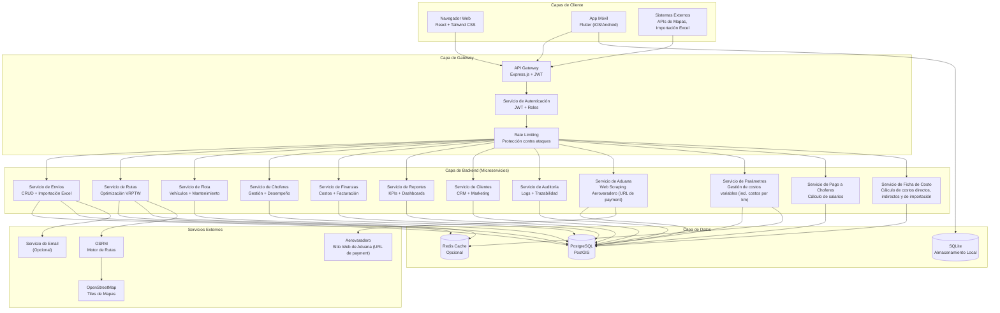
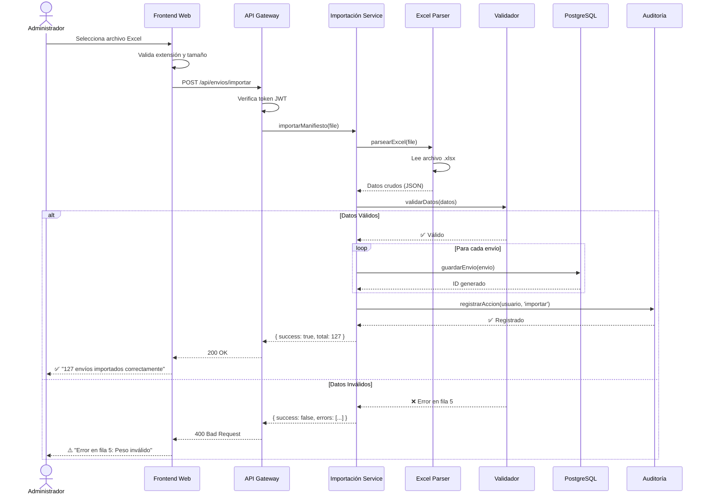
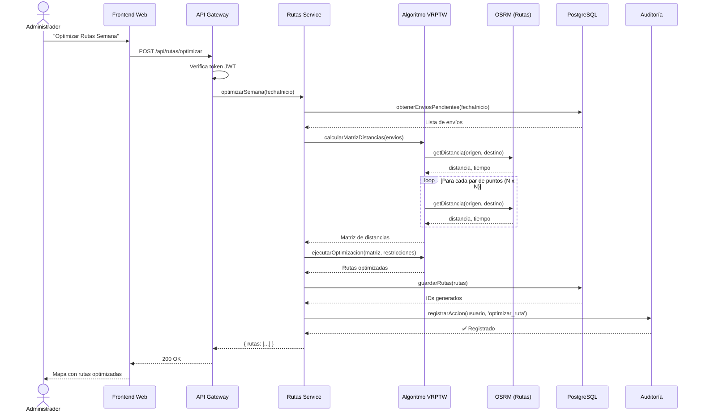
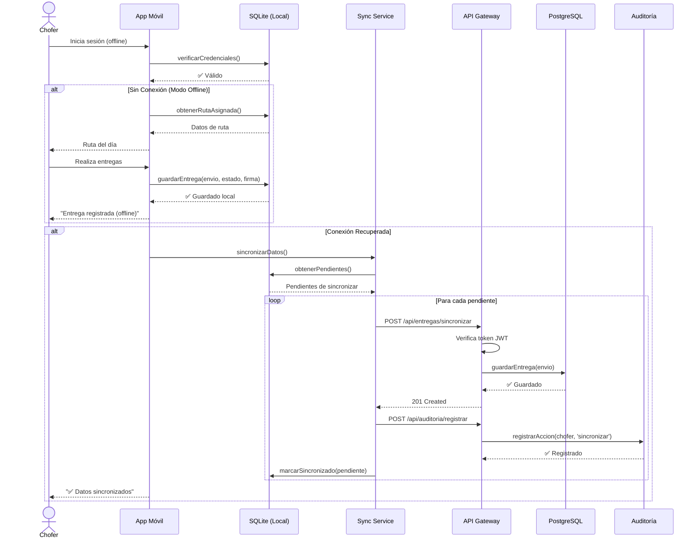
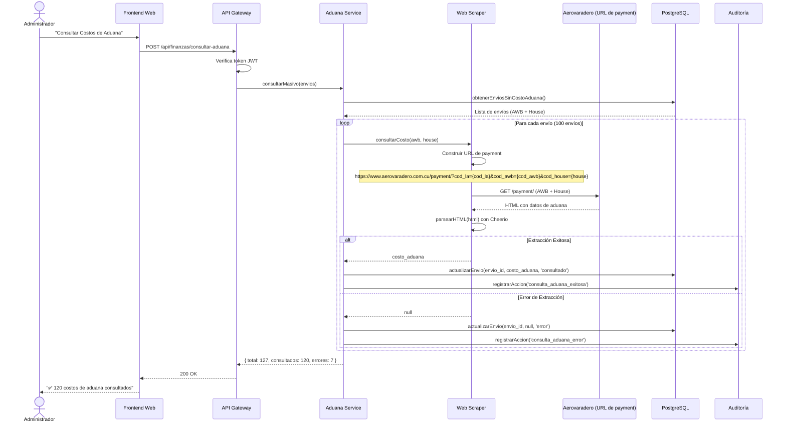
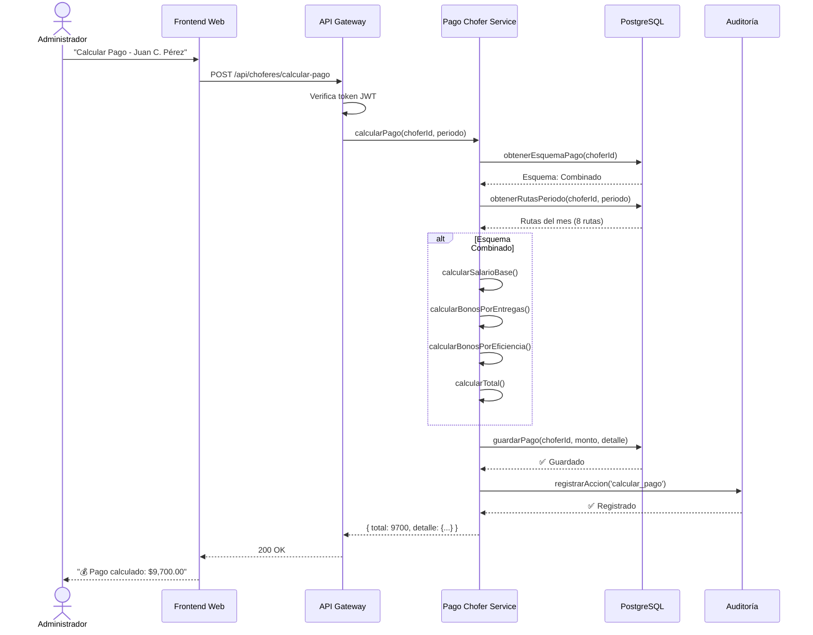
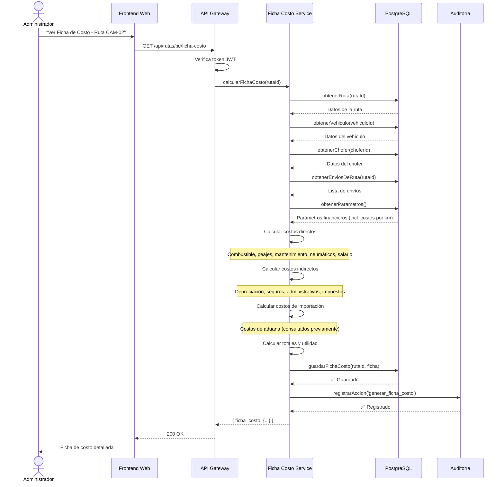

## 📄 DOCUMENTO DE ARQUITECTURA DE SOFTWARE - SIGMA-T (VERSIÓN 2.3 - TOP MUNDIAL CON FINANZAS, ADUANA, FICHA DE COSTO E INFRAESTRUCTURA)

**Basado en IEEE 1016 - Descripción de Diseño de Software (SDD) y estándares de arquitectura de sistemas**

**Proyecto:** SIGMA-T (Sistema Integral de Gestión para MiPYME de Transporte)  
**Cliente / Sponsor:** Osleyder Gonzalez Acosta  
**Fecha de Emisión:** 13 de agosto de 2026  
**Versión del Documento:** 2.3 (Completa - Top Mundial con Finanzas, Aduana, Ficha de Costo e Infraestructura)

---

### 1. INTRODUCCIÓN Y PROPÓSITO

#### 1.1 Propósito del Documento
Este documento describe la arquitectura del sistema SIGMA-T, proporcionando una vista detallada de su estructura, componentes, interacciones y decisiones técnicas. Sirve como guía principal para los desarrolladores y como base para la validación de la solución por parte del Líder del Proyecto. El documento también establece los estándares de codificación, las prácticas de documentación y las estrategias de integración con servicios externos, incluyendo la nueva funcionalidad de consulta automática de costos de aduana (utilizando la URL de payment), la gestión de parámetros financieros (tasa de cambio USD/CUP, precios de combustible, costos por km), la gestión de esquemas de pago a choferes, la generación de la ficha de costo detallada por ruta, y la infraestructura de producción en VPS ETECSA.

#### 1.2 Alcance
El alcance de este documento cubre todos los componentes del sistema, incluyendo backend, frontend web, aplicación móvil, bases de datos, integraciones externas, estrategias de despliegue, estándares de codificación y prácticas de documentación. Se incluye también la nueva funcionalidad de integración con el sitio web de Aerovaradero para la consulta automática de costos de aduana utilizando la URL de payment (`https://www.aerovaradero.com.cu/payment/?cod_la={cod_la}&cod_awb={cod_awb}&cod_house={house}`), la gestión de parámetros financieros (tasa de cambio USD/CUP, precios de combustible, costos por km), la gestión de esquemas de pago a choferes, la generación de la ficha de costo detallada por ruta, y la infraestructura de producción en VPS ETECSA con guía de despliegue y estrategia de distribución de la app móvil.

#### 1.3 Audiencia
- **Líder del Proyecto (Osleyder Gonzalez):** Para validar las decisiones técnicas y asegurar que la arquitectura cumple con los objetivos de negocio.
- **Equipo de Desarrollo:** Como guía de implementación y referencia técnica durante todo el ciclo de desarrollo.
- **Futuros Contribuidores:** Para entender la arquitectura del sistema y sus estándares, facilitando la incorporación de nuevos miembros al equipo.
- **Auditores de Calidad:** Para verificar el cumplimiento de estándares de codificación, documentación y buenas prácticas.
- **Stakeholders Técnicos:** Para comprender las decisiones tecnológicas y su justificación.
- **Administradores de Sistemas:** Para la instalación, configuración y mantenimiento del sistema en producción.

#### 1.4 Referencias
- **IEEE 1016:** Estándar para Descripción de Diseño de Software.
- **ISO/IEC/IEEE 42010:** Prácticas recomendadas para la descripción de arquitectura de sistemas.
- **SRS v3.3:** Especificación de Requisitos del Software (documento de requisitos funcionales y no funcionales).
- **SPMP v3.3:** Plan de Gestión del Proyecto de Software (cronograma, sprints, gestión de riesgos).
- **Conventional Commits:** Estándar para mensajes de commit (formato: tipo(alcance): descripción).
- **JSDoc:** Estándar de documentación para código JavaScript/TypeScript.
- **OpenAPI 3.0:** Especificación para documentación de APIs REST.
- **PMI (Project Management Institute):** Estándares de gestión de proyectos para la estructura organizativa.

---

### 2. DECISIONES ARQUITECTÓNICAS CLAVE

#### 2.1 Principios Arquitectónicos
El diseño de SIGMA-T se rige por los siguientes principios fundamentales, que guían todas las decisiones técnicas y de diseño:

| Principio | Descripción | Aplicación en SIGMA-T |
|-----------|-------------|----------------------|
| **Modularidad** | Componentes independientes y reutilizables | Módulos separados por dominio de negocio (envíos, rutas, finanzas, aduana, choferes, flota, ficha de costo), cada uno con su propia lógica y responsabilidad. |
| **Escalabilidad Horizontal** | Capacidad de crecer añadiendo más instancias | API sin estado (stateless), base de datos replicable, balanceo de carga para manejar picos de demanda. |
| **Offline First** | Priorizar el funcionamiento sin conexión | App móvil con SQLite como almacenamiento local, sincronización diferida con el servidor al recuperar conectividad. |
| **Seguridad por Diseño** | Seguridad integrada desde la base | JWT para autenticación, encriptación de datos sensibles, auditoría en cada capa, HTTPS obligatorio (Let's Encrypt). |
| **Open Source** | Transparencia y comunidad | Código público en GitHub, documentación abierta, licencia permisiva para fomentar contribuciones. |
| **Rendimiento** | Respuesta rápida incluso en condiciones adversas | Caché con Redis, optimización de consultas SQL, CDN para archivos estáticos, compresión de respuestas. |
| **Calidad de Código** | Estándares estrictos y documentación continua | ESLint, Prettier, Dart Analyzer, JSDoc, revisión de código obligatoria, análisis estático en CI/CD. |
| **Robustez en Integraciones** | Tolerancia a fallos en servicios externos | Web scraping con reintentos, timeouts configurables, entrada manual de costos de aduana como contingencia, logging detallado. |
| **Mantenibilidad** | Facilidad para realizar cambios y correcciones | Arquitectura limpia con separación de capas, código tipado (TypeScript), pruebas automatizadas. |
| **Precisión Financiera** | Cálculos con alta precisión | Decimales con 2 posiciones, auditoría de cálculos, validaciones automáticas. |
| **Infraestructura Local** | Optimizado para el contexto cubano | Desplegable en VPS ETECSA con recursos limitados (2 GB RAM, 50 GB disco). |

#### 2.2 Stack Tecnológico Confirmado

| Capa | Tecnología | Versión | Justificación |
|------|------------|---------|---------------|
| **Backend** | Node.js + TypeScript | Node 20.x, TS 5.x | Alto rendimiento para operaciones I/O intensivas, ecosistema maduro con librerías para todo (Excel, mapas, web scraping), tipado estático que reduce errores en producción. |
| **API** | Express.js | 4.x | Estándar de la industria, minimalista y extensible, amplia documentación y comunidad. |
| **Frontend Web** | React + Vite + Tailwind CSS | React 18.x | Interfaz reactiva y dinámica, desarrollo rápido con Vite (hot-reload), diseño moderno con Tailwind CSS. |
| **Mobile** | Flutter | 3.x | Multiplataforma (iOS y Android) con una sola base de código, rendimiento nativo, SQLite para offline robusto. |
| **Base de Datos** | PostgreSQL + PostGIS | 15.x | Robusta, geoespacial (PostGIS para consultas de distancia y ubicación), estándar de la industria, escalable. |
| **Almacenamiento Local** | SQLite | 3.x | Ligero, embeddable, ideal para modo offline en dispositivos móviles. |
| **Mapas y Rutas** | OpenStreetMap + OSRM | OSRM 5.x | 100% open source, editable colaborativamente (choferes pueden mejorar mapas), OSRM es el motor de rutas open source más rápido. |
| **Autenticación** | JWT (JSON Web Tokens) | - | Stateless, seguro, estándar de la industria para APIs REST. |
| **Cache** | Redis (opcional) | 7.x | Para mejorar rendimiento de consultas frecuentes y reducir carga en la base de datos. |
| **Contenedores** | Docker | 24.x | Portabilidad, consistencia en entornos de desarrollo, staging y producción. |
| **Orquestación** | Docker Compose | 2.x | Orquestación simple para entornos de desarrollo y pruebas. |
| **CI/CD** | GitHub Actions | - | Automatización de pruebas, análisis estático, generación de documentación y despliegues. |
| **Monitoreo** | Prometheus + Grafana | - | Monitoreo de métricas, alertas en producción, visualización de rendimiento. |
| **Web Scraping** | Cheerio / Puppeteer | Cheerio 1.x, Puppeteer 22.x | Extracción de datos del sitio web de Aerovaradero (URL de payment). Cheerio para parseo rápido de HTML, Puppeteer como contingencia para sitios con JavaScript. |
| **Generación de PDF** | PDFKit / jsPDF | - | Generación de documentos PDF para fichas de costo y reportes. |
| **Servidor Web** | Nginx | 1.18+ | Proxy inverso, servidor de archivos estáticos, SSL/HTTPS. |
| **Gestor de Procesos** | PM2 | 5.x | Gestión de procesos Node.js en producción. |
| **SSL/HTTPS** | Let's Encrypt / Certbot | - | Certificados SSL gratuitos para comunicaciones seguras. |

#### 2.3 Justificación del Stack
1. **Node.js + TypeScript:**
   - **Ventaja 1:** Velocidad de desarrollo (JavaScript/TypeScript es el lenguaje más popular, con gran cantidad de desarrolladores disponibles).
   - **Ventaja 2:** Ecosistema npm con librerías para todo (optimización de rutas, manejo de Excel, integración con mapas, web scraping, generación de PDF).
   - **Ventaja 3:** TypeScript reduce errores en producción gracias al tipado estático y la detección temprana de problemas.
   - **Ventaja 4:** Perfecto para operaciones I/O intensivas (API, sincronización, scraping) debido a su modelo asíncrono no bloqueante.

2. **React + Vite + Tailwind CSS:**
   - **Ventaja 1:** React es el estándar para dashboards interactivos y aplicaciones web complejas.
   - **Ventaja 2:** Vite para hot-reload ultrarrápido, lo que acelera el desarrollo y la depuración.
   - **Ventaja 3:** Tailwind CSS para diseño consistente, personalizable y responsivo sin escribir CSS personalizado.

3. **Flutter:**
   - **Ventaja 1:** Una base de código para iOS y Android (ahorro significativo de recursos y tiempo).
   - **Ventaja 2:** SQLite nativo para modo offline robusto y almacenamiento local de datos.
   - **Ventaja 3:** Hot reload para desarrollo rápido y visualización inmediata de cambios.
   - **Ventaja 4:** Widgets personalizables para UI/UX superior, con rendimiento nativo.

4. **PostgreSQL + PostGIS:**
   - **Ventaja 1:** Consultas geoespaciales nativas (distancia, área, intersección) para optimización de rutas.
   - **Ventaja 2:** Integridad referencial (claves foráneas, transacciones ACID) para consistencia de datos.
   - **Ventaja 3:** Escalable con particionamiento, replicación y read replicas.
   - **Ventaja 4:** Comunidad activa y documentación extensa, soporte para JSON y datos semiestructurados.

5. **OpenStreetMap + OSRM:**
   - **Ventaja 1:** 100% open source (sin costos de licencia, sin límites de uso).
   - **Ventaja 2:** Editabilidad colaborativa (choferes pueden mejorar mapas en Cuba, donde OSM puede tener datos desactualizados).
   - **Ventaja 3:** OSRM es el motor de rutas open source más rápido y preciso.
   - **Ventaja 4:** No requiere conexión a internet (puede correr localmente con datos pre-descargados de Cuba).

6. **Infraestructura (VPS ETECSA):**
   - **Ventaja 1:** Estabilidad y conectividad local en Cuba.
   - **Ventaja 2:** Sin bloqueos por sanciones de EE.UU.
   - **Ventaja 3:** Costo accesible (250 CUP de suscripción).
   - **Ventaja 4:** Soporte local y centros de datos en La Habana, Mayabeque y Las Tunas.

---

### 3. ARQUITECTURA GENERAL (VISTA DE ALTO NIVEL)

#### 3.1 Diagrama de Arquitectura de Componentes

El siguiente diagrama muestra la estructura general del sistema SIGMA-T, organizado en capas que separan las responsabilidades de cliente, gateway, backend, datos y servicios externos.



**Descripción de Componentes:**

| Componente | Descripción |
|------------|-------------|
| **Navegador Web** | Interfaz de usuario para administradores, dispatchers y clientes, construida con React. |
| **App Móvil** | Aplicación para choferes, construida con Flutter, con funcionalidad offline. |
| **API Gateway** | Punto de entrada único para todas las solicitudes, maneja autenticación y rate limiting. |
| **Servicios Backend** | Microservicios especializados por dominio de negocio. |
| **Base de Datos** | PostgreSQL para almacenamiento persistente, SQLite para caché local en móvil. |
| **Servicios Externos** | OSRM para rutas, OpenStreetMap para mapas, Aerovaradero (URL de payment) para costos de aduana. |

#### 3.2 Flujo de Datos Principal

El siguiente diagrama muestra los flujos de datos principales del sistema, incluyendo los nuevos flujos de aduana, finanzas y ficha de costo.

```mermaid
flowchart LR
    subgraph Importación["Flujo de Importación"]
        Excel[Archivo Excel<br>Manifiesto] --> Importador[Importador<br>Pandas/openpyxl]
        Importador --> Validador[Validador de Datos]
        Validador --> EnvioSvc
        EnvioSvc --> BD[(PostgreSQL)]
    end

    subgraph Optimización["Flujo de Optimización"]
        BD --> Optimizador[Optimizador<br>VRPTW]
        Optimizador --> Matriz[Matriz de Distancias<br>OSRM]
        Matriz --> Algoritmo[Algoritmo de Optimización]
        Algoritmo --> RutaGenerada[Rutas Generadas]
        RutaGenerada --> BD
    end

    subgraph Aduana["Flujo de Aduana - NUEVO"]
        BD --> AduanaSvc[Servicio de Aduana]
        AduanaSvc --> Scraper[Web Scraper<br>Cheerio/Puppeteer]
        Scraper --> Aerovaradero[Aerovaradero<br>https://www.aerovaradero.com.cu/payment/?cod_la={cod_la}&cod_awb={cod_awb}&cod_house={house}]
        Aerovaradero --> Scraper
        Scraper --> AduanaSvc
        AduanaSvc --> BD
    end

    subgraph Finanzas["Flujo de Finanzas - NUEVO"]
        ParametrosSvc[Servicio de Parámetros] --> BD
        PagoChoferSvc[Servicio de Pago a Choferes] --> BD
        FinanzaSvc[Servicio de Finanzas] --> BD
    end

    subgraph FichaCosto["Flujo de Ficha de Costo - NUEVO"]
        BD --> FichaCostoSvc[Servicio de Ficha de Costo]
        FichaCostoSvc --> Calculadora[Calculadora de Costos]
        Calculadora --> FichaCostoSvc
        FichaCostoSvc --> BD
    end

    subgraph Sincronización["Flujo de Sincronización"]
        BD --> API[API REST]
        API --> Mobile[App Móvil]
        Mobile --> SQLite[(SQLite Local)]
        SQLite --> Operaciones[Operaciones Offline<br>Entregas + Incidencias]
        Operaciones --> Sincronizador[Sincronizador]
        Sincronizador --> API
        API --> BD
    end
```

**Descripción de Flujos:**

| Flujo | Descripción |
|-------|-------------|
| **Importación** | El administrador importa un manifiesto Excel, el sistema valida los datos y los guarda en la base de datos. |
| **Optimización** | El sistema calcula rutas óptimas usando el algoritmo VRPTW y OSRM, almacenando las rutas generadas. |
| **Aduana (NUEVO)** | El sistema consulta el sitio web de Aerovaradero (URL de payment) para obtener costos de aduana de cada envío y actualiza la base de datos. |
| **Finanzas (NUEVO)** | El sistema gestiona parámetros financieros (tasa de cambio, precios, costos por km) y calcula pagos a choferes. |
| **Ficha de Costo (NUEVO)** | El sistema calcula la ficha de costo detallada por ruta, incluyendo costos directos, indirectos y de importación. |
| **Sincronización** | La app móvil sincroniza datos offline con el servidor cuando hay conectividad. |

---

### 4. ARQUITECTURA DETALLADA POR CAPAS

#### 4.1 Capa de Backend (API REST)

**Estructura del Proyecto Backend**

La estructura del proyecto backend sigue una organización modular por dominio, separando claramente las responsabilidades de configuración, controladores, modelos, servicios, middlewares, rutas y utilidades.

```
backend/
├── src/
│   ├── config/               # Configuraciones (base de datos, JWT, OSRM)
│   │   ├── database.config.ts
│   │   ├── jwt.config.ts
│   │   ├── osrm.config.ts
│   │   └── index.ts
│   ├── controllers/          # Controladores (lógica de negocio)
│   │   ├── envio.controller.ts
│   │   ├── ruta.controller.ts
│   │   ├── flota.controller.ts
│   │   ├── chofer.controller.ts
│   │   ├── finanza.controller.ts
│   │   ├── reporte.controller.ts
│   │   ├── cliente.controller.ts
│   │   ├── auditoria.controller.ts
│   │   ├── aduana.controller.ts
│   │   ├── parametros.controller.ts
│   │   └── ficha_costo.controller.ts
│   ├── models/               # Modelos de datos (TypeORM)
│   │   ├── envio.model.ts
│   │   ├── ruta.model.ts
│   │   ├── vehiculo.model.ts
│   │   ├── chofer.model.ts
│   │   ├── cliente.model.ts
│   │   ├── costo.model.ts
│   │   ├── mantenimiento.model.ts
│   │   ├── factura.model.ts
│   │   ├── incidente.model.ts
│   │   ├── auditoria.model.ts
│   │   ├── envio_bodega.model.ts
│   │   ├── prospecto.model.ts
│   │   ├── parametros_sistema.model.ts
│   │   ├── historial_parametros.model.ts
│   │   └── index.ts
│   ├── services/             # Servicios (lógica de negocio compleja)
│   │   ├── optimizacion.service.ts   # Algoritmo VRPTW
│   │   ├── geocoding.service.ts      # Geocodificación de direcciones
│   │   ├── importacion.service.ts    # Importación de Excel
│   │   ├── sincronizacion.service.ts # Sincronización offline
│   │   ├── reportes.service.ts       # Generación de reportes
│   │   ├── aduana.service.ts         # Web Scraping Aerovaradero (URL de payment)
│   │   ├── parametros.service.ts     # Gestión de parámetros (incl. costos por km)
│   │   ├── pago_chofer.service.ts    # Cálculo de salarios
│   │   ├── ficha_costo.service.ts    # Cálculo de ficha de costo
│   │   └── index.ts
│   ├── middleware/           # Middlewares (autenticación, logs, errores)
│   │   ├── auth.middleware.ts
│   │   ├── audit.middleware.ts
│   │   ├── error.middleware.ts
│   │   └── validation.middleware.ts
│   ├── routes/               # Definición de rutas API
│   │   ├── envio.routes.ts
│   │   ├── ruta.routes.ts
│   │   ├── flota.routes.ts
│   │   ├── chofer.routes.ts
│   │   ├── finanza.routes.ts
│   │   ├── reporte.routes.ts
│   │   ├── cliente.routes.ts
│   │   ├── auditoria.routes.ts
│   │   ├── aduana.routes.ts
│   │   ├── parametros.routes.ts
│   │   ├── ficha_costo.routes.ts
│   │   └── index.ts
│   ├── utils/                # Utilidades (helpers, validadores)
│   │   ├── validators/
│   │   │   ├── envio.validator.ts
│   │   │   └── index.ts
│   │   ├── excel.parser.ts
│   │   ├── scraper.helper.ts
│   │   ├── logger.ts
│   │   ├── pdf.generator.ts
│   │   └── index.ts
│   ├── types/                # Tipos TypeScript compartidos
│   │   ├── envio.types.ts
│   │   ├── ruta.types.ts
│   │   ├── ficha_costo.types.ts
│   │   └── index.ts
│   └── app.ts                # Punto de entrada de la aplicación
├── tests/                    # Pruebas unitarias e integración
│   ├── unit/
│   ├── integration/
│   └── e2e/
├── Dockerfile                # Configuración de Docker
├── docker-compose.yml        # Orquestación de servicios
├── package.json              # Dependencias
├── tsconfig.json             # Configuración de TypeScript
├── .eslintrc.js              # Configuración de ESLint
├── .prettierrc               # Configuración de Prettier
├── .env.example              # Variables de entorno (ejemplo)
└── .env                      # Variables de entorno (producción)
```

**Dependencias Clave del Backend**

| Librería | Versión | Propósito |
|----------|---------|-----------|
| express | 4.x | Framework web para construir la API REST |
| typeorm | 0.3.x | ORM para PostgreSQL con soporte para PostGIS |
| pg | 8.x | Driver de PostgreSQL |
| jsonwebtoken | 9.x | Generación y verificación de JWT para autenticación |
| bcrypt | 5.x | Hash de contraseñas para almacenamiento seguro |
| xlsx | 0.18.x | Lectura/escritura de archivos Excel (manifiestos) |
| axios | 1.x | Cliente HTTP para comunicarse con OSRM y Aerovaradero |
| dotenv | 16.x | Carga de variables de entorno |
| joi | 17.x | Validación de datos de entrada |
| winston | 3.x | Logging estructurado |
| jest | 29.x | Pruebas unitarias |
| supertest | 6.x | Pruebas de integración de API |
| cheerio | 1.x | Web scraping - parseo y extracción de datos de HTML |
| puppeteer | 22.x | Web scraping - navegación en sitios con JavaScript (contingencia) |
| pdfkit | 0.14.x | Generación de documentos PDF (ficha de costo, reportes) |
| eslint | 8.x | Análisis estático de código y detección de errores |
| prettier | 3.x | Formateo automático de código |
| typedoc | 0.25.x | Generación de documentación técnica a partir de JSDoc |
| eslint-plugin-jsdoc | 46.x | Validación de cobertura y calidad de JSDoc |
| redis | 4.x | Cliente para Redis (caché de consultas frecuentes) |

#### 4.2 Servicio de Aduana (NUEVO)

**Descripción:** Servicio encargado de la integración con el sitio web de Aerovaradero para la consulta automática de costos de aduana, utilizando la URL de payment.

**Estructura del Servicio:**

```typescript
// backend/src/services/aduana.service.ts

async function consultarCostoAduana(awb: string, house: string): Promise<AduanaResponse> {
    // 1. Extraer cod_la y cod_awb del AWB completo
    const [cod_la, cod_awb] = awb.split('-');
    
    // 2. Construir URL de pago (payment)
    const url = `https://www.aerovaradero.com.cu/payment/?cod_la=${cod_la}&cod_awb=${cod_awb}&cod_house=${house}`;
    
    // 3. Realizar la petición HTTP
    const response = await axios.get(url, {
        timeout: 30000,
        headers: {
            'User-Agent': 'Mozilla/5.0 (Windows NT 10.0; Win64; x64) AppleWebKit/537.36'
        }
    });
    
    // 4. Parsear el HTML para extraer los datos
    const $ = cheerio.load(response.data);
    
    // 5. Extraer los datos específicos
    const costoAduana = extraerCostoAduana($);
    const estadoPago = extraerEstadoPago($);
    const datosEnvio = extraerDatosEnvio($);
    
    return {
        costo_aduana: costoAduana,
        estado_pago: estadoPago,
        datos_envio: datosEnvio
    };
}

async function consultarMasivo(envios: Envio[]): Promise<AduanaMasivaResponse> {
    const resultados = [];
    for (const envio of envios) {
        try {
            const resultado = await consultarCostoAduana(envio.awb, envio.house);
            resultados.push({
                envio_id: envio.id_envio,
                ...resultado,
                estado: 'consultado'
            });
        } catch (error) {
            resultados.push({
                envio_id: envio.id_envio,
                estado: 'error',
                error: error.message
            });
        }
    }
    return {
        total: envios.length,
        consultados: resultados.filter(r => r.estado === 'consultado').length,
        errores: resultados.filter(r => r.estado === 'error').length,
        detalle: resultados
    };
}
```

#### 4.3 Servicio de Ficha de Costo (NUEVO)

**Descripción:** Servicio encargado del cálculo automático de la ficha de costo detallada por ruta.

**Estructura del Servicio:**

```typescript
// backend/src/services/ficha_costo.service.ts

async function calcularFichaCosto(rutaId: number): Promise<FichaCosto> {
    // 1. Obtener datos de la ruta
    const ruta = await obtenerRuta(rutaId);
    const vehiculo = await obtenerVehiculo(ruta.id_vehiculo);
    const chofer = await obtenerChofer(ruta.id_chofer);
    const envios = await obtenerEnviosDeRuta(rutaId);
    
    // 2. Obtener parámetros del sistema
    const params = await obtenerParametros();
    
    // 3. Calcular costos directos
    const combustible = (ruta.distancia_total / 100) * vehiculo.consumo * params.precio_combustible;
    const peajes = ruta.peajes || 0;
    const mantenimiento = ruta.distancia_total * params.costo_mantenimiento_por_km;
    const neumaticos = ruta.distancia_total * params.costo_neumatico_por_km;
    const salario = await calcularSalarioChofer(chofer, ruta);
    
    // 4. Calcular costos indirectos
    const depreciacion = ruta.distancia_total * params.costo_depreciacion_por_km;
    const seguro = ruta.distancia_total * params.costo_seguro_por_km;
    const administrativo = ruta.distancia_total * params.costo_administrativo_por_km;
    const impuestos = ruta.distancia_total * params.costo_impuesto_por_km;
    
    // 5. Calcular costos de importación
    const costosAduana = envios.reduce((sum, envio) => sum + (envio.costo_aduana || 0), 0);
    
    // 6. Calcular subtotales
    const subtotalDirectos = combustible + peajes + mantenimiento + neumaticos + salario;
    const subtotalIndirectos = depreciacion + seguro + administrativo + impuestos;
    const subtotalImportacion = costosAduana;
    const totalGeneral = subtotalDirectos + subtotalIndirectos + subtotalImportacion;
    
    // 7. Calcular utilidad
    const ingresos = ruta.ingresos || 0;
    const utilidad = ingresos - totalGeneral;
    const margen = ingresos > 0 ? (utilidad / ingresos) * 100 : 0;
    
    // 8. Construir ficha de costo
    const fichaCosto: FichaCosto = {
        resumen: {
            distancia: ruta.distancia_total,
            entregas: envios.length,
            vehiculo: vehiculo.matricula,
            chofer: chofer.nombre,
            fecha: ruta.fecha,
            ingresos: ingresos
        },
        costos_directos: {
            combustible: { monto: combustible, cantidad: (ruta.distancia_total / 100) * vehiculo.consumo, unidad: 'L' },
            peajes: { monto: peajes, cantidad: 0, unidad: 'viaje' },
            mantenimiento: { monto: mantenimiento, cantidad: ruta.distancia_total, unidad: 'km' },
            neumaticos: { monto: neumaticos, cantidad: ruta.distancia_total, unidad: 'km' },
            salario: { monto: salario, cantidad: 0, unidad: 'viaje' },
            subtotal: subtotalDirectos
        },
        costos_indirectos: {
            depreciacion: { monto: depreciacion, cantidad: ruta.distancia_total, unidad: 'km' },
            seguro: { monto: seguro, cantidad: ruta.distancia_total, unidad: 'km' },
            administrativo: { monto: administrativo, cantidad: ruta.distancia_total, unidad: 'km' },
            impuestos: { monto: impuestos, cantidad: ruta.distancia_total, unidad: 'km' },
            subtotal: subtotalIndirectos
        },
        costos_importacion: {
            aduana: { monto: costosAduana, cantidad: envios.length, unidad: 'envios' },
            subtotal: subtotalImportacion
        },
        totales: {
            total_general: totalGeneral,
            utilidad_neta: utilidad,
            margen_utilidad: margen
        }
    };
    
    // 9. Guardar ficha de costo en la base de datos
    await guardarFichaCosto(rutaId, fichaCosto);
    
    return fichaCosto;
}
```

#### 4.4 Capa de Frontend Web (React + Vite)

**Estructura del Proyecto Frontend**

El frontend web sigue una arquitectura basada en componentes funcionales de React, con separación clara de responsabilidades entre API, componentes, layouts, páginas, hooks, store y estilos.

```
frontend/
├── src/
│   ├── api/                  # Servicios de API
│   │   ├── envio.api.ts
│   │   ├── ruta.api.ts
│   │   ├── flota.api.ts
│   │   ├── chofer.api.ts
│   │   ├── finanza.api.ts
│   │   ├── reporte.api.ts
│   │   ├── cliente.api.ts
│   │   ├── auditoria.api.ts
│   │   ├── aduana.api.ts
│   │   ├── parametros.api.ts
│   │   ├── ficha_costo.api.ts
│   │   ├── auth.api.ts
│   │   └── index.ts
│   ├── components/           # Componentes reutilizables
│   │   ├── common/
│   │   │   ├── Button.tsx
│   │   │   ├── Table.tsx
│   │   │   ├── Modal.tsx
│   │   │   ├── Card.tsx
│   │   │   ├── Input.tsx
│   │   │   ├── Select.tsx
│   │   │   ├── Spinner.tsx
│   │   │   ├── Toast.tsx
│   │   │   └── index.ts
│   │   ├── dashboard/
│   │   │   ├── KPICard.tsx
│   │   │   ├── ActivityFeed.tsx
│   │   │   ├── Chart.tsx
│   │   │   └── index.ts
│   │   ├── envios/
│   │   │   ├── ImportForm.tsx
│   │   │   ├── EnvioList.tsx
│   │   │   ├── EnvioDetail.tsx
│   │   │   ├── EnvioFilters.tsx
│   │   │   └── index.ts
│   │   ├── rutas/
│   │   │   ├── WeeklyPlanner.tsx
│   │   │   ├── RouteMap.tsx
│   │   │   ├── RouteManifest.tsx
│   │   │   ├── RouteDetail.tsx
│   │   │   ├── FichaCosto.tsx
│   │   │   └── index.ts
│   │   ├── flota/
│   │   │   ├── VehicleList.tsx
│   │   │   ├── VehicleDetail.tsx
│   │   │   ├── MaintenanceForm.tsx
│   │   │   ├── MaintenanceHistory.tsx
│   │   │   └── index.ts
│   │   ├── choferes/
│   │   │   ├── ChoferList.tsx
│   │   │   ├── ChoferDetail.tsx
│   │   │   ├── ChoferForm.tsx
│   │   │   ├── PaymentConfig.tsx
│   │   │   └── index.ts
│   │   ├── finanzas/
│   │   │   ├── IncomeExpenseBook.tsx
│   │   │   ├── InvoiceList.tsx
│   │   │   ├── InvoiceDetail.tsx
│   │   │   ├── InvoiceForm.tsx
│   │   │   ├── AduanaConfig.tsx
│   │   │   └── index.ts
│   │   ├── reportes/
│   │   │   ├── ReportFilters.tsx
│   │   │   ├── ReportTable.tsx
│   │   │   ├── ReportChart.tsx
│   │   │   └── index.ts
│   │   ├── auditoria/
│   │   │   ├── AuditLog.tsx
│   │   │   ├── AuditDetail.tsx
│   │   │   └── index.ts
│   │   ├── marketing/
│   │   │   ├── ProspectList.tsx
│   │   │   ├── ProspectForm.tsx
│   │   │   ├── ProspectFollowUp.tsx
│   │   │   └── index.ts
│   │   └── parametros/
│   │       ├── ParametrosForm.tsx
│   │       ├── ParametrosHistory.tsx
│   │       └── index.ts
│   ├── layouts/              # Layouts de la aplicación
│   │   ├── MainLayout.tsx
│   │   ├── AuthLayout.tsx
│   │   ├── ClientLayout.tsx
│   │   └── index.ts
│   ├── pages/                # Páginas completas
│   │   ├── DashboardPage.tsx
│   │   ├── EnviosPage.tsx
│   │   ├── RutasPage.tsx
│   │   ├── FlotaPage.tsx
│   │   ├── ChoferesPage.tsx
│   │   ├── FinanzasPage.tsx
│   │   ├── ReportesPage.tsx
│   │   ├── AuditoriaPage.tsx
│   │   ├── MarketingPage.tsx
│   │   ├── ConfiguracionPage.tsx
│   │   ├── ParametrosPage.tsx
│   │   ├── FichaCostoPage.tsx
│   │   ├── LoginPage.tsx
│   │   └── index.ts
│   ├── hooks/                # Custom React Hooks
│   │   ├── useAuth.ts
│   │   ├── useEnvios.ts
│   │   ├── useRutas.ts
│   │   ├── useChoferes.ts
│   │   ├── useFinanzas.ts
│   │   ├── useReportes.ts
│   │   ├── useAuditoria.ts
│   │   ├── useParametros.ts
│   │   ├── useFichaCosto.ts
│   │   ├── useToast.ts
│   │   └── index.ts
│   ├── store/                # Estado global (Zustand)
│   │   ├── auth.store.ts
│   │   ├── envio.store.ts
│   │   ├── ruta.store.ts
│   │   ├── chofer.store.ts
│   │   ├── finanza.store.ts
│   │   ├── parametros.store.ts
│   │   └── index.ts
│   ├── types/                # Tipos TypeScript
│   │   ├── envio.types.ts
│   │   ├── ruta.types.ts
│   │   ├── flota.types.ts
│   │   ├── chofer.types.ts
│   │   ├── finanza.types.ts
│   │   ├── reporte.types.ts
│   │   ├── auditoria.types.ts
│   │   ├── cliente.types.ts
│   │   ├── parametros.types.ts
│   │   ├── ficha_costo.types.ts
│   │   └── index.ts
│   ├── styles/               # Estilos globales (Tailwind)
│   │   ├── index.css
│   │   ├── tailwind.css
│   │   └── variables.css
│   ├── utils/                # Utilidades
│   │   ├── formatters.ts
│   │   ├── validators.ts
│   │   ├── helpers.ts
│   │   └── index.ts
│   ├── App.tsx               # Componente principal
│   ├── main.tsx              # Punto de entrada
│   ├── routes.tsx            # Definición de rutas
│   └── vite-env.d.ts         # Tipos de Vite
├── public/                   # Archivos estáticos
│   ├── favicon.ico
│   └── logo.svg
├── index.html                # HTML principal
├── package.json              # Dependencias
├── vite.config.ts            # Configuración de Vite
├── tailwind.config.js        # Configuración de Tailwind
├── postcss.config.js         # Configuración de PostCSS
├── .eslintrc.js              # Configuración de ESLint
├── .prettierrc               # Configuración de Prettier
└── .env                      # Variables de entorno
```

**Dependencias Clave del Frontend**

| Librería | Versión | Propósito |
|----------|---------|-----------|
| react | 18.x | Framework UI para construir interfaces de usuario |
| react-router-dom | 6.x | Enrutamiento y navegación entre páginas |
| axios | 1.x | Cliente HTTP para comunicarse con el backend |
| recharts | 2.x | Gráficos y visualización de datos en dashboards |
| leaflet | 1.x | Mapas interactivos |
| react-leaflet | 4.x | Componentes de Leaflet para React |
| tanstack/react-table | 8.x | Tablas avanzadas con ordenamiento y filtrado |
| tailwindcss | 3.x | Estilos CSS utilitarios |
| framer-motion | 10.x | Animaciones y transiciones suaves |
| zustand | 4.x | Estado global ligero |
| react-hook-form | 7.x | Manejo de formularios con validación |
| @tanstack/react-query | 4.x | Fetching de datos y caché |
| react-toastify | 9.x | Notificaciones toast |
| eslint | 8.x | Análisis estático de código |
| prettier | 3.x | Formateo automático |
| pdf-lib | 1.x | Generación de PDF en cliente (opcional) |

#### 4.5 Capa de App Móvil (Flutter)

**Estructura del Proyecto Mobile**

La app móvil sigue una arquitectura basada en el patrón Provider para gestión de estado, con separación clara de modelos, servicios, pantallas, widgets, utilidades y constantes.

```
mobile/
├── lib/
│   ├── main.dart             # Punto de entrada de la aplicación
│   ├── models/               # Modelos de datos
│   │   ├── envio.model.dart
│   │   ├── ruta.model.dart
│   │   ├── vehiculo.model.dart
│   │   ├── chofer.model.dart
│   │   ├── cliente.model.dart
│   │   ├── costo.model.dart
│   │   ├── parametros.model.dart
│   │   ├── ficha_costo.model.dart
│   │   └── index.dart
│   ├── services/             # Servicios
│   │   ├── api.service.dart       # Cliente HTTP (Dio)
│   │   ├── sync.service.dart      # Sincronización offline
│   │   ├── database.service.dart  # SQLite (sqflite)
│   │   ├── auth.service.dart      # Autenticación local
│   │   ├── storage.service.dart   # Almacenamiento seguro
│   │   ├── location.service.dart  # GPS y geolocalización
│   │   ├── notification.service.dart # Notificaciones push
│   │   └── index.dart
│   ├── screens/              # Pantallas
│   │   ├── home_screen.dart      # Inicio / Ruta del día
│   │   ├── ruta_screen.dart      # Ruta del día (mapa + lista)
│   │   ├── entrega_screen.dart   # Detalle de entrega
│   │   ├── incidencia_screen.dart # Incidencias
│   │   ├── perfil_screen.dart    # Perfil del chofer
│   │   ├── historial_screen.dart # Historial de entregas (incluye ficha de costo)
│   │   ├── login_screen.dart     # Login offline
│   │   ├── config_screen.dart    # Configuración de la app
│   │   └── index.dart
│   ├── widgets/              # Widgets reutilizables
│   │   ├── custom_button.dart
│   │   ├── custom_appbar.dart
│   │   ├── progress_indicator.dart
│   │   ├── signature_pad.dart
│   │   ├── image_picker.dart
│   │   ├── status_badge.dart
│   │   ├── sync_status.dart
│   │   └── index.dart
│   ├── providers/            # Proveedores de estado (Provider)
│   │   ├── auth_provider.dart
│   │   ├── ruta_provider.dart
│   │   ├── entrega_provider.dart
│   │   ├── sync_provider.dart
│   │   └── index.dart
│   ├── utils/                # Utilidades
│   │   ├── validators.dart
│   │   ├── formatters.dart
│   │   ├── helpers.dart
│   │   └── index.dart
│   ├── constants/            # Constantes
│   │   ├── colors.dart
│   │   ├── strings.dart
│   │   ├── routes.dart
│   │   └── index.dart
│   └── theme/                # Tema de la aplicación
│       ├── app_theme.dart
│       └── dark_theme.dart
├── assets/                   # Recursos (imágenes, fuentes)
│   ├── images/
│   ├── fonts/
│   └── icons/
├── android/                  # Configuración Android
│   ├── app/
│   └── ...
├── ios/                      # Configuración iOS
│   ├── Runner/
│   └── ...
├── test/                     # Pruebas unitarias
├── pubspec.yaml              # Dependencias
├── analysis_options.yaml     # Configuración de Dart Analyzer
└── .env                      # Variables de entorno
```

**Dependencias Clave del Mobile**

| Librería | Versión | Propósito |
|----------|---------|-----------|
| flutter | 3.x | Framework UI |
| sqflite | 2.x | SQLite para almacenamiento offline |
| dio | 5.x | Cliente HTTP con interceptores |
| provider | 6.x | Gestión de estado |
| flutter_secure_storage | 9.x | Almacenamiento seguro de credenciales |
| signature | 5.x | Captura de firma digital |
| image_picker | 1.x | Cámara y galería para fotos de evidencia |
| flutter_map | 6.x | Mapas (Leaflet para Flutter) |
| url_launcher | 6.x | Llamar y navegar a direcciones |
| flutter_local_notifications | 15.x | Notificaciones push y locales |
| connectivity_plus | 5.x | Estado de conexión a internet |
| shared_preferences | 2.x | Preferencias locales ligeras |
| permission_handler | 11.x | Gestión de permisos (GPS, cámara) |
| geolocator | 10.x | GPS y geolocalización en tiempo real |
| printing | 5.x | Generación de PDF en móvil (opcional) |

---

### 5. DIAGRAMAS DE SECUENCIA (FLUJOS CLAVE)

#### 5.1 Flujo: Importación de Manifiesto Excel

Este diagrama muestra la secuencia completa del proceso de importación de un manifiesto Excel, desde que el administrador selecciona el archivo hasta que los datos se guardan en la base de datos.



#### 5.2 Flujo: Optimización de Rutas

Este diagrama muestra el proceso de optimización de rutas, desde la solicitud del administrador hasta la generación y almacenamiento de las rutas optimizadas.



#### 5.3 Flujo: Sincronización Offline de Chofer

Este diagrama muestra el flujo completo de sincronización offline, desde el login del chofer sin conexión hasta la sincronización automática al recuperar conectividad.



#### 5.4 Flujo: Consulta Automática de Aduana (NUEVO)

Este diagrama muestra el flujo de consulta automática de costos de aduana en el sitio web de Aerovaradero, utilizando la URL de payment.



#### 5.5 Flujo: Cálculo de Pago a Chofer (NUEVO)

Este diagrama muestra el flujo de cálculo de pago a un chofer según el esquema configurado (fijo, por km, por entrega o combinado).



#### 5.6 Flujo: Generación de Ficha de Costo (NUEVO)

Este diagrama muestra el flujo de generación de la ficha de costo detallada por ruta.



---

### 6. MODELO DE DATOS (DETALLADO)

#### 6.1 Diagrama Entidad-Relación (ER)

El siguiente diagrama muestra todas las entidades del sistema y sus relaciones, incluyendo las nuevas entidades y campos.

```
┌─────────────┐      ┌─────────────┐      ┌─────────────┐
│   USUARIO   │      │   VEHICULO  │      │   CHOFER    │
├─────────────┤      ├─────────────┤      ├─────────────┤
│ id_usuario  │◄─────│ id_vehiculo │      │ id_chofer   │
│ nombre      │      │ matricula   │      │ nombre      │
│ email       │      │ marca       │      │ identific   │
│ password    │      │ modelo      │      │ licencia    │
│ rol         │      │ capacidad   │      │ telefono    │
│ activo      │      │ combustible │      │ fecha_ing   │
│ fecha_reg   │      │ consumo     │      │ salario_base│
└─────────────┘      │ kilometraje │      │ disponible  │
                     │ disponible  │      │ esquema_pago│
                     └─────────────┘      │ salario_por_km│
                            │             │ salario_por_entrega│
                            │             └─────────────┘
                            │                   │
                            ▼                   ▼
                     ┌─────────────────────────────┐
                     │           RUTA              │
                     ├─────────────────────────────┤
                     │ id_ruta (PK)               │
                     │ id_vehiculo (FK)           │
                     │ id_chofer (FK)             │
                     │ fecha                      │
                     │ secuencia_paradas (JSON)   │
                     │ distancia_total            │
                     │ tiempo_estimado            │
                     │ combustible_estimado       │
                     │ costo_total_estimado       │
                     │ costo_total_real           │
                     │ pago_chofer                │
                     │ ficha_costo (JSON)         │
                     │ ingresos                   │
                     │ utilidad_neta              │
                     │ margen_utilidad            │
                     │ estado                     │
                     └─────────────────────────────┘
                            │
                            ▼
┌─────────────┐      ┌─────────────┐      ┌─────────────┐
│   CLIENTE   │      │    ENVIO    │      │   COSTO     │
├─────────────┤      ├─────────────┤      ├─────────────┤
│ id_cliente  │─────►│ id_envio    │─────►│ id_costo    │
│ nombre_emp  │      │ id_cliente  │      │ tipo        │
│ contacto    │      │ id_chofer   │      │ categoria   │
│ telefono    │      │ id_vehiculo │      │ descripcion │
│ email       │      │ id_ruta     │      │ monto       │
│ tarifa      │      │ house (UK)  │      │ cantidad    │
│ activo      │      │ awb         │      │ precio_unit │
└─────────────┘      │ descripcion │      │ es_estimado │
                     │ peso        │      │ fecha       │
                     │ volumen     │      │ id_vehiculo │
                     │ bultos      │      │ id_ruta     │
                     │ remitente   │      │ id_envio    │
                     │ destinatario│      └─────────────┘
                     │ direccion   │
                     │ telefono    │      ┌─────────────┐
                     │ prioridad   │      │ PARAMETROS  │
                     │ fecha_limite│      │ SISTEMA     │
                     │ estado      │      ├─────────────┤
                     │ firma       │      │ id_parametro│
                     │ costo_aduana│      │ clave       │
                     │ costo_import│      │ valor       │
                     │ fecha_cons_ │      │ descripcion │
                     │ aduana      │      │ unidad      │
                     │ estado_adu  │      │ fecha_act   │
                     └─────────────┘      └─────────────┘
                            │
┌─────────────┐      ┌─────────────┐      ┌─────────────┐
│  AUDITORIA  │      │ MANTENIMIENTO│      │ HISTORIAL   │
├─────────────┤      ├─────────────┤      │ PARAMETROS  │
│ id_audit    │      │ id_manten   │      ├─────────────┤
│ id_usuario  │      │ id_vehiculo │      │ id_historial│
│ accion      │      │ fecha       │      │ id_parametro│
│ entidad     │      │ tipo        │      │ valor_ant   │
│ id_entidad  │      │ descripcion │      │ valor_nuevo │
│ detalle     │      │ costo       │      │ fecha_cambio│
│ ip          │      │ kilometraje │      │ usuario     │
│ fecha       │      │ proximo_km  │      └─────────────┘
└─────────────┘      └─────────────┘
                     ┌─────────────┐      ┌─────────────┐
                     │  PROSPECTO  │      │  FACTURA    │
                     ├─────────────┤      ├─────────────┤
                     │ id_prosp    │      │ id_factura  │
                     │ nombre_emp  │      │ id_cliente  │
                     │ contacto    │      │ numero_fact │
                     │ telefono    │      │ fecha_emision│
                     │ email       │      │ fecha_venc  │
                     │ fuente      │      │ subtotal    │
                     │ estado      │      │ impuestos   │
                     │ fecha_reg   │      │ total       │
                     └─────────────┘      │ estado      │
                                          └─────────────┘
                     ┌─────────────┐      ┌─────────────┐
                     │ ENVIO_BODEGA│      │ INCIDENTE   │
                     ├─────────────┤      ├─────────────┤
                     │ id_ebodega  │      │ id_incid    │
                     │ id_envio    │      │ id_envio    │
                     │ ubicacion   │      │ id_chofer   │
                     │ fecha_ing   │      │ tipo        │
                     │ fecha_sal   │      │ descripcion │
                     └─────────────┘      │ fecha       │
                                          │ prioridad   │
                                          │ estado      │
                                          │ solucion    │
                                          └─────────────┘
```

#### 6.2 Tabla Detallada de la Entidad ENVIO

| Campo | Tipo | Restricciones | Descripción |
|-------|------|---------------|-------------|
| id_envio | SERIAL | PRIMARY KEY | Identificador único del envío |
| id_cliente | INTEGER | FOREIGN KEY (cliente.id_cliente) | Cliente que contrató el servicio |
| id_chofer | INTEGER | FOREIGN KEY (chofer.id_chofer) | Chofer asignado (puede ser null) |
| id_vehiculo | INTEGER | FOREIGN KEY (vehiculo.id_vehiculo) | Vehículo asignado (puede ser null) |
| id_ruta | INTEGER | FOREIGN KEY (ruta.id_ruta) | Ruta a la que pertenece |
| house | VARCHAR(20) | UNIQUE, NOT NULL | Número de House del manifiesto |
| awb | VARCHAR(20) | - | Air Way Bill (ej. 230-66684660) |
| descripcion | TEXT | NOT NULL | Naturaleza y cantidad del paquete |
| peso | DECIMAL(10,2) | CHECK (peso > 0) | Peso en kilogramos |
| volumen | DECIMAL(10,2) | DEFAULT 0 | Volumen en metros cúbicos |
| bultos | INTEGER | CHECK (bultos > 0) | Cantidad de bultos |
| remitente_nombre | VARCHAR(150) | NOT NULL | Nombre del remitente |
| remitente_passport | VARCHAR(20) | - | Passport del remitente |
| destinatario_nombre | VARCHAR(150) | NOT NULL | Nombre del destinatario |
| destinatario_direccion | TEXT | NOT NULL | Dirección completa |
| destinatario_telefono | VARCHAR(30) | NOT NULL | Teléfono del destinatario |
| cobrado_origen | BOOLEAN | DEFAULT FALSE | ¿Cobrado en origen? |
| unidad_destino | VARCHAR(10) | - | Código de provincia (CMW, HOG, etc.) |
| prioridad | ENUM('urgente','normal','economico') | DEFAULT 'normal' | Prioridad de entrega |
| fecha_limite | DATE | - | Fecha límite de entrega |
| fecha_asignacion | TIMESTAMP | - | Fecha de asignación a ruta |
| fecha_entrega_real | TIMESTAMP | - | Fecha real de entrega |
| estado | ENUM('pendiente','en_bodega','en_ruta','entregado','incidencia') | DEFAULT 'pendiente' | Estado del envío |
| incidencia | TEXT | - | Descripción de la incidencia (si aplica) |
| firma_digital | TEXT | - | Imagen de la firma (Base64) |
| foto_evidencia | TEXT | - | Imagen de evidencia (Base64) |
| costo_aduana | DECIMAL(12,2) | - | Costo de aduana obtenido de Aerovaradero (URL de payment) |
| costo_importacion | DECIMAL(12,2) | - | Otros costos de importación |
| fecha_consulta_aduana | TIMESTAMP | - | Fecha de última consulta a Aerovaradero |
| estado_aduana | ENUM('pendiente','consultado','error') | DEFAULT 'pendiente' | Estado de la consulta aduanera |
| created_at | TIMESTAMP | DEFAULT CURRENT_TIMESTAMP | Fecha de creación |
| updated_at | TIMESTAMP | DEFAULT CURRENT_TIMESTAMP | Fecha de última actualización |

#### 6.3 Tabla Detallada de la Entidad CHOFER

| Campo | Tipo | Restricciones | Descripción |
|-------|------|---------------|-------------|
| id_chofer | SERIAL | PRIMARY KEY | Identificador único del chofer |
| nombre | VARCHAR(150) | NOT NULL | Nombre completo del chofer |
| identificacion | VARCHAR(20) | UNIQUE, NOT NULL | Número de identificación (Carnet) |
| licencia_tipo | VARCHAR(10) | NOT NULL | Tipo de licencia (B, C, D, etc.) |
| licencia_vigencia | DATE | NOT NULL | Fecha de vigencia de la licencia |
| telefono | VARCHAR(30) | NOT NULL | Número de teléfono de contacto |
| email | VARCHAR(100) | - | Correo electrónico (opcional) |
| fecha_ingreso | DATE | NOT NULL | Fecha de ingreso a la empresa |
| salario_base | DECIMAL(12,2) | DEFAULT 0 | Salario base mensual |
| disponible | BOOLEAN | DEFAULT TRUE | ¿Disponible para asignar rutas? |
| esquema_pago | ENUM('fijo','por_km','por_entrega','combinado') | DEFAULT 'fijo' | Esquema de pago configurado |
| salario_por_km | DECIMAL(12,2) | - | Tarifa por kilómetro (si aplica) |
| salario_por_entrega | DECIMAL(12,2) | - | Tarifa por entrega (si aplica) |
| created_at | TIMESTAMP | DEFAULT CURRENT_TIMESTAMP | Fecha de creación |
| updated_at | TIMESTAMP | DEFAULT CURRENT_TIMESTAMP | Fecha de última actualización |

#### 6.4 Tabla Detallada de la Entidad RUTA

| Campo | Tipo | Restricciones | Descripción |
|-------|------|---------------|-------------|
| id_ruta | SERIAL | PRIMARY KEY | Identificador único de la ruta |
| id_vehiculo | INTEGER | FOREIGN KEY (vehiculo.id_vehiculo) | Vehículo asignado |
| id_chofer | INTEGER | FOREIGN KEY (chofer.id_chofer) | Chofer asignado |
| fecha | DATE | NOT NULL | Fecha de la ruta |
| secuencia_paradas | JSON | NOT NULL | Secuencia de paradas (orden, envio, direccion, eta) |
| distancia_total | DECIMAL(10,2) | NOT NULL | Distancia total en km |
| tiempo_estimado | INTEGER | NOT NULL | Tiempo estimado en minutos |
| combustible_estimado | DECIMAL(10,2) | NOT NULL | Combustible estimado en litros |
| costo_total_estimado | DECIMAL(12,2) | NOT NULL | Costo total estimado |
| costo_total_real | DECIMAL(12,2) | - | Costo total real |
| pago_chofer | DECIMAL(12,2) | - | Monto calculado para el chofer |
| ficha_costo | JSON | - | Ficha de costo completa en formato JSON |
| ingresos | DECIMAL(12,2) | - | Ingresos totales de la ruta |
| utilidad_neta | DECIMAL(12,2) | - | Utilidad neta calculada |
| margen_utilidad | DECIMAL(5,2) | - | Margen de utilidad en porcentaje |
| estado | ENUM('planificada','en_curso','completada','cancelada') | DEFAULT 'planificada' | Estado de la ruta |

#### 6.5 Tabla Detallada de la Entidad COSTO

| Campo | Tipo | Restricciones | Descripción |
|-------|------|---------------|-------------|
| id_costo | SERIAL | PRIMARY KEY | Identificador único del costo |
| tipo | ENUM('fijo','variable') | NOT NULL | Tipo de costo |
| categoria | ENUM('combustible','peaje','mantenimiento','neumatico','salario','depreciacion','seguro','administrativo','impuesto','aduana','importacion') | NOT NULL | Categoría del costo |
| descripcion | TEXT | - | Descripción del costo |
| monto | DECIMAL(12,2) | NOT NULL | Monto del costo en CUP |
| cantidad | DECIMAL(12,2) | - | Cantidad consumida (ej. litros, km) |
| precio_unitario | DECIMAL(12,2) | - | Precio por unidad |
| es_estimado | BOOLEAN | DEFAULT TRUE | ¿Es un costo estimado o real? |
| fecha | TIMESTAMP | DEFAULT CURRENT_TIMESTAMP | Fecha del costo |
| id_vehiculo | INTEGER | FOREIGN KEY (vehiculo.id_vehiculo) | Vehículo asociado (opcional) |
| id_ruta | INTEGER | FOREIGN KEY (ruta.id_ruta) | Ruta asociada (opcional) |
| id_envio | INTEGER | FOREIGN KEY (envio.id_envio) | Envío asociado (opcional) |
| facturado | BOOLEAN | DEFAULT FALSE | ¿Está facturado? |

#### 6.6 Tabla Detallada de la Entidad PARAMETROS_SISTEMA

| Campo | Tipo | Restricciones | Descripción |
|-------|------|---------------|-------------|
| id_parametro | SERIAL | PRIMARY KEY | Identificador único del parámetro |
| clave | VARCHAR(50) | UNIQUE, NOT NULL | Clave del parámetro |
| valor | DECIMAL(12,2) | NOT NULL | Valor numérico del parámetro |
| descripcion | TEXT | - | Descripción del parámetro |
| unidad | VARCHAR(20) | - | Unidad de medida (ej. 'CUP', 'CUP/L', 'CUP/km') |
| fecha_actualizacion | TIMESTAMP | DEFAULT CURRENT_TIMESTAMP | Fecha de última actualización |
| usuario_actualizacion | VARCHAR(50) | - | Usuario que realizó la actualización |

**Datos Iniciales de la Tabla:**

| clave | valor | descripcion | unidad |
|-------|-------|-------------|--------|
| tasa_cambio | 240.00 | Tasa de cambio USD → CUP | CUP |
| precio_gasolina | 180.00 | Precio de la gasolina por litro | CUP/L |
| precio_diesel | 160.00 | Precio del diesel por litro | CUP/L |
| costo_fijo_importacion | 5.00 | Costo fijo por importación de paquete | USD |
| costo_mantenimiento_por_km | 15.00 | Costo de mantenimiento por kilómetro | CUP/km |
| costo_neumatico_por_km | 5.00 | Costo de neumáticos por kilómetro | CUP/km |
| costo_depreciacion_por_km | 8.00 | Costo de depreciación por kilómetro | CUP/km |
| costo_seguro_por_km | 3.00 | Costo de seguro por kilómetro | CUP/km |
| costo_administrativo_por_km | 4.00 | Costo administrativo por kilómetro | CUP/km |
| costo_impuesto_por_km | 2.00 | Costo de impuestos por kilómetro | CUP/km |

#### 6.7 Tabla Detallada de la Entidad HISTORIAL_PARAMETROS (NUEVA)

| Campo | Tipo | Restricciones | Descripción |
|-------|------|---------------|-------------|
| id_historial | SERIAL | PRIMARY KEY | Identificador único del historial |
| id_parametro | INTEGER | FOREIGN KEY (parametros_sistema.id_parametro) | Parámetro modificado |
| valor_anterior | DECIMAL(12,2) | NOT NULL | Valor antes de la modificación |
| valor_nuevo | DECIMAL(12,2) | NOT NULL | Valor después de la modificación |
| fecha_cambio | TIMESTAMP | DEFAULT CURRENT_TIMESTAMP | Fecha del cambio |
| usuario | VARCHAR(50) | NOT NULL | Usuario que realizó el cambio |

#### 6.8 Índices Recomendados

| Tabla | Columna(s) | Tipo de Índice | Propósito |
|-------|------------|---------------|-----------|
| envio | house | UNIQUE | Búsqueda rápida por House |
| envio | id_cliente, estado | BTREE | Filtrar envíos por cliente y estado |
| envio | fecha_limite | BTREE | Envíos próximos a vencer |
| envio | id_ruta | BTREE | Envíos por ruta |
| envio | destinatario_direccion | GIST (geográfico) | Búsquedas geoespaciales |
| envio | awb | BTREE | Búsqueda por Air Way Bill |
| envio | estado_aduana | BTREE | Filtrado por estado de aduana |
| ruta | fecha | BTREE | Planificación semanal |
| ruta | id_chofer, estado | BTREE | Rutas por chofer |
| ruta | ficha_costo | GIN (JSON) | Búsqueda en ficha de costo |
| chofer | identificacion | UNIQUE | Búsqueda por identificación |
| chofer | disponible | BTREE | Choferes disponibles |
| auditoria | id_usuario, fecha | BTREE | Auditoría por usuario |
| auditoria | entidad, id_entidad | BTREE | Historial por entidad |
| parametros_sistema | clave | UNIQUE | Búsqueda por clave de parámetro |
| historial_parametros | id_parametro, fecha_cambio | BTREE | Historial por parámetro |

---

### 7. API RESTful (ESPECIFICACIÓN)

#### 7.1 Base URL
```
https://api.sigma-t.com/v1
```

#### 7.2 Autenticación
- **Tipo:** JWT (JSON Web Token)
- **Header:** `Authorization: Bearer <token>`
- **Tiempo de expiración:** 24 horas
- **Refresh Token:** Opcional para sesiones largas

#### 7.3 Endpoints por Módulo

**Módulo de Autenticación**

| Método | Endpoint | Descripción | Autenticación |
|--------|----------|-------------|---------------|
| POST | `/api/auth/login` | Iniciar sesión | Pública |
| POST | `/api/auth/refresh` | Refrescar token | Pública |
| POST | `/api/auth/logout` | Cerrar sesión | Admin/Dispatcher |
| GET | `/api/auth/me` | Obtener perfil del usuario | Admin/Dispatcher |

**Módulo de Envíos**

| Método | Endpoint | Descripción | Autenticación |
|--------|----------|-------------|---------------|
| POST | `/api/envios/importar` | Importar manifiesto desde Excel | Admin/Dispatcher |
| POST | `/api/envios` | Crear envío manual | Admin/Dispatcher |
| GET | `/api/envios` | Listar envíos (con filtros) | Admin/Dispatcher |
| GET | `/api/envios/:id` | Obtener detalle de envío | Admin/Dispatcher |
| PUT | `/api/envios/:id` | Actualizar envío | Admin/Dispatcher |
| DELETE | `/api/envios/:id` | Eliminar envío | Admin |
| GET | `/api/envios/buscar/:house` | Buscar por House | Admin/Dispatcher |
| GET | `/api/envios/buscar/awb/:awb` | Buscar por Air Way Bill | Admin/Dispatcher |
| GET | `/api/envios/estadisticas` | Estadísticas de envíos | Admin/Dispatcher |

**Módulo de Rutas**

| Método | Endpoint | Descripción | Autenticación |
|--------|----------|-------------|---------------|
| POST | `/api/rutas/optimizar` | Optimizar rutas (VRPTW) | Admin/Dispatcher |
| GET | `/api/rutas/semana/:fecha` | Obtener rutas de una semana | Admin/Dispatcher |
| GET | `/api/rutas/:id` | Obtener detalle de ruta | Admin/Dispatcher |
| PUT | `/api/rutas/:id` | Actualizar ruta (manual) | Admin/Dispatcher |
| POST | `/api/rutas/:id/asignar` | Asignar ruta a chofer | Admin |
| GET | `/api/rutas/:id/manifiesto` | Generar manifiesto PDF | Admin/Dispatcher |
| POST | `/api/rutas/:id/reoptimizar` | Reoptimizar ruta ante incidencias | Admin/Dispatcher |
| GET | `/api/rutas/:id/ficha-costo` | Obtener ficha de costo de una ruta | Admin/Dispatcher |
| GET | `/api/rutas/:id/ficha-costo/exportar` | Exportar ficha de costo a PDF | Admin |
| GET | `/api/rutas/:id/ficha-costo/exportar/csv` | Exportar ficha de costo a CSV | Admin |

**Módulo de Flota**

| Método | Endpoint | Descripción | Autenticación |
|--------|----------|-------------|---------------|
| POST | `/api/flota/vehiculos` | Registrar vehículo | Admin |
| GET | `/api/flota/vehiculos` | Listar vehículos | Admin/Dispatcher |
| GET | `/api/flota/vehiculos/:id` | Obtener detalle | Admin/Dispatcher |
| PUT | `/api/flota/vehiculos/:id` | Actualizar vehículo | Admin |
| DELETE | `/api/flota/vehiculos/:id` | Eliminar vehículo | Admin |
| POST | `/api/flota/mantenimiento` | Registrar mantenimiento | Admin |
| GET | `/api/flota/mantenimiento/:id_vehiculo` | Historial de mantenimiento | Admin |
| GET | `/api/flota/mantenimiento/alertas` | Alertas de mantenimiento | Admin |

**Módulo de Choferes**

| Método | Endpoint | Descripción | Autenticación |
|--------|----------|-------------|---------------|
| POST | `/api/choferes` | Registrar chofer | Admin |
| GET | `/api/choferes` | Listar choferes | Admin/Dispatcher |
| GET | `/api/choferes/:id` | Obtener detalle | Admin/Dispatcher |
| PUT | `/api/choferes/:id` | Actualizar chofer | Admin |
| DELETE | `/api/choferes/:id` | Eliminar chofer | Admin |
| GET | `/api/choferes/:id/desempeno` | Desempeño del chofer | Admin |
| GET | `/api/choferes/:id/rutas` | Rutas del chofer | Admin/Dispatcher |
| POST | `/api/choferes/calcular-pago` | Calcular pago de chofer | Admin |
| GET | `/api/choferes/:id/pagos` | Historial de pagos | Admin |

**Módulo de Finanzas**

| Método | Endpoint | Descripción | Autenticación |
|--------|----------|-------------|---------------|
| POST | `/api/finanzas/ingreso` | Registrar ingreso | Admin |
| POST | `/api/finanzas/gasto` | Registrar gasto | Admin |
| GET | `/api/finanzas/resumen` | Resumen financiero | Admin |
| POST | `/api/finanzas/factura` | Generar factura | Admin |
| GET | `/api/finanzas/facturas` | Listar facturas | Admin |
| GET | `/api/finanzas/facturas/:id` | Obtener detalle de factura | Admin |
| PUT | `/api/finanzas/facturas/:id` | Actualizar factura | Admin |
| POST | `/api/finanzas/facturas/:id/pagar` | Registrar pago de factura | Admin |
| POST | `/api/finanzas/consultar-aduana` | Consultar costos de aduana (URL de payment) | Admin |
| GET | `/api/finanzas/costos-aduana` | Reporte de costos de aduana | Admin |

**Módulo de Parámetros**

| Método | Endpoint | Descripción | Autenticación |
|--------|----------|-------------|---------------|
| GET | `/api/parametros` | Obtener todos los parámetros | Admin |
| GET | `/api/parametros/:clave` | Obtener un parámetro por clave | Admin |
| PUT | `/api/parametros/:clave` | Actualizar un parámetro | Admin |
| GET | `/api/parametros/historial/:clave` | Obtener historial de un parámetro | Admin |

**Módulo de Reportes**

| Método | Endpoint | Descripción | Autenticación |
|--------|----------|-------------|---------------|
| GET | `/api/reportes/dashboard` | Datos del dashboard principal | Admin/Dispatcher |
| GET | `/api/reportes/rentabilidad` | Reporte de rentabilidad | Admin |
| GET | `/api/reportes/choferes` | Reporte de desempeño de choferes | Admin |
| GET | `/api/reportes/flota` | Reporte de estado de flota | Admin |
| GET | `/api/reportes/exportar` | Exportar reporte a PDF/CSV | Admin |

**Módulo de Auditoría**

| Método | Endpoint | Descripción | Autenticación |
|--------|----------|-------------|---------------|
| GET | `/api/auditoria/logs` | Obtener logs de auditoría | Admin/Auditor |
| GET | `/api/auditoria/entidad/:entidad/:id` | Historial por entidad | Admin/Auditor |
| GET | `/api/auditoria/exportar` | Exportar logs | Admin |

#### 7.4 Ejemplos de API

**Importar Manifiesto**
```http
POST /api/envios/importar
Content-Type: multipart/form-data
Authorization: Bearer <token>

{
  "file": "manifiesto.xlsx"
}
```

**Respuesta (Éxito):**
```json
{
  "success": true,
  "total": 127,
  "importados": 127,
  "errores": [],
  "envios": [
    {
      "house": "CACC-24014926",
      "destinatario": "ANILEX MARIAM PEREZ FONSECA",
      "peso": 30.0,
      "estado": "pendiente"
    }
  ]
}
```

**Optimizar Rutas**
```http
POST /api/rutas/optimizar
Content-Type: application/json
Authorization: Bearer <token>

{
  "fechaInicio": "2026-08-16",
  "dias": 7
}
```

**Respuesta:**
```json
{
  "success": true,
  "rutas": [
    {
      "id_ruta": 1,
      "fecha": "2026-08-16",
      "vehiculo": "CAC-01",
      "chofer": "Juan C. Pérez",
      "entregas": 15,
      "distancia_total": 185.5,
      "tiempo_estimado": 270,
      "combustible_estimado": 22.3,
      "secuencia": [
        {
          "orden": 1,
          "envio": "CACC-24014926",
          "direccion": "CALLE VICENTE SOMONTE # 16, CAMAGUEY",
          "eta": "08:00"
        }
      ]
    }
  ]
}
```

**Consultar Costos de Aduana (NUEVO)**
```http
POST /api/finanzas/consultar-aduana
Content-Type: application/json
Authorization: Bearer <token>

{
  "envios": [
    { "awb": "230-66684660", "house": "24014999" },
    { "awb": "230-66684660", "house": "24015000" }
  ]
}
```

**Respuesta:**
```json
{
  "success": true,
  "total": 2,
  "consultados": 1,
  "errores": 1,
  "detalle": [
    {
      "awb": "230-66684660",
      "house": "24014999",
      "costo_aduana": 1250.00,
      "estado": "Consultado"
    },
    {
      "awb": "230-66684660",
      "house": "24015000",
      "costo_aduana": null,
      "estado": "Error: No encontrado"
    }
  ],
  "tiempo_total": "12.5s"
}
```

**Calcular Pago de Chofer (NUEVO)**
```http
POST /api/choferes/calcular-pago
Content-Type: application/json
Authorization: Bearer <token>

{
  "choferId": "CH-001",
  "periodo": "2026-08-01",
  "esquema": "combinado",
  "parametros": {
    "salario_base": 8500,
    "bonificacion_entrega": 100,
    "bonificacion_eficiencia": 1200,
    "umbral_eficiencia": 95
  }
}
```

**Respuesta:**
```json
{
  "choferId": "CH-001",
  "nombre": "Juan C. Pérez",
  "periodo": "2026-08-01",
  "total_pago": 9700.00,
  "detalle": {
    "salario_base": 8500.00,
    "bonos_entregas": 4700.00,
    "bonos_eficiencia": 0.00,
    "total_bonos": 4700.00,
    "descuentos": 0.00
  },
  "resumen": {
    "rutas": 8,
    "kilometros": 2350,
    "entregas": 47,
    "eficiencia": 94
  }
}
```

**Actualizar Parámetro Financiero (NUEVO)**
```http
PUT /api/parametros/tasa_cambio
Content-Type: application/json
Authorization: Bearer <token>

{
  "valor": 240.00
}
```

**Respuesta:**
```json
{
  "success": true,
  "clave": "tasa_cambio",
  "valor_anterior": 235.00,
  "valor_nuevo": 240.00,
  "fecha_actualizacion": "2026-08-18T10:30:00Z"
}
```

**Generar Ficha de Costo (NUEVO)**
```http
GET /api/rutas/1/ficha-costo
Authorization: Bearer <token>
```

**Respuesta:**
```json
{
  "resumen": {
    "distancia": 245.0,
    "entregas": 18,
    "vehiculo": "CAC-01",
    "chofer": "Juan C. Pérez",
    "fecha": "2026-08-18",
    "ingresos": 30500.00
  },
  "costos_directos": {
    "combustible": { "monto": 5760.00, "cantidad": 32.0, "unidad": "L" },
    "peajes": { "monto": 45.00, "cantidad": 0, "unidad": "viaje" },
    "mantenimiento": { "monto": 3675.00, "cantidad": 245.0, "unidad": "km" },
    "neumaticos": { "monto": 1225.00, "cantidad": 245.0, "unidad": "km" },
    "salario": { "monto": 9700.00, "cantidad": 0, "unidad": "viaje" },
    "subtotal": 20405.00
  },
  "costos_indirectos": {
    "depreciacion": { "monto": 1960.00, "cantidad": 245.0, "unidad": "km" },
    "seguro": { "monto": 735.00, "cantidad": 245.0, "unidad": "km" },
    "administrativo": { "monto": 980.00, "cantidad": 245.0, "unidad": "km" },
    "impuestos": { "monto": 490.00, "cantidad": 245.0, "unidad": "km" },
    "subtotal": 4165.00
  },
  "costos_importacion": {
    "aduana": { "monto": 2150.00, "cantidad": 18, "unidad": "envios" },
    "subtotal": 2150.00
  },
  "totales": {
    "total_general": 26720.00,
    "utilidad_neta": 3780.00,
    "margen_utilidad": 12.39
  }
}
```

---

### 8. ALGORITMO DE OPTIMIZACIÓN (VRPTW)

#### 8.1 Definición del Problema
El algoritmo resuelve el **Problema de Enrutamiento de Vehículos con Ventanas de Tiempo (VRPTW)** , que consiste en encontrar un conjunto de rutas óptimas para una flota de vehículos que deben visitar un conjunto de clientes, respetando:

1. **Capacidad de los vehículos** (peso y volumen máximo por vehículo)
2. **Ventanas de tiempo** (horarios de entrega establecidos por cada cliente)
3. **Restricciones de los choferes** (horarios de trabajo, habilidades, zonas asignadas)
4. **Minimización de distancia/tiempo total** (reducir costos operativos)

#### 8.2 Pseudocódigo del Algoritmo

```
function optimizarRutas(envios, vehiculos, choferes):
    // 1. Geocodificar direcciones
    coordenadas = geocodificar(envios.direcciones)
    
    // 2. Calcular matriz de distancias y tiempos
    matrizDistancias = calcularMatrizDistancias(coordenadas)
    matrizTiempos = calcularMatrizTiempos(coordenadas)
    
    // 3. Construir solución inicial (Algoritmo de Inserción de Solomon)
    solucionInicial = construirSolucionInicial(
        envios, 
        vehiculos, 
        matrizDistancias, 
        matrizTiempos
    )
    
    // 4. Mejorar solución (Búsqueda Local)
    mejorSolucion = solucionInicial
    iteraciones = 0
    while iteraciones < MAX_ITERACIONES:
        // 4.1 Aplicar operadores de vecindad
        nuevaSolucion = aplicarOperadoresVecindad(
            mejorSolucion,
            [2-opt, intercambio, insertar, reubicar]
        )
        
        // 4.2 Evaluar nueva solución (función de costo)
        if evaluar(nuevaSolucion) < evaluar(mejorSolucion):
            mejorSolucion = nuevaSolucion
        
        // 4.3 Actualizar criterios de aceptación
        actualizarParametros()
        
        iteraciones++
    
    // 5. Ajustar a restricciones de Cuba (modo offline)
    mejorSolucion = ajustarRestriccionesCuba(mejorSolucion)
    
    return mejorSolucion
```

#### 8.3 Restricciones Específicas para Cuba
1. **Calles sin nombre:** El sistema permite asignar coordenadas manuales desde la app del chofer, que luego se almacenan para futuras optimizaciones.
2. **Zonas de difícil acceso:** El algoritmo puede marcar zonas donde los choferes han reportado dificultades y sugerir rutas alternativas.
3. **Combustible:** Prioriza rutas más cortas en zonas rurales donde la gasolina es escasa.
4. **Horarios de atención:** Considera que en zonas rurales los horarios de atención pueden ser más restringidos.

---

### 9. ESTRATEGIA OFFLINE Y SINCRONIZACIÓN

#### 9.1 Arquitectura Offline
La app móvil está diseñada para funcionar completamente sin conexión a internet, almacenando todos los datos localmente en SQLite.

```
┌─────────────────────────────────────────────────────────────┐
│                    APP MÓVIL (Flutter)                     │
├─────────────────────────────────────────────────────────────┤
│                                                             │
│  ┌───────────────┐         ┌───────────────────────────┐   │
│  │  Interfaz UI  │◄────────│  Lógica de Negocio Local   │   │
│  └───────────────┘         └───────────────────────────┘   │
│            │                          ▲                    │
│            ▼                          │                    │
│  ┌─────────────────────────────────────────────────────┐   │
│  │                 SQLite (Local DB)                   │   │
│  │  ┌─────────────────────────────────────────────┐  │   │
│  │  │  Tablas: Ruta, Entrega, Incidencia, Costo   │  │   │
│  │  │  Datos sincronizados para operación offline │  │   │
│  │  └─────────────────────────────────────────────┘  │   │
│  └─────────────────────────────────────────────────────┘   │
│            │                          ▲                    │
│            ▼                          │                    │
│  ┌─────────────────────────────────────────────────────┐   │
│  │              Sincronizador                          │   │
│  │  - Detectar conexión                               │   │
│  │  - Cola de operaciones pendientes                  │   │
│  │  - Resolución de conflictos                        │   │
│  │  - Reintentos automáticos                          │   │
│  └─────────────────────────────────────────────────────┘   │
│                                                             │
└─────────────────────────────────────────────────────────────┘
```

#### 9.2 Estrategia de Sincronización

1. **Detección de Conexión:** La app monitorea el estado de la red usando `connectivity_plus`.
2. **Cola de Operaciones:** Las operaciones realizadas offline se almacenan en una cola local (SQLite) con un timestamp.
3. **Sincronización Automática:** Al recuperar conexión, la app sincroniza automáticamente.
4. **Resolución de Conflictos:** Si hay conflictos (ej. el estado de un envío cambió en el servidor), se resuelven con una política de "última actualización gana" o se notifica al usuario.
5. **Priorización:** Primero se sincronizan operaciones críticas (entregas completadas) y luego operaciones secundarias (costos).
6. **Reintentos:** En caso de fallo, se reintenta la sincronización con backoff exponencial (1min, 5min, 15min, 30min, 60min).

#### 9.3 Datos Sincronizados Offline

| Tabla | Datos Sincronizados | Frecuencia | Tamaño Estimado |
|-------|---------------------|------------|-----------------|
| Ruta | Ruta del día (paradas, direcciones, destinatarios) | Diaria (al inicio del día) | ~50 KB |
| Envío | Información de envíos asignados | Diaria | ~100 KB |
| Chofer | Datos del chofer (nombre, teléfono) | Cada semana | ~1 KB |
| Vehículo | Datos del vehículo asignado | Cada semana | ~1 KB |
| Entrega | Estado de entregas realizadas | En tiempo real (offline) | ~10 KB por entrega |
| Incidencia | Incidencias reportadas | En tiempo real (offline) | ~5 KB por incidencia |
| Costo | Costos reales registrados | En tiempo real (offline) | ~2 KB por registro |

---

### 10. SEGURIDAD

#### 10.1 Autenticación y Autorización

| Capa | Mecanismo | Propósito |
|------|-----------|-----------|
| **Autenticación** | JWT (JSON Web Token) | Validar identidad del usuario |
| **Autorización** | Roles y permisos | Controlar acceso a recursos |
| **Seguridad de Datos** | Encriptación (AES-256) | Proteger información sensible |
| **HTTPS** | TLS 1.3 | Cifrar comunicaciones |
| **Rate Limiting** | Express-rate-limit | Prevenir ataques de fuerza bruta |

#### 10.2 Roles y Permisos

| Rol | Permisos |
|-----|----------|
| **Admin** | Acceso total a todas las funcionalidades, gestión de usuarios, parámetros del sistema, gestión de aduana, ficha de costo |
| **Dispatcher** | Crear/editar rutas, asignar choferes, ver envíos, consultar costos de aduana, ver fichas de costo |
| **Chofer** | Ver su ruta, registrar entregas, registrar costos, ver su historial, ver fichas de costo de sus rutas |
| **Cliente** | Ver sus envíos, tracking, descargar comprobantes de entrega |
| **Auditor** | Solo lectura de todos los módulos, acceso a logs de auditoría |

#### 10.3 Registro de Auditoría
Todas las acciones de los usuarios se registran en la tabla `auditoria`, incluyendo:

- ID del usuario
- Acción realizada (crear, leer, actualizar, eliminar, login, logout, consultar_aduana, calcular_pago, generar_ficha_costo)
- Entidad afectada (envío, ruta, vehículo, chofer, cliente, parámetro, ficha_costo, etc.)
- ID de la entidad
- Detalle de los cambios (en formato JSON)
- Dirección IP
- Timestamp
- User-Agent

#### 10.4 Cumplimiento de Normativas Cubanas
- **Ley de Protección de Datos Personales:** Los datos sensibles de los clientes se almacenan encriptados y solo se comparten con personal autorizado.
- **Regulaciones de Transporte:** El sistema valida que las operaciones cumplan con los requisitos legales para el transporte de carga y pasajeros.
- **Regulaciones de Importación:** El sistema mantiene un registro detallado de los costos de aduana para cumplir con las normativas de importación.

---

### 11. ESCALABILIDAD

#### 11.1 Estrategia de Escalabilidad

| Dimensión | Estrategia | Detalle |
|-----------|------------|---------|
| **Base de Datos** | Replicación | Lectura de réplicas, escritura en maestro |
| **Base de Datos** | Particionamiento | Tablas por fecha (envíos, rutas, auditoría) |
| **Base de Datos** | Índices | Índices optimizados para consultas frecuentes |
| **Backend** | Load Balancing | Varias instancias de Node.js con balanceador |
| **Backend** | Cache | Redis para consultas frecuentes (parámetros, KPIs) |
| **Frontend** | CDN | Archivos estáticos en CDN (opcional) |
| **App Móvil** | Offline First | Reducción de carga al servidor |
| **Web Scraping** | Cola de Tareas | Procesamiento asíncrono con colas (Bull) |
| **Ficha de Costo** | Cálculo bajo demanda | Generación bajo demanda, no en tiempo real |

#### 11.2 Capacidad Estimada

| Métrica | Fase 1 (MVP) | Fase 2 (Crecimiento) | Fase 3 (Escalado) |
|---------|--------------|----------------------|-------------------|
| **Envíos/día** | 100-200 | 500-1,000 | 1,000-5,000 |
| **Choferes** | 5-10 | 20-50 | 50-200 |
| **Vehículos** | 5-10 | 20-50 | 50-200 |
| **Usuarios Activos** | 10-20 | 50-100 | 100-500 |
| **Concurrencia (API)** | 10 req/s | 100 req/s | 500 req/s |
| **Consultas de Aduana** | 127 por lote | 500 por lote | 1,000 por lote |
| **Fichas de Costo** | 10-20 por semana | 50-100 por semana | 100-500 por semana |

#### 11.3 Pasos para Escalar

1. **Fase 1 (MVP):** Una instancia de backend, una base de datos, sin cache. Procesamiento de scraping en línea.
2. **Fase 2 (Crecimiento):** Añadir Redis, replicación de BD, load balancer. Procesamiento de scraping con colas (Bull) para evitar timeouts.
3. **Fase 3 (Escalado):** Microservicios, particionamiento de BD, CDN. Scraping distribuido con múltiples workers.

---

### 12. INFRAESTRUCTURA Y DESPLIEGUE - CON VPS ETECSA

#### 12.1 Docker Compose (Desarrollo)

```yaml
version: '3.8'
services:
  postgres:
    image: postgis/postgis:15-3.4
    environment:
      POSTGRES_DB: sigma_t
      POSTGRES_USER: admin
      POSTGRES_PASSWORD: ${DB_PASSWORD}
    volumes:
      - postgres_data:/var/lib/postgresql/data
    ports:
      - "5432:5432"
    restart: unless-stopped
  
  redis:
    image: redis:7-alpine
    ports:
      - "6379:6379"
    restart: unless-stopped
  
  osrm:
    image: ghcr.io/project-osrm/osrm-backend:latest
    volumes:
      - ./osrm_data:/data
    command: "osrm-routed --algorithm mld /data/cuba-latest.osrm"
    ports:
      - "5000:5000"
    restart: unless-stopped
  
  backend:
    build: ./backend
    environment:
      DB_HOST: postgres
      DB_PORT: 5432
      DB_USER: admin
      DB_PASSWORD: ${DB_PASSWORD}
      DB_NAME: sigma_t
      REDIS_HOST: redis
      REDIS_PORT: 6379
      JWT_SECRET: ${JWT_SECRET}
      OSRM_URL: http://osrm:5000
      NODE_ENV: development
      AEROVARADERO_URL: https://www.aerovaradero.com.cu/payment/
    ports:
      - "3000:3000"
    depends_on:
      - postgres
      - redis
      - osrm
    volumes:
      - ./backend:/app
    restart: unless-stopped
  
  frontend:
    build: ./frontend
    ports:
      - "5173:5173"
    environment:
      VITE_API_URL: http://localhost:3000
    depends_on:
      - backend
    volumes:
      - ./frontend:/app
    restart: unless-stopped
  
  nginx:
    image: nginx:alpine
    volumes:
      - ./nginx.conf:/etc/nginx/nginx.conf
      - ./ssl:/etc/nginx/ssl
    ports:
      - "80:80"
      - "443:443"
    depends_on:
      - backend
      - frontend
    restart: unless-stopped

volumes:
  postgres_data:
```

#### 12.2 Infraestructura de Producción (VPS ETECSA)

**Arquitectura de Producción:**

```
┌─────────────────────────────────────────────────────────────────┐
│                      VPS ETECSA                                │
│  ┌───────────────────────────────────────────────────────────┐ │
│  │                      Ubuntu 22.04 LTS                    │ │
│  │                                                          │ │
│  │  ┌─────────────────────────────────────────────────────┐ │ │
│  │  │                    Nginx                           │ │ │
│  │  │  (Proxy Inverso + SSL/HTTPS con Let's Encrypt)    │ │ │
│  │  └─────────────────────────────────────────────────────┘ │ │
│  │                          │                                │ │
│  │                          ▼                                │ │
│  │  ┌──────────────────────┴─────────────────────────────┐ │ │
│  │  │                  Backend (Node.js)                 │ │ │
│  │  │  (Gestionado por PM2, puerto 3000)               │ │ │
│  │  └─────────────────────────────────────────────────────┘ │ │
│  │                          │                                │ │
│  │                          ▼                                │ │
│  │  ┌─────────────────────────────────────────────────────┐ │ │
│  │  │               PostgreSQL + PostGIS                  │ │ │
│  │  │  (Base de datos principal)                         │ │ │
│  │  └─────────────────────────────────────────────────────┘ │ │
│  │                                                          │ │
│  │  ┌─────────────────────────────────────────────────────┐ │ │
│  │  │               Redis (Opcional)                      │ │ │
│  │  │  (Caché para consultas frecuentes)                 │ │ │
│  │  └─────────────────────────────────────────────────────┘ │ │
│  │                                                          │ │
│  │  ┌─────────────────────────────────────────────────────┐ │ │
│  │  │               Frontend (React)                      │ │ │
│  │  │  (Build estático servido por Nginx)                │ │ │
│  │  └─────────────────────────────────────────────────────┘ │ │
│  └──────────────────────────────────────────────────────────┘ │
└─────────────────────────────────────────────────────────────────┘
```

**Requisitos del VPS ETECSA:**
- **Sistema Operativo:** Ubuntu 22.04 LTS o 24.04 LTS
- **RAM:** 2 GB mínimo (recomendado: 4 GB)
- **Disco:** 50 GB SSD mínimo
- **Ancho de Banda:** 100 Mbps garantizado
- **Transferencia Mensual:** 250 GB incluidos
- **Ubicaciones:** Centros de Datos en La Habana, Mayabeque y Las Tunas

**Guía de Despliegue en VPS ETECSA:**

```bash
# 1. Conectar al servidor
ssh usuario@ip-vps-etecsa

# 2. Actualizar el sistema
sudo apt update && sudo apt upgrade -y

# 3. Instalar Node.js 20.x
curl -fsSL https://deb.nodesource.com/setup_20.x | sudo -E bash -
sudo apt install -y nodejs

# 4. Instalar PM2 (gestor de procesos)
npm install -g pm2

# 5. Instalar Nginx
sudo apt install -y nginx

# 6. Instalar PostgreSQL + PostGIS
sudo apt install -y postgresql postgresql-contrib postgis

# 7. Instalar Redis (opcional)
sudo apt install -y redis-server

# 8. Instalar Certbot (SSL)
sudo apt install -y certbot python3-certbot-nginx

# 9. Clonar el repositorio
git clone https://github.com/tu-usuario/sigma-t.git /var/www/sigma-t

# 10. Configurar base de datos
sudo -u postgres psql
CREATE DATABASE sigma_t;
CREATE USER admin WITH PASSWORD 'secure_password';
GRANT ALL PRIVILEGES ON DATABASE sigma_t TO admin;
\q

# 11. Instalar backend
cd /var/www/sigma-t/backend
npm install --production
npm run build

# 12. Instalar frontend
cd /var/www/sigma-t/frontend
npm install --production
npm run build

# 13. Configurar PM2
pm2 start /var/www/sigma-t/backend/dist/app.js --name sigma-t-backend
pm2 save
pm2 startup

# 14. Configurar Nginx
sudo nano /etc/nginx/sites-available/sigma-t
```

**Configuración de Nginx:**

```nginx
server {
    listen 80;
    server_name tu-dominio.com;

    # Frontend
    location / {
        root /var/www/sigma-t/frontend/dist;
        try_files $uri $uri/ /index.html;
    }

    # Backend API
    location /api {
        proxy_pass http://localhost:3000;
        proxy_http_version 1.1;
        proxy_set_header Upgrade $http_upgrade;
        proxy_set_header Connection 'upgrade';
        proxy_set_header Host $host;
        proxy_cache_bypass $http_upgrade;
    }
}
```

**Configurar SSL/HTTPS:**

```bash
# Activar el sitio
sudo ln -s /etc/nginx/sites-available/sigma-t /etc/nginx/sites-enabled/
sudo nginx -t
sudo systemctl reload nginx

# Configurar SSL con Let's Encrypt
sudo certbot --nginx -d tu-dominio.com

# Verificar renovación automática
sudo systemctl status certbot.timer
```

#### 12.3 Plan de Despliegue

| Fase | Entorno | Propósito | Acceso |
|------|---------|-----------|--------|
| **Desarrollo** | Local (Docker) | Desarrollo y pruebas unitarias | Equipo de desarrollo |
| **Staging** | VPS ETECSA (pruebas) | Pruebas de integración y QA | Equipo + Líder |
| **Producción** | VPS ETECSA (producción) | Operación real | Equipo + Líder |

#### 12.4 Variables de Entorno

```
# .env (Producción)
DB_HOST=localhost
DB_PORT=5432
DB_USER=admin
DB_PASSWORD=SecurePassword123
DB_NAME=sigma_t

REDIS_HOST=localhost
REDIS_PORT=6379

JWT_SECRET=VerySecureJWTSecretKey

OSRM_URL=http://localhost:5000

NODE_ENV=production
API_PORT=3000

SMTP_HOST=smtp.gmail.com
SMTP_PORT=587
SMTP_USER=notifications@sigma-t.com
SMTP_PASSWORD=SmtpPassword

# URL de Aduana (payment)
AEROVARADERO_URL=https://www.aerovaradero.com.cu/payment/
AEROVARADERO_TIMEOUT=30000
AEROVARADERO_RETRIES=3

# Parámetros por defecto
DEFAULT_TASA_CAMBIO=240.00
DEFAULT_PRECIO_GASOLINA=180.00
DEFAULT_PRECIO_DIESEL=160.00
DEFAULT_COSTO_MANTENIMIENTO_POR_KM=15.00
DEFAULT_COSTO_NEUMATICO_POR_KM=5.00
DEFAULT_COSTO_DEPRECIACION_POR_KM=8.00
DEFAULT_COSTO_SEGURO_POR_KM=3.00
DEFAULT_COSTO_ADMINISTRATIVO_POR_KM=4.00
DEFAULT_COSTO_IMPUESTO_POR_KM=2.00
```

#### 12.5 Estrategia de Distribución de la App Móvil

| Plataforma | Propósito | URL / Acceso |
|------------|-----------|--------------|
| **Google Play Store** | Distribución global | play.google.com |
| **APKlis** | Tienda oficial cubana | apklis.cu (acceso nacional) |
| **Descarga Directa** | Distribución desde el sitio web | sigma-t.com/download |

**Pasos para Publicar en Google Play Store:**

1. Crear cuenta de desarrollador en Google Play Console (US$25 pago único)
2. Generar clave de firma:
   ```bash
   keytool -genkey -v -keystore sigma-t.keystore -alias sigma-t -keyalg RSA -keysize 2048 -validity 10000
   ```
3. Construir App Bundle:
   ```bash
   cd mobile
   flutter build appbundle --release
   ```
4. Subir el AAB a Google Play Console
5. Completar la ficha de la app (descripción, capturas, icono)
6. Enviar a revisión (aprox. 7 días)

**Pasos para Publicar en APKlis:**

1. Acceder al portal APKlis desde navegación nacional
2. Registrar la aplicación con los datos requeridos
3. Subir el APK firmado
4. Esperar la revisión y aprobación

---

### 13. MANTENIBILIDAD Y EVOLUCIÓN

#### 13.1 Estrategia de Mantenibilidad

| Aspecto | Estrategia |
|---------|------------|
| **Código** | TypeScript (tipado estático), ESLint, Prettier |
| **Documentación** | Comentarios en código, JSDoc, documentación externa |
| **Pruebas** | Unitarias (Jest), Integración (Supertest), E2E (Cypress) |
| **CI/CD** | GitHub Actions (pruebas automáticas, análisis estático, generación de documentación, despliegue) |
| **Monitoreo** | Prometheus + Grafana (métricas, alertas) |
| **Logging** | Winston (logs estructurados con niveles: error, warn, info, debug) |
| **Versionado** | SemVer (MAJOR.MINOR.PATCH) |
| **Gestión de Dependencias** | Renovación automática con Dependabot |

#### 13.2 Plan de Evolución (Roadmap Técnico)

| Hito | Fecha | Entregable |
|------|-------|------------|
| **MVP** | 15/01/2027 | Módulos de Envíos, Rutas, App Chofer, Ficha de Costo básica |
| **Versión 1.0** | 01/04/2027 | Sistema completo con finanzas, aduana (URL de payment) y ficha de costo |
| **Versión 1.1** | 01/06/2027 | Mejoras UX, reportes avanzados, optimización de scraping |
| **Versión 1.2** | 01/09/2027 | IA predictiva para estimación de costos de aduana (opcional) |
| **Versión 2.0** | 01/01/2028 | Escalabilidad, integraciones con sistemas externos |

#### 13.3 Estrategia de Backups

| Tipo | Frecuencia | Retención |
|------|------------|-----------|
| **Base de Datos (Completo)** | Diario | 30 días |
| **Base de Datos (Incremental)** | Cada hora | 7 días |
| **Archivos (Excel, PDF)** | Diario | 90 días |
| **Logs** | Diario | 30 días |

---

### 14. APROBACIONES

| Rol | Nombre | Firma | Fecha |
|-----|--------|-------|-------|
| **Líder del Proyecto / Sponsor** | Osleyder Gonzalez Acosta | _________ | ___/___/2026 |
| **Arquitecto de Software** | Equipo SIGMA-T | _________ | ___/___/2026 |

---

### 15. ESTÁNDARES DE CODIFICACIÓN Y DOCUMENTACIÓN DE CÓDIGO

Esta sección define las buenas prácticas, estándares y herramientas que el equipo de desarrollo debe seguir para garantizar que el código de SIGMA-T sea robusto, legible, mantenible y esté preparado para su reutilización futura.

#### 15.1 Estándares de Codificación por Tecnología

##### 15.1.1 Backend: TypeScript y Node.js

El backend se desarrollará con **TypeScript**, un superconjunto de JavaScript que añade tipado estático, y se regirá por las siguientes normas:

| Área | Estándar | Ejemplo / Explicación |
| :--- | :--- | :--- |
| **Nomenclatura** | Clases: `PascalCase`<br>Variables, Funciones, Métodos: `camelCase`<br>Archivos y Directorios: `kebab-case`<br>Constantes y Variables de Entorno: `UPPERCASE` | `class EnvioService`, `const totalPeso = ...`, `envio.controller.ts` |
| **Funciones** | Nombres descriptivos combinando verbo y sustantivo (ej. `getUserData`). Preferir funciones flecha (`=>`) para operaciones concisas. Usar parámetros por defecto y desestructuración de objetos. | `async function fetchEnvios(clienteId: string): Promise<Envio[]>` |
| **Tipado (TypeScript)** | Usar tipado fuerte. **Evitar el uso de `any`**. Crear esquemas con Zod para definir tipos complejos. Usar `readonly` para propiedades inmutables. Importar tipos exclusivamente con `import type`. | `interface Envio { readonly id: string; peso: number; }` |
| **Manejo de Errores** | Implementar un manejo de errores comprensivo usando `try/catch` y errores personalizados o de la API. No ignorar errores. | `try { ... } catch (error) { console.error('Error al procesar:', error); throw new Error('...'); }` |
| **Async/Await** | Usar `async/await` para operaciones asíncronas. **Ejecutar operaciones independientes en paralelo con `Promise.all`** para optimizar el rendimiento. | `const [vehiculos, choferes] = await Promise.all([ fetchVehiculos(), fetchChoferes() ]);` |
| **Principios y Patrones** | Aplicar el Principio de Responsabilidad Única (SOLID). Cada función y clase debe tener una única responsabilidad. | Separar lógica de negocio (`calcularCosto`), acceso a datos (`guardarEnvio`) y presentación (`formatearRespuesta`). |
| **Herramientas de Análisis** | Usar **ESLint** con una configuración estricta y **Prettier** para el formateo automático. | `@antfu/eslint-config` o configuración personalizada estricta. |
| **Longitud de Línea** | Máximo 100 caracteres | Ajustar líneas largas para mejorar legibilidad |

##### 15.1.2 Frontend: React y TypeScript

El frontend web seguirá los estándares modernos de React con componentes funcionales y hooks, manteniendo la consistencia con TypeScript.

| Área | Estándar | Ejemplo / Explicación |
| :--- | :--- | :--- |
| **Componentes** | Usar `PascalCase` para el nombre de los componentes y `camelCase` para el resto de funciones. | `function ListaEnvios()`, `function useFetchEnvios()` |
| **Props y Estado** | Definir interfaces o tipos para las `props` con tipado estricto. Usar `readonly` donde corresponda. Evitar la mutación directa del estado. | `interface EnvioItemProps { readonly envio: Envio; onUpdate: () => void; }` |
| **Estructura y Formato** | Retornar temprano para reducir anidamiento. Mantener un formato consistente (ej. con Prettier). Un componente debería dividirse si supera las 150 líneas o maneja múltiples responsabilidades. | `if (isLoading) return <Spinner />; if (error) return <Error />; return <div>...</div>;` |
| **Hooks** | Espaciar `useEffect` y otros hooks para mejorar la legibilidad. Crear hooks personalizados (`use...`) para lógica reutilizable. | `const debouncedQuery = useDebounce(searchQuery, 500);` |
| **Herramientas de Análisis** | Las mismas reglas de ESLint que para el backend se aplicarán al frontend. | Configuración compartida o específica. |

##### 15.1.3 Móvil: Flutter y Dart

Para la aplicación móvil, se seguirán las guías de estilo de Dart y las mejores prácticas de Flutter.

| Área | Estándar | Ejemplo / Explicación |
| :--- | :--- | :--- |
| **Lenguaje Dart** | Usar `const` en widgets siempre que sea posible para optimizar el rendimiento. Preferir `final` para variables que no se reasignan y tipado explícito en lugar de `var`. | `const Padding(padding: EdgeInsets.all(8.0), child: MyWidget())` |
| **Seguridad Nula** | Aprovechar la null-safety de Dart. **Evitar el operador `!` (bang)**, ya que puede lanzar excepciones en tiempo de ejecución. | ✅ `final name = user?.displayName ?? 'Anónimo';` ❌ `final name = user!.displayName!;` |
| **Widgets** | Mantenerlos pequeños y enfocados en una sola responsabilidad. Preferir `StatelessWidget` a `StatefulWidget` cuando sea posible. | - |
| **Características Modernas de Dart** | Usar registros y pattern matching de Dart 3+ para código más expresivo y seguro. | `return switch(authState) { Authenticated(:final user) => HomePage(user: user), Unauthenticated() => LoginPage(), };` |
| **Herramientas de Análisis** | Configurar `analysis_options.yaml` para usar un conjunto de lintings estrictos, como los proporcionados por `better_lints` o `dart_code_quality`. | - |

#### 15.2 Estrategia de Documentación de Código

La documentación es esencial para la reutilización y el mantenimiento. Adoptaremos un enfoque de "documentación como código", donde los comentarios estructurados y la documentación externa son partes integrales del proceso de desarrollo.

##### 15.2.1 Documentación a Nivel de Código (JSDoc)

Para TypeScript y JavaScript, se utilizará **JSDoc**. Este estándar permite documentar el propósito, parámetros y valores de retorno de funciones, clases e interfaces, y es soportado por editores como VS Code para ofrecer sugerencias inteligentes.

- **Regla Fundamental:** **Documentar la intención ("el por qué") del código**, no solo describir lo que hace ("el cómo"). El código en sí mismo debe ser claro; los comentarios explican la lógica compleja y el contexto.
- **Templates y Guía de Estilo:** Se creará una guía interna con templates para casos comunes (funciones, clases, React components, hooks) a fin de garantizar consistencia.

**Plantilla de Documentación (JSDoc para TypeScript):**

```typescript
/**
 * @fileoverview [Descripción breve del módulo/archivo]
 * @module [Nombre del módulo]
 */

/**
 * [Descripción detallada de la función/clase/interfaz]
 *
 * @param {Tipo} nombreParam - [Descripción del parámetro]
 * @param {Tipo} [nombreParamOpcional] - [Descripción del parámetro opcional]
 * @returns {TipoRetorno} [Descripción del valor de retorno]
 * @throws {TipoError} [Descripción de cuándo se lanza]
 *
 * @example
 * // Ejemplo de uso
 * const resultado = funcionEjemplo(param1, param2);
 * console.log(resultado);
 */
```

**Plantilla de Documentación (Dart):**

```dart
/// [Descripción detallada de la función/clase]
///
/// [Información adicional sobre el comportamiento]
///
/// Parámetros:
/// - [nombreParam]: [Descripción del parámetro]
///
/// Devuelve:
/// - [TipoRetorno]: [Descripción del valor de retorno]
///
/// Ejemplo:
/// ```dart
/// final resultado = funcionEjemplo(param1, param2);
/// print(resultado);
/// ```
```

##### 15.2.2 Documentación de API (OpenAPI / Swagger)

La API RESTful se documentará formalmente siguiendo el estándar **OpenAPI 3.0**. Esto permitirá generar automáticamente una interfaz interactiva (Swagger UI) para que los desarrolladores y clientes puedan explorar y probar los endpoints fácilmente.

**Ejemplo de Documentación OpenAPI:**

```yaml
openapi: 3.0.0
info:
  title: SIGMA-T API
  version: 1.0.0
  description: API para la gestión integral de transporte

paths:
  /api/envios/importar:
    post:
      summary: Importar manifiesto desde Excel
      description: Importa un archivo Excel con el formato de manifiesto estándar
      security:
        - bearerAuth: []
      requestBody:
        required: true
        content:
          multipart/form-data:
            schema:
              type: object
              properties:
                file:
                  type: string
                  format: binary
      responses:
        200:
          description: Importación exitosa
          content:
            application/json:
              schema:
                $ref: '#/components/schemas/ImportacionResponse'
        400:
          description: Error en los datos
          content:
            application/json:
              schema:
                $ref: '#/components/schemas/ErrorResponse'
  /api/rutas/{id}/ficha-costo:
    get:
      summary: Obtener ficha de costo de una ruta
      description: Calcula y devuelve la ficha de costo detallada de una ruta específica
      security:
        - bearerAuth: []
      parameters:
        - name: id
          in: path
          required: true
          schema:
            type: integer
      responses:
        200:
          description: Ficha de costo generada exitosamente
          content:
            application/json:
              schema:
                $ref: '#/components/schemas/FichaCosto'
        404:
          description: Ruta no encontrada
```

##### 15.2.3 Documentación de Módulos (READMEs)

Cada módulo o paquete importante del sistema tendrá un archivo `README.md` que explique su propósito, cómo instalarlo/configurarlo, dependencias principales y un ejemplo de uso.

**Estructura Base de README.md:**

```markdown
# Módulo: [Nombre del Módulo]

## Descripción
[Explicación breve del propósito y función del módulo]

## Instalación
[Pasos para instalar o configurar el módulo]

## Dependencias
- [Librería 1] - [Propósito]
- [Librería 2] - [Propósito]

## Uso
[Ejemplos de uso del módulo]

## Estructura
[Estructura de archivos y carpetas del módulo]

## Mantenimiento
[Notas para futuros mantenedores]
```

##### 15.2.4 Generación Automática de Documentación

| Herramienta | Propósito | Frecuencia de Generación |
|-------------|-----------|--------------------------|
| **TypeDoc** | Generar documentación HTML/Markdown a partir de JSDoc en TypeScript | En cada release / manualmente |
| **Swagger UI** | Generar interfaz interactiva de API | En cada cambio de API |
| **JSDoc** | Validar cobertura de documentación | En cada PR / CI/CD |

##### 15.2.5 Integración Continua (CI/CD)

El pipeline de CI/CD (GitHub Actions) incluirá los siguientes pasos relacionados con estándares y documentación:

1. **Análisis Estático:** Ejecutar ESLint, Prettier y Dart Analyzer.
2. **Validación de Documentación:** Ejecutar `eslint-plugin-jsdoc` para verificar cobertura de JSDoc.
3. **Pruebas Unitarias:** Ejecutar pruebas unitarias con Jest (backend) y Flutter Test (mobile).
4. **Generación de Documentación:** Generar documentación con TypeDoc y Swagger UI.
5. **Construcción:** Compilar y construir los artefactos.
6. **Despliegue:** Desplegar en el entorno correspondiente (staging/producción).

#### 15.3 Herramientas de Análisis y Formateo

| Herramienta | Lenguaje | Propósito | Integración |
|-------------|----------|-----------|-------------|
| **ESLint** | TypeScript/JavaScript | Análisis estático de código | CI/CD y pre-commit hooks |
| **Prettier** | TypeScript/JavaScript | Formateo automático de código | CI/CD y pre-commit hooks |
| **Dart Analyzer** | Dart | Análisis estático y lints | CI/CD y pre-commit hooks |
| **TypeDoc** | TypeScript | Generación de documentación | CI/CD (manual o automatizado) |
| **Swagger UI** | API | Documentación interactiva de API | CI/CD |
| **ESLint-plugin-jsdoc** | TypeScript/JavaScript | Validación de JSDoc | CI/CD |

#### 15.4 Política de Commits (Conventional Commits)

Los mensajes de commit deben seguir el formato de **Conventional Commits** para mantener un historial claro y permitir la generación automática de changelogs:

```
tipo(alcance): descripción corta (máximo 50 caracteres)

[descripción larga opcional, con más detalles]

[referencias a issues o tickets]
```

**Tipos permitidos:**
- `feat`: Nueva funcionalidad
- `fix`: Corrección de bug
- `docs`: Cambios en documentación
- `style`: Cambios de formato (espacios, comas, etc.)
- `refactor`: Refactorización de código
- `test`: Adición o modificación de pruebas
- `chore`: Cambios en el proceso de build o herramientas
- `perf`: Mejora de rendimiento
- `ci`: Cambios en CI/CD

**Pre-commit Hooks:**
- ESLint / Prettier (TypeScript)
- Dart Analyzer (Flutter)
- Commitlint (validación de mensajes)

#### 15.5 Métricas de Calidad de Código

| Métrica | Objetivo | Medición | Frecuencia |
|---------|----------|----------|------------|
| **Cobertura de Documentación** | ≥80% de funciones públicas documentadas | ESLint-plugin-jsdoc | Cada PR |
| **Cumplimiento de Estándares** | ≥95% del código sin violaciones de ESLint/Dart Analyzer | ESLint / Dart Analyzer | Cada PR |
| **Deuda Técnica** | <5% de deuda técnica identificada | SonarQube (opcional) | Mensual |
| **Código Duplicado** | <3% de código duplicado | SonarQube (opcional) | Mensual |
| **Complejidad Ciclomática** | <10 por función | ESLint (complexity) | Cada PR |

#### 15.6 Plan de Formación Continua

El equipo de desarrollo recibirá formación continua en:

- **Estándares de Codificación:** Talleres iniciales y revisiones periódicas.
- **Herramientas de Análisis:** Uso de ESLint, Prettier, Dart Analyzer.
- **Documentación de Código:** Prácticas de JSDoc, OpenAPI y TypeDoc.
- **Revisión de Código:** Mejores prácticas para revisiones efectivas.
- **Técnicas de Web Scraping:** Uso de Cheerio y Puppeteer para integración con sitios externos (URL de payment).
- **Cálculos Financieros:** Precisión en cálculos de costos, pagos a choferes y ficha de costo.
- **Despliegue en VPS ETECSA:** Configuración de Nginx, SSL/HTTPS, PM2.

---

## 📌 CONCLUSIÓN

Este documento establece la base técnica sólida y de clase mundial sobre la cual se construirá SIGMA-T. Con una arquitectura moderna, escalable y adaptada a las condiciones específicas de Cuba, y con estándares de codificación y documentación de primer nivel, SIGMA-T está posicionado para convertirse en el sistema de gestión de transporte líder en su nicho.

**Novedades incorporadas en esta versión:**

- ✅ **Servicio de Aduana Actualizado:** Integración con Aerovaradero utilizando URL de payment (`https://www.aerovaradero.com.cu/payment/?cod_la={cod_la}&cod_awb={cod_awb}&cod_house={house}`), con manejo de errores y entrada manual de contingencia.
- ✅ **Servicio de Parámetros Financieros:** Gestión de tasa de cambio USD/CUP, precios de combustible y **costos por km (mantenimiento, neumáticos, depreciación, seguros, administrativos, impuestos)**.
- ✅ **Servicio de Pago a Choferes:** Cálculo de salarios con esquemas flexibles (fijo, por km, por entrega, combinado).
- ✅ **Servicio de Ficha de Costo:** Cálculo automático de ficha de costo detallada por ruta, incluyendo costos directos, indirectos y de importación.
- ✅ **Nuevos endpoints API:** Consulta de aduana, cálculo de pago, gestión de parámetros, generación de ficha de costo, exportación a PDF/CSV.
- ✅ **Nuevas tablas en BD:** `PARAMETROS_SISTEMA` (actualizada con costos por km), `HISTORIAL_PARAMETROS`.
- ✅ **Campos nuevos en ENVIO:** `awb`, `costo_aduana`, `costo_importacion`, `fecha_consulta_aduana`, `estado_aduana`.
- ✅ **Campos nuevos en CHOFER:** `esquema_pago`, `salario_por_km`, `salario_por_entrega`.
- ✅ **Campos nuevos en RUTA:** `pago_chofer`, `ficha_costo`, `ingresos`, `utilidad_neta`, `margen_utilidad`.
- ✅ **Campos nuevos en COSTO:** `cantidad`, `precio_unitario`, `es_estimado`.
- ✅ **Diagramas de secuencia** para los nuevos flujos de aduana (URL de payment), pago a choferes y ficha de costo.
- ✅ **Modelo de datos completo** con todas las entidades y relaciones actualizadas.
- ✅ **Especificación de API** con todos los endpoints incluyendo los nuevos.
- ✅ **Infraestructura de Producción:** Guía completa de despliegue en VPS ETECSA con Ubuntu 22.04 LTS, Nginx, SSL/HTTPS con Let's Encrypt, PM2.
- ✅ **Estrategia de Distribución:** Publicación en Google Play Store, APKlis (tienda cubana) y descarga directa.
