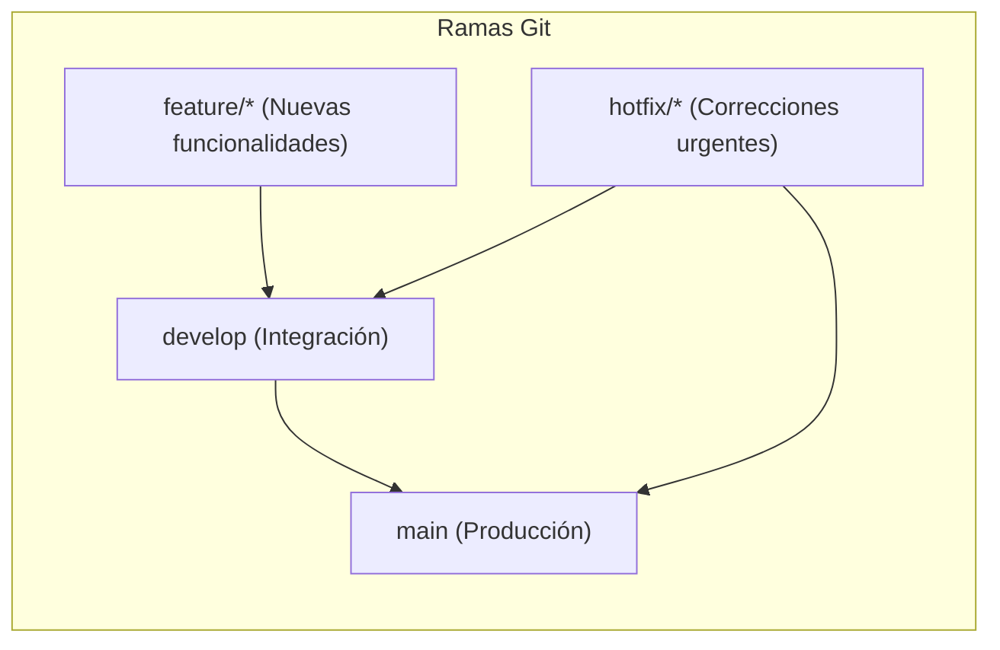
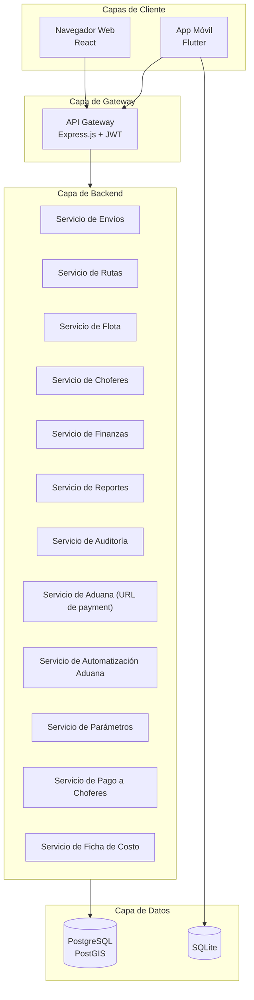

## 📄 DOCUMENTO: GUÍA DE ARRANQUE DEL PROYECTO SIGMA-T (PROJECT ONBOARDING GUIDE) - VERSIÓN 1.3

**Versión:** 1.3
**Fecha de Emisión:** 15 de agosto de 2026
**Propósito:** Servir como punto de entrada único para todos los miembros del equipo, estableciendo el contexto, los estándares, las metodologías, las guías de interacción con IA, los enlaces oficiales de documentación y la configuración del entorno de desarrollo que rigen el proyecto SIGMA-T.

---

## 1. PROPÓSITO Y ALCANCE DE ESTE DOCUMENTO

### 1.1 Propósito
Este documento es la **puerta de entrada** al proyecto SIGMA-T. Su objetivo es proporcionar a cualquier miembro del equipo (nuevo o existente) una visión clara y completa del proyecto en menos de 30 minutos de lectura. Al finalizar este documento, el lector deberá entender:

- **¿Qué es SIGMA-T?** La visión, el alcance y los objetivos del proyecto.
- **¿Cómo se organiza el proyecto?** La metodología, los roles y los flujos de trabajo.
- **¿Cómo se desarrolla el código?** Los estándares, las herramientas y los patrones de diseño.
- **¿Cómo configurar el entorno de desarrollo?** Las tareas automatizadas, extensiones de VSCode y CI/CD.
- **¿Cómo interactuar con la IA?** Las directrices para el uso de asistentes de IA en el proyecto.
- **¿Dónde está la documentación oficial?** Los enlaces a toda la documentación de frameworks y lenguajes.
- **¿Dónde está la documentación completa?** La guía para acceder a todos los documentos detallados.
- **¿Cómo funciona el flujo de paquetería?** El proceso completo desde el remitente hasta el destinatario.
- **¿Cuáles son los perfiles de usuario?** Los 5 perfiles y sus permisos.

### 1.2 Obligatoriedad
**Este documento es de lectura OBLIGATORIA para TODOS los miembros del equipo antes de realizar cualquier contribución al proyecto.** Ningún miembro del equipo podrá comenzar a trabajar en el código, diseñar funcionalidades o tomar decisiones técnicas sin haber leído y comprendido este documento.

### 1.3 ¿Cómo usar este documento?
1. **Lectura inicial:** Lee este documento de principio a fin para obtener una visión general.
2. **Consulta continua:** Utiliza este documento como referencia rápida para recordar estándares y metodologías.
3. **Profundización:** Cuando necesites más detalles, consulta los documentos completos que se mencionan en la Sección 13.

---

## 2. VISIÓN GENERAL DEL PROYECTO

### 2.1 ¿Qué es SIGMA-T?
**SIGMA-T** (Sistema Integral de Gestión para MiPYME de Transporte) es una plataforma de clase mundial diseñada para gestionar de forma integral una MiPYME de transporte terrestre de carga y pasajeros en Cuba.

### 2.2 ¿Por qué existe?
El proyecto nace para resolver los desafíos críticos que enfrentan las MiPYMEs de transporte en Cuba:
- Gestión manual y descoordinada (dependencia de Excel).
- Ineficiencia operativa (rutas planificadas manualmente).
- Falta de visibilidad financiera (costos no calculados en tiempo real).
- Brecha digital (choferes sin herramientas offline).
- Falta de control sobre costos de aduana y pago a choferes.
- Falta de transparencia en costos de importación.
- Falta de una solución integral adaptada al contexto cubano.

### 2.3 ¿Qué resuelve?
SIGMA-T es un sistema modular que cubre **todo el ciclo de vida** de una operación de transporte:
- **Venta y Marketing:** Prospectos, cotizaciones, CRM.
- **Operaciones:** Flota, choferes, rutas, envíos, almacén.
- **Finanzas:** Costos, facturación, contabilidad, **gestión de aduana**, **pago a choferes**, **ficha de costo detallada**.
- **Post-Venta:** Seguimiento, encuestas, casos de éxito.
- **Control:** Auditoría, KPIs, reportes.

### 2.4 Visión a Largo Plazo
Ser el **estándar de gestión** para MiPYMEs de transporte en Cuba y la región, basado en tecnología de punta, código abierto y prácticas de clase mundial.

---

## 3. FLUJO DE PAQUETERÍA Y ESTADOS DEL PAQUETE

### 3.1 Diagrama del Flujo de Paquetería

```
Cliente Remitente → Agencia CAC (Panamá/México/Miami) → Aerovaradero → Aduana → Seta Expreso → Cliente Destinatario
```

### 3.2 Estados del Paquete (9 estados)

| # | Estado | Responsable | Descripción | ¿Llega a Seta Expreso? |
|---|--------|-------------|-------------|------------------------|
| 1 | **Faltante de Origen** | Aerovaradero | El bulto nunca salió del país de origen | ❌ **NO** (FIN) |
| 2 | **Presencial** | Aerovaradero | Problema detectado por aduana | ❌ **NO** (FIN) |
| 3 | **Arribado** | Aerovaradero | Llegó al Aeropuerto de destino | ✅ Sí |
| 4 | **Facturado** | Aerovaradero | Tiene importe y factura en Aerovaradero | ✅ Sí |
| 5 | **Entregado en Aerovaradero** | Aerovaradero | Recogido por Seta Expreso | ✅ Sí |
| 6 | **Clasificación** | Seta Expreso | En almacén clasificando por provincia | ✅ Sí |
| 7 | **Proceso de Entrega** | Seta Expreso | En ruta al destinatario | ✅ Sí |
| 8 | **Entregado** | Seta Expreso | Entregado con firma y fotos | ✅ Sí |
| 9 | **No Entregado** | Seta Expreso | No se pudo entregar, vuelve a clasificación | ✅ Sí |

### 3.3 Automatización de Facturación de Aduana

| Aspecto | Especificación |
|---------|----------------|
| **Horarios de consulta** | 8:00 AM, 12:00 PM, 4:00 PM, 12:00 AM (hora de Cuba) |
| **URL de consulta** | `https://www.aerovaradero.com.cu/payment/?cod_la={cod_la}&cod_awb={cod_awb}&cod_house={house}` |
| **Criterio de facturación** | El house debe tener **AMBOS**: Importe > $0.00 Y Factura existe |
| **Acción** | Cambiar estado de **"Arribado"** a **"Facturado"** |
| **Optimización** | SOLO se consultan houses con estado **"Arribado"** |
| **Ignorar** | Houses con estado **"Facturado"** NO se consultan nuevamente |

---

## 4. PERFILES DE USUARIO (5 PERFILES)

| # | Perfil | Descripción | Permisos |
|---|--------|-------------|----------|
| 1 | **Administrador** | Dueño/gerente del sistema | Acceso total a todas las funcionalidades |
| 2 | **Jefe de Operaciones** | Controla rutas y operaciones | CRUD Rutas, Importar manifiestos, Ver todos los estados, Ver historial, Exportar |
| 3 | **Agencia de Envíos** | CAC Panamá/México/Miami | Importar manifiestos, Ver sus envíos, Historial, Exportar, Ver costos de aduana |
| 4 | **Cliente Remitente** | Persona que envía un paquete | Ver su envío (todos los estados), Historial, Exportar, Ver costo de aduana |
| 5 | **Cliente Destinatario** | Persona que recibe un paquete | Ver su envío (todos los estados), Historial, Exportar, Ver costo de aduana |

### 4.1 Matriz de Permisos

| Funcionalidad | Admin | Jefe Operaciones | Agencia | Remitente | Destinatario |
|---------------|-------|------------------|---------|-----------|--------------|
| CRUD Clientes | ✅ | ❌ | ❌ | ❌ | ❌ |
| CRUD Envíos | ✅ | ❌ | ❌ | ❌ | ❌ |
| CRUD Rutas | ✅ | ✅ | ❌ | ❌ | ❌ |
| Ver todos los envíos | ✅ | ✅ | ❌ | ❌ | ❌ |
| Ver sus envíos | ✅ | ✅ | ✅ | ✅ | ✅ |
| Ver historial por cliente | ✅ | ✅ | ✅ | ✅ | ✅ |
| Importar manifiestos | ✅ | ✅ | ✅ | ❌ | ❌ |
| Exportar historial | ✅ | ✅ | ✅ | ✅ | ✅ |
| Ver costo de aduana | ✅ | ✅ | ✅ | ✅ | ✅ |
| Ver ficha de costo | ✅ | ✅ | ❌ | ❌ | ❌ |
| Gestión de parámetros | ✅ | ❌ | ❌ | ❌ | ❌ |

---

## 5. ESTRUCTURA ORGANIZATIVA Y ROLES

### 5.1 Organigrama del Proyecto

```mermaid
flowchart TD
    L[Líder del Proyecto<br>Osleyder Gonzalez] --> E[Equipo de Desarrollo<br>Ingenieros y Documentalistas]
    L --> C[Stakeholders<br>(Clientes, Choferes, Dispatchers)]
    E --> C
    subgraph E [Equipo de Desarrollo]
        direction LR
        BE[Backend<br>Node.js + TypeScript]
        FE[Frontend<br>React + TypeScript]
        MO[Mobile<br>Flutter + Dart]
        QA[QA Engineer]
        DOC[Documentalista]
        DevOps[DevOps Engineer]
    end
```

### 5.2 Roles y Responsabilidades

| Rol | Responsabilidad | Asignado a |
| :--- | :--- | :--- |
| **Líder del Proyecto** | Dirección estratégica, toma de decisiones, validación de entregables. | **Osleyder Gonzalez** |
| **Arquitecto de Software** | Definir la arquitectura, estandarizar tecnologías, revisar el diseño técnico. | Equipo SIGMA-T |
| **Desarrollador Backend** | API REST, lógica de negocio, optimización de rutas, base de datos, servicios de aduana, finanzas y ficha de costo. | Equipo SIGMA-T |
| **Desarrollador Frontend** | Dashboard web, panel administrativo, portal del cliente, UI de parámetros, aduana y ficha de costo. | Equipo SIGMA-T |
| **Desarrollador Mobile** | App Flutter para choferes, offline, sincronización, publicación en Play Store y APKlis. | Equipo SIGMA-T |
| **Diseñador UX/UI** | Maquetas, prototipos, experiencia de usuario. | Equipo SIGMA-T |
| **Ingeniero de QA** | Pruebas, calidad, verificación de estándares. | Equipo SIGMA-T |
| **Documentalista** | Documentación técnica, manuales, guías. | Equipo SIGMA-T |
| **DevOps Engineer** | Configurar entorno de desarrollo, gestionar despliegue en VPS ETECSA, SSL/HTTPS, Nginx, PM2. | Equipo SIGMA-T |

---

## 6. METODOLOGÍA DE TRABAJO

### 6.1 Metodología: Ágil con Scrum
El proyecto se desarrolla utilizando **Scrum** con sprints de **2 semanas de duración**.

### 6.2 Ceremonias Clave

| Ceremonia | Frecuencia | Propósito |
|-----------|------------|-----------|
| **Sprint Planning** | Cada 2 semanas (inicio del sprint) | Definir el trabajo del sprint. |
| **Daily Standup** | Diario (15 min) | Sincronizar avances y resolver bloqueos. |
| **Sprint Review** | Cada 2 semanas (fin del sprint) | Presentar el trabajo completado al Líder. |
| **Sprint Retrospective** | Cada 2 semanas (fin del sprint) | Mejorar el proceso de trabajo. |

### 6.3 Flujo de Trabajo (Git Flow)



### 6.4 Convención de Commits (Conventional Commits)
Todos los mensajes de commit deben seguir el estándar **Conventional Commits**:

```
tipo(alcance): descripción corta (máximo 50 caracteres)

[descripción larga opcional]

[referencias a issues]
```

**Tipos permitidos:**
- `feat`: Nueva funcionalidad
- `fix`: Corrección de bug
- `docs`: Cambios en documentación
- `style`: Cambios de formato
- `refactor`: Refactorización
- `test`: Pruebas
- `chore`: Tareas de mantenimiento
- `perf`: Mejora de rendimiento
- `ci`: Cambios en CI/CD

### 6.5 Flujo de Trabajo para Nuevas Funcionalidades
1. **Crear una rama:** `feature/nombre-funcionalidad` desde `develop`.
2. **Desarrollar:** Implementar la funcionalidad con pruebas y documentación.
3. **Commit:** Seguir Conventional Commits.
4. **Pull Request:** Crear PR a `develop` con descripción clara.
5. **Revisión:** Al menos un miembro del equipo debe revisar y aprobar.
6. **Merge:** Fusionar a `develop` y eliminar la rama feature.
7. **Release:** Al final del sprint, fusionar `develop` a `main`.

---

## 7. ESTÁNDARES DE CODIFICACIÓN

### 7.1 Tecnologías y Versiones

| Capa | Tecnología | Versión |
|------|------------|---------|
| **Backend** | Node.js + TypeScript | Node 22.14.x, TS 5.8.x |
| **API** | Express.js | 5.0.0 |
| **Frontend Web** | React + Vite + Tailwind CSS | React 18.x |
| **Mobile** | Flutter | 3.x |
| **Base de Datos** | PostgreSQL + PostGIS | 15.x |
| **Almacenamiento Local** | SQLite | 3.x |
| **Mapas y Rutas** | OpenStreetMap + OSRM | OSRM 5.x |
| **Servidor Web** | Nginx | 1.18+ |
| **Gestor de Procesos** | PM2 | 5.x |
| **SSL/HTTPS** | Let's Encrypt / Certbot | - |

### 7.2 Herramientas de Análisis y Formateo

| Herramienta | Lenguaje | Propósito |
|-------------|----------|-----------|
| **ESLint** | TypeScript/JavaScript | Análisis estático de código |
| **Prettier** | TypeScript/JavaScript | Formateo automático |
| **Dart Analyzer** | Dart | Análisis estático y lints |
| **TypeDoc** | TypeScript | Generación de documentación |
| **Swagger UI** | API | Documentación interactiva de API |
| **SonarQube** | Multi-lenguaje | Análisis de calidad de código |

### 7.3 Estándares de Nomenclatura

| Elemento | Estándar | Ejemplo |
|----------|----------|---------|
| Clases | `PascalCase` | `EnvioService` |
| Variables/Funciones | `camelCase` | `totalPeso` |
| Archivos/Directorios | `kebab-case` | `envio.controller.ts` |
| Constantes | `UPPERCASE` | `MAX_RETRIES` |
| Componentes React | `PascalCase` | `EnvioList` |

### 7.4 Tipado (TypeScript)
- Usar tipado fuerte. **Evitar `any`.** 
- Importar tipos con `import type`.
- Usar `readonly` para propiedades inmutables.

### 7.5 Documentación de Código (JSDoc)
**Toda función, clase, interfaz o componente público DEBE estar documentado con JSDoc.**

**Plantilla:**
```typescript
/**
 * [Descripción detallada de la función/clase/interfaz]
 *
 * @param {Tipo} nombreParam - [Descripción del parámetro]
 * @param {Tipo} [nombreParamOpcional] - [Descripción del parámetro opcional]
 * @returns {TipoRetorno} [Descripción del valor de retorno]
 * @throws {TipoError} [Descripción de cuándo se lanza]
 *
 * @example
 * const resultado = funcionEjemplo(param1, param2);
 */
```

### 7.6 Métricas de Calidad de Código

| Métrica | Objetivo | Herramienta |
|---------|----------|-------------|
| Cobertura de Documentación | ≥80% | ESLint-plugin-jsdoc |
| Cumplimiento de Estándares | ≥95% | ESLint / Dart Analyzer |
| Deuda Técnica | <5% | SonarQube |
| Código Duplicado | <3% | SonarQube |
| Complejidad Ciclomática | <10 por función | ESLint (complexity) |

---

## 8. CONFIGURACIÓN DEL ENTORNO DE DESARROLLO

### 8.1 Configuración Automatizada con VSCode

Para garantizar que todos los desarrolladores tengan el mismo entorno, se ha definido un archivo `tasks.json` que automatiza las tareas de configuración y desarrollo.

**Archivo `.vscode/tasks.json`:**

```json
{
  "version": "2.0.0",
  "tasks": [
    {
      "label": "Setup: Inicializar Entorno SIGMA-T",
      "dependsOn": [
        "Setup: Instalar Dependencias Backend",
        "Setup: Instalar Dependencias Frontend",
        "Setup: Instalar Dependencias Mobile",
        "Setup: Configurar Base de Datos",
        "Setup: Configurar OSRM",
        "Setup: Configurar Variables de Entorno"
      ],
      "group": {
        "kind": "build",
        "isDefault": true
      },
      "detail": "Ejecuta todas las tareas de configuración inicial del proyecto"
    },
    {
      "label": "Setup: Instalar Dependencias Backend",
      "type": "shell",
      "command": "cd backend && npm install",
      "detail": "Instala las dependencias del backend (Node.js + TypeScript)"
    },
    {
      "label": "Setup: Instalar Dependencias Frontend",
      "type": "shell",
      "command": "cd frontend && npm install",
      "detail": "Instala las dependencias del frontend (React + Vite)"
    },
    {
      "label": "Setup: Instalar Dependencias Mobile",
      "type": "shell",
      "command": "cd mobile && flutter pub get",
      "detail": "Instala las dependencias de la app móvil (Flutter)"
    },
    {
      "label": "Setup: Configurar Base de Datos",
      "type": "shell",
      "command": "docker-compose up -d postgres",
      "detail": "Levanta el contenedor de PostgreSQL con PostGIS"
    },
    {
      "label": "Setup: Configurar OSRM",
      "type": "shell",
      "command": "docker-compose up -d osrm",
      "detail": "Levanta el contenedor de OSRM para rutas"
    },
    {
      "label": "Setup: Configurar Variables de Entorno",
      "type": "shell",
      "command": "cp .env.example .env",
      "detail": "Crea el archivo .env a partir de la plantilla"
    },
    {
      "label": "Dev: Levantar Backend",
      "type": "shell",
      "command": "cd backend && npm run dev",
      "detail": "Inicia el servidor de desarrollo del backend"
    },
    {
      "label": "Dev: Levantar Frontend",
      "type": "shell",
      "command": "cd frontend && npm run dev",
      "detail": "Inicia el servidor de desarrollo del frontend"
    },
    {
      "label": "Dev: Levantar Mobile",
      "type": "shell",
      "command": "cd mobile && flutter run",
      "detail": "Inicia la app móvil en el emulador/dispositivo"
    },
    {
      "label": "Dev: Levantar Todo (Docker Compose)",
      "type": "shell",
      "command": "docker-compose up",
      "detail": "Levanta todos los servicios con Docker Compose"
    },
    {
      "label": "Test: Ejecutar Pruebas Backend",
      "type": "shell",
      "command": "cd backend && npm test",
      "detail": "Ejecuta las pruebas unitarias del backend"
    },
    {
      "label": "Test: Ejecutar Pruebas Frontend",
      "type": "shell",
      "command": "cd frontend && npm test",
      "detail": "Ejecuta las pruebas del frontend"
    },
    {
      "label": "Test: Ejecutar Pruebas Mobile",
      "type": "shell",
      "command": "cd mobile && flutter test",
      "detail": "Ejecuta las pruebas de la app móvil"
    },
    {
      "label": "Lint: Verificar Código Backend",
      "type": "shell",
      "command": "cd backend && npm run lint",
      "detail": "Ejecuta ESLint en el backend"
    },
    {
      "label": "Lint: Verificar Código Frontend",
      "type": "shell",
      "command": "cd frontend && npm run lint",
      "detail": "Ejecuta ESLint en el frontend"
    },
    {
      "label": "Build: Compilar Backend",
      "type": "shell",
      "command": "cd backend && npm run build",
      "detail": "Compila el código TypeScript del backend"
    },
    {
      "label": "Build: Compilar Frontend",
      "type": "shell",
      "command": "cd frontend && npm run build",
      "detail": "Compila el frontend para producción"
    },
    {
      "label": "Build: Compilar Mobile (Android)",
      "type": "shell",
      "command": "cd mobile && flutter build apk --release",
      "detail": "Genera el APK de la app móvil para Android"
    }
  ]
}
```

### 8.2 Extensiones de VSCode Recomendadas

| Extensión | Propósito |
|-----------|-----------|
| **ESLint** | Análisis estático de código TypeScript/JavaScript |
| **Prettier** | Formateo automático de código |
| **Dart** | Soporte para Flutter/Dart |
| **Flutter** | Soporte para desarrollo Flutter |
| **TypeScript/JavaScript** | Soporte nativo para TS/JS |
| **Tailwind CSS IntelliSense** | Autocompletado para Tailwind |
| **Docker** | Gestión de contenedores desde VSCode |
| **GitLens** | Visualización avanzada de Git |
| **REST Client** | Pruebas de API desde VSCode |
| **PostgreSQL** | Gestión de base de datos desde VSCode |

### 8.3 Pipeline de CI/CD (GitHub Actions)

El pipeline automatiza pruebas, análisis estático, generación de documentación y despliegues. Ver el archivo `.github/workflows/ci.yml` en el repositorio para más detalles.

---

## 9. PATRONES DE DISEÑO Y ARQUITECTURA

### 9.1 Arquitectura General



### 9.2 Patrones de Diseño Utilizados

| Patrón | Aplicación |
|--------|------------|
| **MVC (Model-View-Controller)** | Backend: Modelos (TypeORM), Controladores, Vistas (JSON) |
| **Repository** | Acceso a datos a través de repositorios |
| **Service Layer** | Lógica de negocio encapsulada en servicios |
| **Dependency Injection** | Inyección de dependencias en servicios y controladores |
| **Factory** | Creación de objetos complejos (ej. configuración de OSRM) |
| **Observer** | Eventos y notificaciones (ej. sincronización offline) |
| **Singleton** | Conexiones a base de datos y servicios externos |
| **Strategy** | Algoritmos de optimización de rutas intercambiables |

### 9.3 Principios SOLID
Todos los desarrolladores deben aplicar los principios SOLID:
- **S**ingle Responsibility: Una clase, una responsabilidad.
- **O**pen/Closed: Abierto para extensión, cerrado para modificación.
- **L**iskov Substitution: Subtipos deben ser sustituibles.
- **I**nterface Segregation: Interfaces específicas, no genéricas.
- **D**ependency Inversion: Depender de abstracciones, no de implementaciones.

---

## 10. MÓDULOS Y FUNCIONALIDADES CLAVE

### 10.1 Módulos del Sistema

| # | Módulo | Funcionalidades Clave |
|---|--------|----------------------|
| 1 | **Administración de Flota** | CRUD vehículos, mantenimientos, alertas, depreciación |
| 2 | **Gestión de Choferes** | CRUD conductores, disponibilidad, esquemas de pago |
| 3 | **Gestión de Envíos** | Importación Excel, registro manual, historial, estados |
| 4 | **Planificación de Rutas** | Optimización VRPTW, mapa interactivo, drag & drop |
| 5 | **Módulo Financiero** | Ingresos/gastos, fichas de costos, facturación, parámetros financieros |
| 6 | **App del Chofer** | Offline, ruta, entregas, incidencias, firma, costos reales |
| 7 | **Dashboard y Reportes** | KPIs, gráficos, alertas, exportación |
| 8 | **Portal del Cliente** | Login, seguimiento, notificaciones, comprobantes |
| 9 | **Gestión de Almacén** | Entrada/salida, ubicación, mapa de bodega |
| 10 | **Marketing y CRM** | Prospectos, cotizaciones, encuestas, casos de éxito |
| 11 | **Auditoría y Seguridad** | Logs, trazabilidad, alertas de seguridad |
| 12 | **Estándares de Codificación** | ESLint, Prettier, Dart Analyzer, JSDoc, OpenAPI |
| 13 | **Integración con Aduana** | Consulta automática de costos en Aerovaradero (URL de payment) |
| 14 | **Automatización de Aduana** | Consultas programadas (8AM, 12PM, 4PM, 12AM) para facturación automática |
| 15 | **Ficha de Costo Detallada** | Cálculo automático de costos directos, indirectos y de importación por ruta |

### 10.2 Funcionalidades Críticas (Prioridad P1)

| Funcionalidad | Módulo |
|---------------|--------|
| Importación de manifiestos Excel | Envíos |
| Optimización de rutas (VRPTW) | Rutas |
| App del Chofer (modo offline) | Mobile |
| Cálculo de costos y KPIs | Dashboard |
| Auditoría de acciones | Auditoría |
| Gestión de parámetros financieros | Finanzas |
| Consulta automática de costos de aduana | Finanzas |
| Automatización de facturación de aduana (4 horarios) | Aduana |
| Cálculo de pago a choferes | Choferes |
| Ficha de costo detallada por ruta | Finanzas |

---

## 11. BASE DE DATOS Y MODELO DE DATOS

### 11.1 Entidades Principales

| Entidad | Descripción |
|---------|-------------|
| **USUARIO** | Usuarios del sistema (5 perfiles) |
| **VEHICULO** | Vehículos de la flota |
| **CHOFER** | Conductores con esquemas de pago |
| **ENVIO** | Envíos con datos de aduana (AWB, costo_aduana, importe_aduana, numero_factura_aduana) |
| **RUTA** | Rutas planificadas con pago a chofer y ficha de costo |
| **COSTO** | Costos fijos y variables con categorías detalladas |
| **PARAMETROS_SISTEMA** | Parámetros financieros (tasa de cambio, precios, costos por km) |
| **HISTORIAL_PARAMETROS** | Historial de cambios de parámetros |
| **AUDITORIA** | Logs de todas las acciones |

### 11.2 Estados del Paquete (Nuevos Campos en ENVIO)

| Campo | Tipo | Descripción |
|-------|------|-------------|
| `estado_aerovaradero` | ENUM | Arribado, Facturado, Entregado en Aerovaradero, Faltante de Origen, Presencial |
| `estado_seta_expreso` | ENUM | Clasificación, Proceso de Entrega, Entregado, No Entregado |
| `importe_aduana` | DECIMAL | Importe registrado en Aerovaradero |
| `numero_factura_aduana` | VARCHAR | Número de factura registrado en Aerovaradero |
| `fecha_ultima_consulta_aduana` | TIMESTAMP | Fecha de la última consulta a Aerovaradero |
| `intentos_consulta_aduana` | INTEGER | Número de intentos de consulta fallidos |

### 11.3 Convenciones de Base de Datos
- **Nombres de tablas:** `snake_case` y en plural (ej. `envios`, `vehiculos`).
- **Nombres de columnas:** `snake_case` (ej. `id_cliente`, `fecha_creacion`).
- **Claves primarias:** `id_nombre` (ej. `id_envio`).
- **Claves foráneas:** `id_tabla_referenciada` (ej. `id_cliente`).
- **Timestamps:** `created_at`, `updated_at` en todas las tablas.

---

## 12. INTEGRACIONES EXTERNAS

### 12.1 Servicios Externos

| Servicio | Propósito | Tecnología |
|----------|-----------|------------|
| **OSRM** | Cálculo de rutas y distancias | Open Source Routing Machine |
| **OpenStreetMap** | Visualización de mapas | Tiles de mapas |
| **Aerovaradero** | Consulta de costos y facturación de aduana | Web Scraping (Cheerio/Puppeteer) |
| **Email (opcional)** | Notificaciones | SMTP |
| **Google Play Store** | Distribución global de la app | - |
| **APKlis** | Tienda de aplicaciones cubana | - |

### 12.2 Estrategia de Web Scraping (Aduana)
- **URL:** `https://www.aerovaradero.com.cu/payment/?cod_la={cod_la}&cod_awb={cod_awb}&cod_house={house}`
- **Parámetros:** `cod_la` (primeros 3 dígitos del AWB), `cod_awb` (últimos 8 dígitos del AWB), `house` (número de House)
- **Timeout:** 30 segundos por consulta
- **Reintentos:** 3 reintentos con backoff exponencial
- **Contingencia:** Entrada manual de costos de aduana

### 12.3 Automatización de Facturación de Aduana

| Aspecto | Especificación |
|---------|----------------|
| **Horarios** | 8:00 AM, 12:00 PM, 4:00 PM, 12:00 AM |
| **Criterio** | Importe > $0.00 Y Factura existe |
| **Acción** | "Arribado" → "Facturado" |
| **Optimización** | SOLO se consultan houses "Arribados" |
| **Ignorar** | Houses "Facturados" NO se consultan |

### 12.4 Estrategia de Distribución de la App Móvil

| Plataforma | Propósito | URL / Acceso |
|------------|-----------|--------------|
| **Google Play Store** | Distribución global | play.google.com |
| **APKlis** | Tienda oficial cubana | apklis.cu (acceso nacional) |
| **Descarga Directa** | Distribución desde el sitio web | sigma-t.com/download |

---

## 13. GUÍA DE INTERACCIÓN CON IA

### 13.1 Principios Generales

Los asistentes de IA (como DeepSeek, ChatGPT, Claude, etc.) son herramientas valiosas para el desarrollo, pero **no son infalibles**. Para garantizar la calidad y precisión del código generado, se deben seguir estas directrices:

| Principio | Descripción |
|-----------|-------------|
| **La IA no asume** | La IA no debe asumir ni inventar requisitos, funcionalidades, APIs o comportamientos que no estén explícitamente documentados. |
| **La IA pregunta** | Antes de generar código para una funcionalidad, la IA debe preguntar: "¿Puedes proporcionarme el documento original (SRS, Arquitectura, Maquetas) donde se especifica esta funcionalidad?" |
| **La IA cita fuentes** | Toda respuesta técnica debe incluir la fuente de la información (documento del proyecto, enlace oficial, etc.). |
| **La IA usa documentación oficial** | La IA debe consultar y basar sus respuestas en la documentación oficial de los frameworks y lenguajes (Sección 15), no en su conocimiento interno general. |
| **La IA conoce el flujo de paquetería** | La IA debe entender el proceso completo: Remitente → Agencia → Aerovaradero → Aduana → Seta Expreso → Destinatario. |
| **La IA conoce los 9 estados** | La IA debe conocer los estados del paquete y en qué etapa del flujo ocurren. |
| **La IA conoce los 5 perfiles** | La IA debe conocer los 5 perfiles de usuario y sus permisos. |
| **La IA conoce la automatización de aduana** | La IA debe conocer los 4 horarios de consulta y el criterio de facturación. |

### 13.2 Flujo de Trabajo con IA

```mermaid
flowchart TD
    A[Inicio de Interacción con IA] --> B{¿La IA tiene el documento original?}
    B -->|No| C[IA: "Proporcione el documento original donde se especifica esta funcionalidad"]
    C --> D[Usuario proporciona el documento]
    D --> E[IA lee y analiza el documento]
    B -->|Sí| E
    E --> F{¿La IA necesita consultar documentación oficial?}
    F -->|Sí| G[IA: "Consultando documentación oficial de [framework/lenguaje]"]
    G --> H[IA consulta enlaces oficiales de la Sección 15]
    H --> I[IA genera código/documentación basada en fuentes]
    F -->|No| I
    I --> J{¿La IA ha citado sus fuentes?}
    J -->|No| K[IA: "Fuente: [documento/enlace]"]
    J -->|Sí| L[Fin de Interacción]
    K --> L
```

### 13.3 Plantilla de Interacción con IA

**Cuando la IA recibe una solicitud para programar una funcionalidad, debe responder con este formato:**

```markdown
## 📋 ANÁLISIS DE LA SOLICITUD

He recibido su solicitud para [descripción de la funcionalidad].

### 🔍 Verificación de Documentación

Para poder programar esta funcionalidad correctamente, necesito consultar los siguientes documentos:

- [ ] **SRS (Especificación de Requisitos)** - Sección donde se especifica esta funcionalidad
- [ ] **Arquitectura de Software** - Diseño técnico y patrones aplicables
- [ ] **Maquetas UI/UX** - Diseño de interfaz de usuario
- [ ] **Modelo de Datos** - Estructura de datos requerida

**Por favor, proporcione el/los documento(s) original(es) para poder proceder con precisión.**

### 📚 Documentación Oficial a Consultar

Para esta funcionalidad, consultaré la documentación oficial de:
- [Framework/Lenguaje 1] - [Enlace]
- [Framework/Lenguaje 2] - [Enlace]

### 📌 Fuentes de Información

Una vez revisados los documentos, citaré las fuentes específicas utilizadas:
- Fuente: [Documento del proyecto, sección, versión]
- Fuente: [Documentación oficial, enlace]

**¿Puede proporcionarme los documentos solicitados para continuar?**
```

### 13.4 Ejemplo de Interacción Correcta con IA

**Usuario:**
> "Quiero que programes la funcionalidad de consulta de costos de aduana"

**IA (Respuesta Correcta):**

```markdown
## 📋 ANÁLISIS DE LA SOLICITUD

He recibido su solicitud para programar la **funcionalidad de consulta de costos de aduana**.

### 🔍 Verificación de Documentación

Para poder programar esta funcionalidad correctamente, necesito consultar los siguientes documentos:

- [ ] **SRS v3.6** - RF-ADU-01 (Automatización de Facturación de Aduana)
- [ ] **Arquitectura v2.6** - Sección 4.2 (Servicio de Aduana Automatización)
- [ ] **Maquetas UI/UX v2.4** - Pantalla de Monitoreo de Aduana

**Por favor, proporcione el/los documento(s) original(es) para poder proceder con precisión.**

### 📚 Documentación Oficial a Consultar

Para esta funcionalidad, consultaré la documentación oficial de:
- **TypeScript/Node.js** - https://www.typescriptlang.org/docs/
- **Express.js** - https://expressjs.com/en/api.html
- **Cheerio** - https://cheerio.js.org/docs/api
- **Axios** - https://axios-http.com/docs/intro
- **node-cron** - https://www.npmjs.com/package/node-cron

### 📌 Fuentes de Información

Una vez revisados los documentos, citaré las fuentes específicas utilizadas:
- Fuente: SRS v3.6 - Sección 3, RF-ADU-01
- Fuente: Arquitectura v2.6 - Sección 4.2
- Horarios: 8:00 AM, 12:00 PM, 4:00 PM, 12:00 AM
- Criterio: Importe > $0.00 Y Factura existe

**¿Puede proporcionarme los documentos solicitados para continuar?**
```

---

## 14. FLUJO DE TRABAJO PARA NUEVOS MIEMBROS

### 14.1 Pasos para Incorporarse al Proyecto

1. **Leer este documento (Project Onboarding Guide) de principio a fin.**
2. **Leer los documentos completos:**
   - **Project Charter (v2.6):** Visión estratégica y alcance.
   - **SRS (v3.7):** Requisitos funcionales y no funcionales.
   - **SPMP (v3.7):** Plan de proyecto y sprints.
   - **Arquitectura de Software (v2.7):** Diseño técnico detallado.
   - **Maquetas UI/UX (v2.5):** Diseño de interfaz de usuario.
   - **Análisis de Competencia (v2.2):** Posicionamiento de mercado.
3. **Configurar el entorno de desarrollo** (seguir las instrucciones del README del repositorio y la Sección 8 de este documento).
4. **Participar en el Daily Standup** para sincronizarse con el equipo.
5. **Tomar una tarea del backlog** y comenzar a trabajar bajo la guía de un miembro senior.

### 14.2 Checklist de Onboarding

- [ ] Leer el Project Onboarding Guide
- [ ] Leer el Project Charter (v2.6)
- [ ] Leer el SRS (v3.7)
- [ ] Leer el SPMP (v3.7)
- [ ] Leer el Documento de Arquitectura (v2.7)
- [ ] Leer las Maquetas UI/UX (v2.5)
- [ ] Leer el Análisis de Competencia (v2.2)
- [ ] Comprender el flujo de paquetería
- [ ] Conocer los 9 estados del paquete
- [ ] Conocer los 5 perfiles de usuario
- [ ] Conocer la automatización de aduana (4 horarios)
- [ ] Configurar entorno de desarrollo (Docker, VSCode, tasks.json)
- [ ] Participar en Daily Standup
- [ ] Tomar primera tarea del backlog

---

## 15. DOCUMENTOS DE REFERENCIA

| Documento | Versión | Ubicación | Contenido |
|-----------|---------|-----------|-----------|
| **Project Charter** | 2.6 | `/docs/01-project-charter.md` | Visión, objetivos, stakeholders, hitos |
| **SRS** | 3.7 | `/docs/02-srs.md` | Requisitos funcionales y no funcionales, 9 estados, 5 perfiles |
| **SPMP** | 3.7 | `/docs/03-spmp.md` | Plan de proyecto, sprints, riesgos, QA |
| **Maquetas UI/UX** | 2.5 | `/docs/04-maquetas-uiux.md` | Pantallas de alta fidelidad (21+) |
| **Análisis de Competencia** | 2.2 | `/docs/05-analisis-competencia.md` | Competidores, matriz comparativa, FODA |
| **Arquitectura de Software** | 2.7 | `/docs/06-arquitectura.md` | Stack, diagramas, API, servicios, estándares, infraestructura VPS ETECSA |
| **Project Onboarding Guide** | 1.3 | `/docs/07-onboarding-guide.md` | Este documento |

---

## 16. ENLACES OFICIALES DE DOCUMENTACIÓN

### 16.1 Documentación Oficial de Frameworks y Lenguajes

| Tecnología | Documentación Oficial | Versión |
|------------|----------------------|---------|
| **TypeScript** | https://www.typescriptlang.org/docs/ | 5.x |
| **Node.js** | https://nodejs.org/en/docs/ | 22.14.x |
| **Express.js** | https://expressjs.com/en/api.html | 5.x |
| **React** | https://react.dev/reference/react | 18.x |
| **Vite** | https://vitejs.dev/guide/ | 5.x |
| **Tailwind CSS** | https://tailwindcss.com/docs | 3.x |
| **Flutter** | https://docs.flutter.dev/ | 3.x |
| **Dart** | https://dart.dev/guides | 3.x |
| **PostgreSQL** | https://www.postgresql.org/docs/ | 15.x |
| **PostGIS** | https://postgis.net/documentation/ | 3.x |
| **SQLite** | https://www.sqlite.org/docs.html | 3.x |
| **TypeORM** | https://typeorm.io/ | 0.3.x |
| **JWT (jsonwebtoken)** | https://github.com/auth0/node-jsonwebtoken#readme | 9.x |
| **Axios** | https://axios-http.com/docs/intro | 1.x |
| **Cheerio** | https://cheerio.js.org/docs/api | 1.x |
| **Puppeteer** | https://pptr.dev/ | 22.x |
| **node-cron** | https://www.npmjs.com/package/node-cron | 3.x |
| **Jest** | https://jestjs.io/docs/getting-started | 29.x |
| **Supertest** | https://github.com/visionmedia/supertest#readme | 6.x |
| **ESLint** | https://eslint.org/docs/latest/ | 8.x |
| **Prettier** | https://prettier.io/docs/en/ | 3.x |
| **TypeDoc** | https://typedoc.org/guides/ | 0.25.x |
| **Swagger UI** | https://swagger.io/docs/ | 3.0 |
| **Docker** | https://docs.docker.com/ | 24.x |
| **Git** | https://git-scm.com/doc | 2.x |
| **Nginx** | https://nginx.org/en/docs/ | 1.18+ |
| **PM2** | https://pm2.keymetrics.io/docs/usage/quick-start/ | 5.x |
| **Let's Encrypt** | https://letsencrypt.org/docs/ | - |

### 16.2 Enlaces de Referencia Adicional

| Recurso | Enlace | Propósito |
|---------|--------|-----------|
| **Conventional Commits** | https://www.conventionalcommits.org/es/v1.0.0/ | Estándar de mensajes de commit |
| **SemVer** | https://semver.org/lang/es/ | Versionado semántico |
| **OpenAPI 3.0** | https://swagger.io/specification/ | Especificación de APIs |
| **JSDoc** | https://jsdoc.app/ | Documentación de código JavaScript |
| **PostGIS Geometry** | https://postgis.net/docs/geometry.html | Geometrías geoespaciales |
| **PMI (Project Management)** | https://www.pmi.org/pmbok-guide-standards | Estándares de gestión de proyectos |
| **IEEE 1016** | https://standards.ieee.org/ieee/1016/ | Descripción de diseño de software |
| **Google Play Console** | https://play.google.com/console/ | Publicación de apps en Play Store |
| **APKlis** | https://apklis.cu/ | Tienda de aplicaciones cubana |

---

## 17. REGLAS DE ORO DEL PROYECTO

| # | Regla | Descripción |
|---|-------|-------------|
| 1 | **Lee la documentación** | Antes de preguntar, consulta los documentos. |
| 2 | **Sigue los estándares** | ESLint, Prettier, Dart Analyzer son obligatorios. |
| 3 | **Documenta tu código** | JSDoc para funciones públicas. |
| 4 | **Prueba tu código** | Pruebas unitarias para todo código nuevo. |
| 5 | **Commits semánticos** | Conventional Commits. |
| 6 | **Revisión de código** | Toda PR necesita aprobación. |
| 7 | **Comunicación diaria** | Participa en el Daily Standup. |
| 8 | **Calidad sobre cantidad** | Código limpio > código rápido. |
| 9 | **Piensa en el usuario** | La UI debe ser simple e intuitiva. |
| 10 | **Cultura Open Source** | Código público, documentación abierta. |
| 11 | **La IA debe pedir los documentos originales** | Antes de programar cualquier funcionalidad, la IA debe solicitar explícitamente el documento original (SRS, Arquitectura, Maquetas, etc.) que contiene la especificación de esa funcionalidad. No debe asumir ni inventar requisitos que no estén documentados. |
| 12 | **La IA debe consultar documentación oficial** | La IA debe basar sus respuestas en la documentación oficial de los frameworks y lenguajes (enlaces proporcionados en la Sección 16). No debe inventar APIs, métodos o comportamientos que no existan en la documentación oficial. |
| 13 | **La IA debe citar sus fuentes** | Cuando la IA proporcione información técnica, debe citar la fuente (documento del proyecto o enlace oficial) para que el equipo pueda verificar. |
| 14 | **La IA debe conocer el flujo de paquetería** | La IA debe entender el proceso completo: Remitente → Agencia → Aerovaradero → Aduana → Seta Expreso → Destinatario. |
| 15 | **Configura el entorno con tasks.json** | Utiliza el archivo `.vscode/tasks.json` para automatizar la configuración del entorno de desarrollo. |
| 16 | **Prueba en VPS ETECSA** | Antes del lanzamiento, verifica el funcionamiento en el VPS ETECSA con SSL/HTTPS. |
| 17 | **Publica en Play Store y APKlis** | La app móvil debe estar disponible en Google Play Store y APKlis. |

---

## 18. APROBACIONES

| Rol | Nombre | Firma | Fecha |
| :--- | :--- | :--- | :--- |
| **Líder del Proyecto** | Osleyder Gonzalez Acosta | _________ | ___/___/2026 |
| **Arquitecto de Software** | Equipo SIGMA-T | _________ | ___/___/2026 |

---

## 📌 CONCLUSIÓN

**Líder, este documento es ahora la puerta de entrada obligatoria para todos los miembros del proyecto.** Antes de que cualquier persona (nuevo miembro, colaborador o incluso un nuevo chat de IA) comience a trabajar en SIGMA-T, DEBE leer este documento.

Esto garantiza:

1. **Consistencia:** Todos trabajan con la misma visión y estándares.
2. **Eficiencia:** Nuevos miembros se ponen al día rápidamente.
3. **Calidad:** Se mantienen los estándares de codificación y documentación.
4. **Alineación:** Todos conocen la metodología, los patrones y las reglas del proyecto.
5. **Precisión con IA:** La IA no asume ni inventa, siempre consulta documentos originales y fuentes oficiales.
6. **Verificabilidad:** Toda información técnica tiene una fuente citada.
7. **Entorno de Desarrollo:** Configuración automatizada con tasks.json y extensiones de VSCode.
8. **Infraestructura:** Directrices claras para el despliegue en VPS ETECSA con SSL/HTTPS.
9. **Distribución:** Estrategia de publicación en Google Play Store, APKlis y descarga directa.
10. **Flujo de Paquetería:** Todos entienden el proceso completo y los 9 estados del paquete.
11. **Perfiles de Usuario:** Todos conocen los 5 perfiles y sus permisos.
12. **Automatización de Aduana:** Todos entienden la facturación automática en 4 horarios.